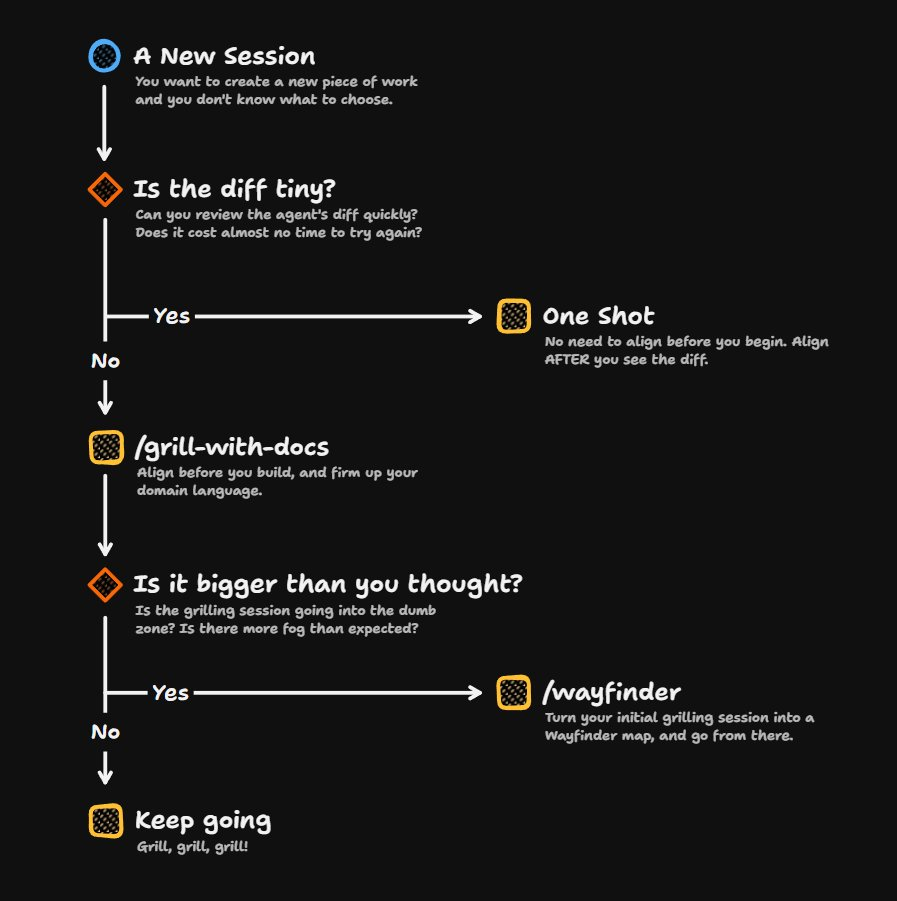

# Matt Pocock (@mattpocockuk)

> Automatisch per `npm run ingest:x` erfasst. Quelle: [x.com/mattpocockuk/status/2108216899439894574](https://x.com/mattpocockuk/status/2108216899439894574)

## Bilder

<!-- Reihenfolge wie von der API geliefert (Cover zuerst). Die Position im Artikeltext gibt die API nicht mit. -->

**photo**

## Post-Text

Should you /grill-with-docs, /wayfinder, or just one shot the code?

1. If the diff is tiny, DON'T grill

/grill-with-docs saves you from situations where the agent built the wrong thing. But if the thing it's building is tiny, that cost drops to nothing. So one-shotting is absolutely fine when you're only making small changes.

2. Never start with /wayfinder

A failure mode of /wayfinder is that you start grilling and the solution turns out to be way simpler than you thought. Why is this bad? Because you've created the map and tickets, and you realise you don't need them.

So if the expected diff is medium-large, always start with a /grill-with-docs session. Then, if planning starts to get out of hand, just say "/wayfinder let's turn this into a map".

## Links

- [pic.x.com/Owea1c2ENn](https://x.com/mattpocockuk/status/2108216899439894574/photo/1)

## Thread

### 1/7

Should you /grill-with-docs, /wayfinder, or just one shot the code?

1. If the diff is tiny, DON'T grill

/grill-with-docs saves you from situations where the agent built the wrong thing. But if the thing it's building is tiny, that cost drops to nothing. So one-shotting is absolutely fine when you're only making small changes.

2. Never start with /wayfinder

A failure mode of /wayfinder is that you start grilling and the solution turns out to be way simpler than you thought. Why is this bad? Because you've created the map and tickets, and you realise you don't need them.

So if the expected diff is medium-large, always start with a /grill-with-docs session. Then, if planning starts to get out of hand, just say "/wayfinder let's turn this into a map".

### 2/7

@nbbaier IMO /grill-with-docs is a better default

### 3/7

@Nicolas_Llousas Yep, /wayfinder

### 4/7

@georgeorch If you don't know the size of the diff, then grill

### 5/7

@alguemdsfarcado No, it's just a skill

### 6/7

@carlassmann I agree, for high-fidelity work you don't want discussion, you want rapid iteration on a prototype

I.e. /prototype

### 7/7

@BenjieMalinao But to me that's a decision about human review, not whether to use /grill-with-docs before you code
