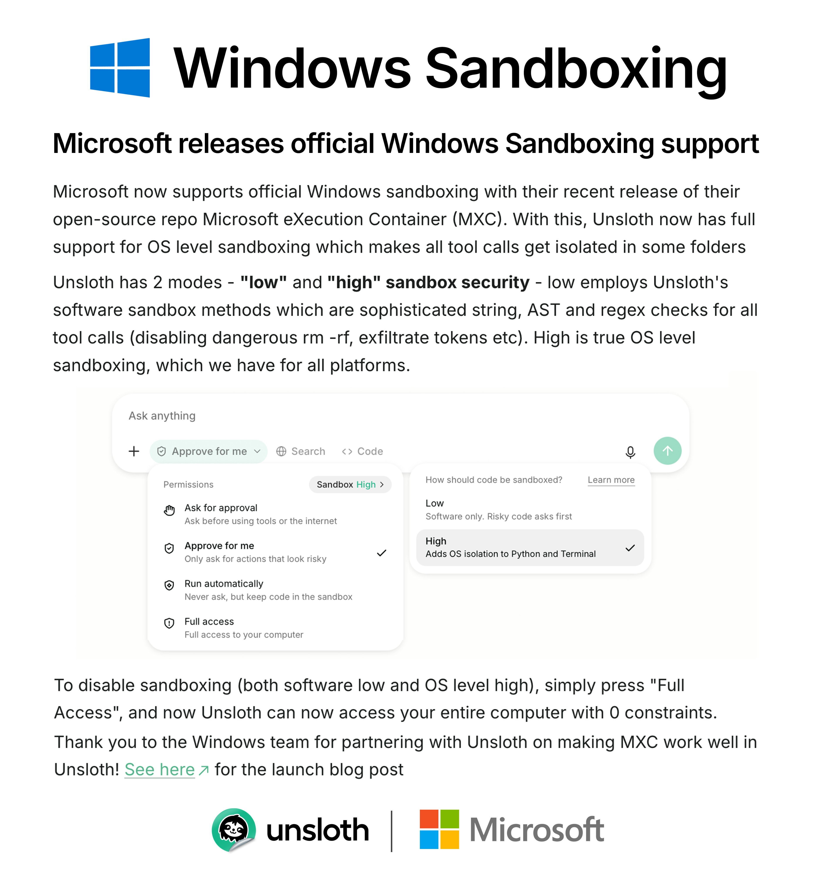

# Unsloth AI (@UnslothAI)

> Automatisch per `npm run ingest:x` erfasst. Quelle: [x.com/UnslothAI/status/2108229721159053557](https://x.com/UnslothAI/status/2108229721159053557)

## Bilder

<!-- Reihenfolge wie von der API geliefert (Cover zuerst). Die Position im Artikeltext gibt die API nicht mit. -->

**photo**

## Post-Text

Windows now has sandboxing!
Microsoft released an open-source repo, mxc, for sandboxed code execution.

We collaborated with Windows to add mxc OS level sandboxing to Unsloth which adds just &lt;100 ms of overhead.

GitHub: https://t.co/aZWYAtakBP
Guide: https://t.co/mhgPeh9Fld https://t.co/NTGo1l4iRQ

## Links

- [github.com/unslothai/unsl…](https://github.com/unslothai/unsloth)
- [unsloth.ai/docs/new/studi…](https://unsloth.ai/docs/new/studio/sandboxing-in-unsloth)
- [pic.x.com/NTGo1l4iRQ](https://x.com/UnslothAI/status/2108229721159053557/photo/1)

## Thread

### 1/1

Windows now has sandboxing!
Microsoft released an open-source repo, mxc, for sandboxed code execution.

We collaborated with Windows to add mxc OS level sandboxing to Unsloth which adds just &lt;100 ms of overhead.

GitHub: https://t.co/aZWYAtakBP
Guide: https://t.co/mhgPeh9Fld https://t.co/NTGo1l4iRQ
