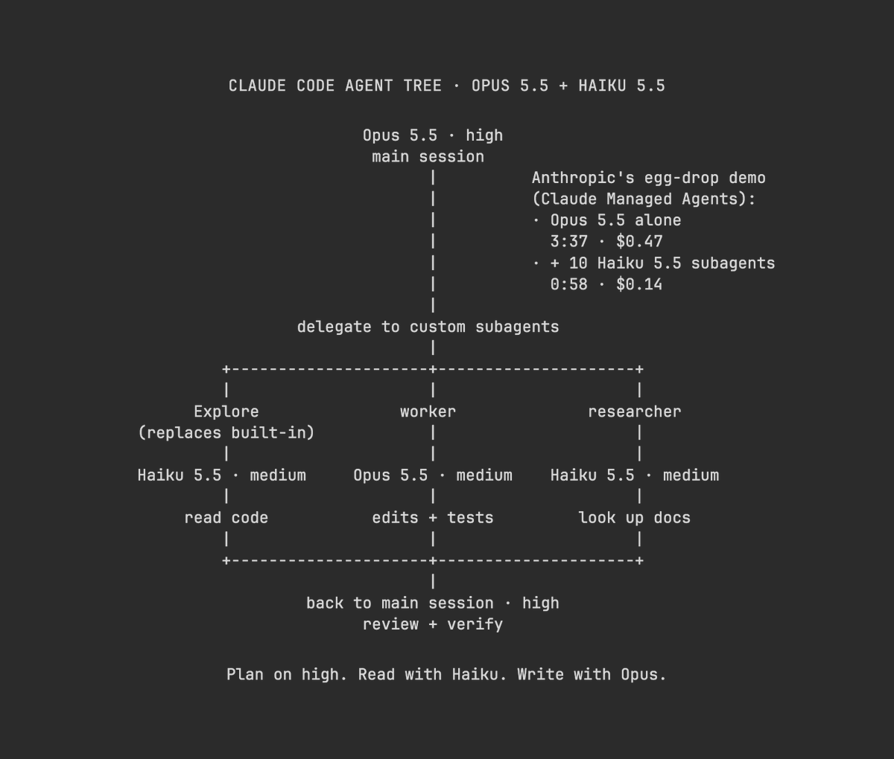

# Vox (@Voxyz_ai)

> Automatisch per `npm run ingest:x` erfasst. Quelle: [x.com/Voxyz_ai/status/2108301411188408794](https://x.com/Voxyz_ai/status/2108301411188408794)

## Bilder

<!-- Reihenfolge wie von der API geliefert (Cover zuerst). Die Position im Artikeltext gibt die API nicht mit. -->

**photo**

## Post-Text

𝗖𝗹𝗮𝘂𝗱𝗲 𝗖𝗼𝗱𝗲 𝘁𝗶𝗽: Haiku 5.5 came out yesterday. Keep Opus 5.5 as your main model and hand work like reading code and looking up docs to Haiku 5.5 subagents.

For the launch, Anthropic ran an egg-drop test on Claude Managed Agents. Opus 5.5 with 10 Haiku 5.5 subagents hit the 32-meter goal in 𝟱𝟴 𝘀𝗲𝗰𝗼𝗻𝗱𝘀 𝗳𝗼𝗿 $𝟬.𝟭𝟰. Opus alone took 3:37 and $0.47.

One default behavior needs changing too. Claude Code's built-in Explore subagent follows your main model, so when Opus 5.5 sends Explore to search your code, 𝗘𝘅𝗽𝗹𝗼𝗿𝗲 𝗿𝘂𝗻𝘀 𝗼𝗻 𝗢𝗽𝘂𝘀 𝗮𝘀 𝘄𝗲𝗹𝗹. Create your own subagent named Explore with model: haiku, and it replaces the built-in one.

The tree is the full setup. Opus 5.5 on high runs the main session. Three subagents on medium split the rest: Explore and the researcher move to Haiku 5.5, one reading code and one looking up docs, while the worker that edits code and runs tests stays on Opus 5.5. Hand the tree and this prompt to Claude Code to set it up 👇

"Set up my Claude Code to match this tree:
1. Check claude --version. If it's below 2.1.293, stop and tell me to run claude update, since Haiku 5.5 needs it. If I'm on Bedrock or Vertex, tell me, because haiku has to be a full model ID there.
2. For the three subagents, reuse fitting ones from ~/.claude/agents and .claude/agents, and propose new ones in ~/.claude/agents only for missing roles. Explore (replacing the built-in one) and the researcher get model: haiku and effort: medium. Explore gets only Read, Grep and Glob; the researcher also gets WebFetch and WebSearch. The worker gets model: opus and effort: medium and handles edits and tests. Give each subagent a description that says what work to hand it, and write Explore's to match the built-in one's purpose. If any already sets a different model, or the project has one with the same name, list it and ask me before changing it.
3. In ~/.claude/settings.json, set the main session's default model to Opus 5.5 and its default effort to high. If I've saved a different effort level for Opus 5.5, tell me.
4. Check whether CLAUDE_CODE_EFFORT_LEVEL is set, since it overrides every subagent's effort. Report it; don't change it.
Show me the changes first. Don't edit any files yet."

## Links

- [pic.x.com/SWcYSZtuC1](https://x.com/Voxyz_ai/status/2108301411188408794/photo/1)

## Thread

### 1/1

𝗖𝗹𝗮𝘂𝗱𝗲 𝗖𝗼𝗱𝗲 𝘁𝗶𝗽: Haiku 5.5 came out yesterday. Keep Opus 5.5 as your main model and hand work like reading code and looking up docs to Haiku 5.5 subagents.

For the launch, Anthropic ran an egg-drop test on Claude Managed Agents. Opus 5.5 with 10 Haiku 5.5 subagents hit the 32-meter goal in 𝟱𝟴 𝘀𝗲𝗰𝗼𝗻𝗱𝘀 𝗳𝗼𝗿 $𝟬.𝟭𝟰. Opus alone took 3:37 and $0.47.

One default behavior needs changing too. Claude Code's built-in Explore subagent follows your main model, so when Opus 5.5 sends Explore to search your code, 𝗘𝘅𝗽𝗹𝗼𝗿𝗲 𝗿𝘂𝗻𝘀 𝗼𝗻 𝗢𝗽𝘂𝘀 𝗮𝘀 𝘄𝗲𝗹𝗹. Create your own subagent named Explore with model: haiku, and it replaces the built-in one.

The tree is the full setup. Opus 5.5 on high runs the main session. Three subagents on medium split the rest: Explore and the researcher move to Haiku 5.5, one reading code and one looking up docs, while the worker that edits code and runs tests stays on Opus 5.5. Hand the tree and this prompt to Claude Code to set it up 👇

"Set up my Claude Code to match this tree:
1. Check claude --version. If it's below 2.1.293, stop and tell me to run claude update, since Haiku 5.5 needs it. If I'm on Bedrock or Vertex, tell me, because haiku has to be a full model ID there.
2. For the three subagents, reuse fitting ones from ~/.claude/agents and .claude/agents, and propose new ones in ~/.claude/agents only for missing roles. Explore (replacing the built-in one) and the researcher get model: haiku and effort: medium. Explore gets only Read, Grep and Glob; the researcher also gets WebFetch and WebSearch. The worker gets model: opus and effort: medium and handles edits and tests. Give each subagent a description that says what work to hand it, and write Explore's to match the built-in one's purpose. If any already sets a different model, or the project has one with the same name, list it and ask me before changing it.
3. In ~/.claude/settings.json, set the main session's default model to Opus 5.5 and its default effort to high. If I've saved a different effort level for Opus 5.5, tell me.
4. Check whether CLAUDE_CODE_EFFORT_LEVEL is set, since it overrides every subagent's effort. Report it; don't change it.
Show me the changes first. Don't edit any files yet."
