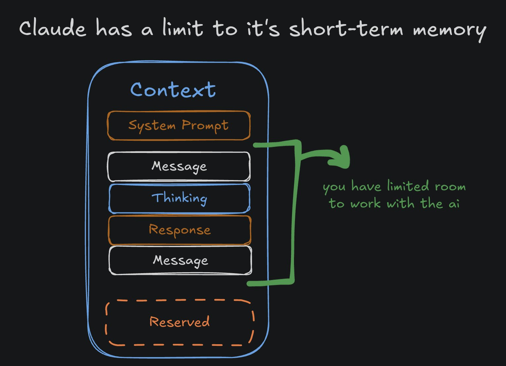
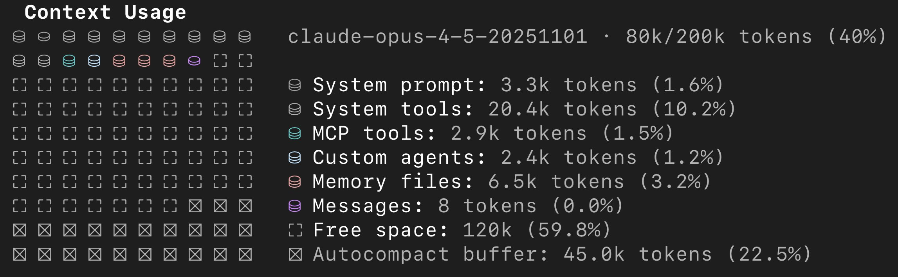
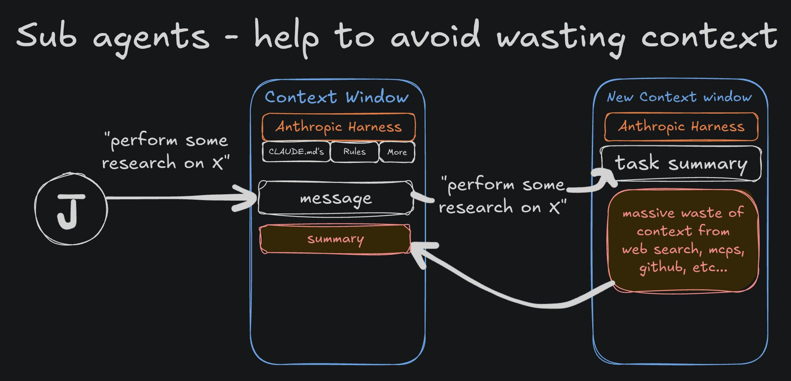
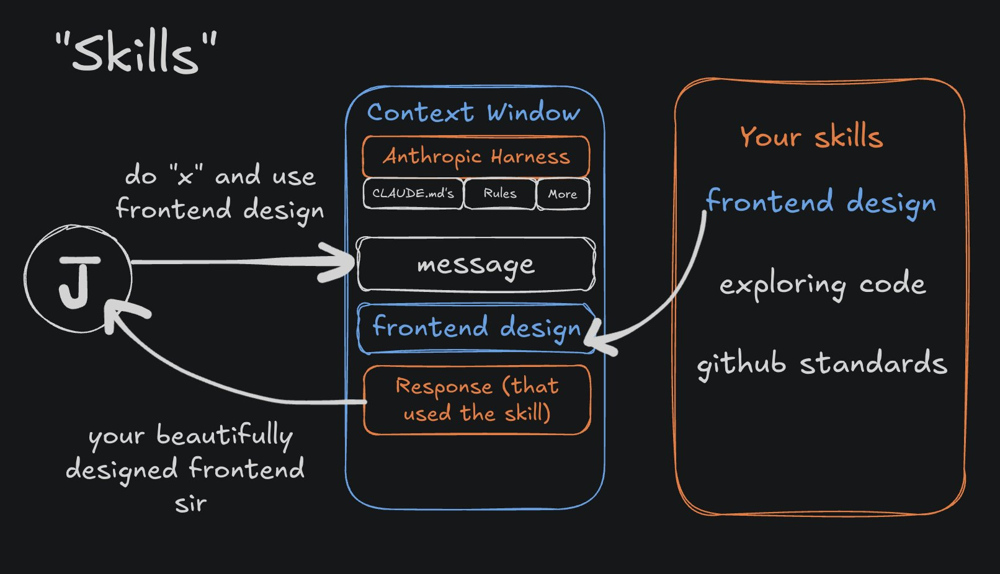

# Wertdichter Kontext statt Kontext-Überflutung: ein praktischer Leitfaden zu Context Engineering

Jarrod Watts dreht die übliche Schuldzuweisung um: „AI Slop“ (minderwertiger KI-Output) ist nicht mehr das Problem des Modells, sondern des Nutzers, weil Kontext in einem Black-Box-System wie Claude Code der einzige Stellhebel ist, den man tatsächlich kontrolliert. Der Artikel bündelt dazu ein praktisches Vokabular — Basiskonfiguration, Reset-Strategie, MCP, Subagents, Skills — entlang der Frage, wie man das „kleinstmögliche Set an High-Signal Tokens“ für eine Aufgabe zusammenstellt.

## Was Kontext im Context Window tatsächlich kostet

Kontext ist alles, was beim Senden einer Nachricht an das LLM mitgeschickt wird: der Prompt selbst, System Prompts und Metadaten, alle vorherigen Nachrichten, das Thinking des Modells sowie Tool-Calls und deren Antworten. Claude Codes Context Window ist mit 200k Token begrenzt, und die Modellqualität nimmt laut Watts mit wachsendem Kontext ab — unabhängig davon, ob das Limit überhaupt erreicht wird.

Wie schnell das Fenster tatsächlich voll ist, zeigt ein `/context`-Screenshot aus der Primärquelle mit exakten Werten für `claude-opus-4-5-20251101` bei 80k/200k Token (40 %) Auslastung: System Prompt 3,3k Token (1,6 %), System Tools 20,4k Token (10,2 %), MCP Tools 2,9k Token (1,5 %), Custom Agents 2,4k Token (1,2 %), Memory Files 6,5k Token (3,2 %), Messages 8 Token (0,0 %), freier Raum 120k Token (59,8 %) und ein Autocompact-Puffer von 45k Token (22,5 %).

Die deutsche Sekundärfassung rundet dieselben Zahlen auf „22,5 % reserviert“, „~10 % System Prompts“ und „~120k Token nutzbar“ — inhaltlich deckungsgleich mit dem Screenshot, nur ungenauer. Damit bleiben real rund 120k Token für die eigentliche Aufgabe, nicht die vollen 200k.

## Basiskonfiguration und Konversations-Scoping

Watts' 80/20-Einstieg ist reine, zeitgebundene Konfiguration und keine übertragbare Erkenntnis: `/upgrade` auf den Max Plan, `/model` auf Opus 4.5, `/init` für eine Projekt-Setup-Datei. Diese Modell- und Plan-Namen verfallen mit dem nächsten Produkt-Release und sind hier nur als Datenpunkt für den 06.01.2026 festgehalten.

Übertragbar ist dagegen die Arbeitsweise danach: im Plan Mode starten, Claude gezielt Rückfragen zum Plan stellen lassen, den Plan mehrfach gegen Architektur, Best Practices, Sicherheitsrisiken und Teststrategie reviewen lassen, bevor umgesetzt wird — deckt sich mit [[Spec-Grilling]] und [[Plan-first-mit-getrenntem-Review]]. Ergänzend rät Watts, jede neue Konversation als ein einzelnes Ziel zu behandeln („diesen Bug fixen“, „dieses Feature bauen“) und bei neuen, breiteren Projekten entsprechend mehr Zeit in Planung und Verfeinerung zu investieren — dieselbe Faustregel „eine neue Aufgabe bedeutet meistens eine neue Session“ wie in [[Kontext-Hygiene-Entscheidungsbaum]].

## Wann zurückspulen statt weiter im Loop zu retten

Läuft eine Session gut, soll man laut Watts einfach weiterarbeiten; nähert sich das Fenster dem Limit, schafft `/compact` Platz — dafür ist der 22,5-%-Autocompact-Puffer aus dem Screenshot oben gedacht. Läuft es schlecht, beschreibt der Artikel den namensgebenden „Loop of Slop“: „das ist furchtbar, bitte fixen“ → Slop → „das ist noch schlimmer, was denkst du dir“ → Slop.

Die empfohlene Reaktion ist explizit **nicht**, im selben Thread weiter zu korrigieren, sondern zurückzuspulen oder neu zu starten: `/rewind` auf einen Punkt, an dem es noch gut lief, oder `/new` mit dem verfeinerten Ursprungsprompt plus expliziter Nennung, was diesmal vermieden werden soll. Das ist exakt der `rewind`-vor-Korrektur-Mechanismus aus [[Kontext-Hygiene-Entscheidungsbaum]], hier von einer bislang dort nicht vertretenen, unabhängigen Stimme bestätigt.

## MCP als „Just-in-Time“-Kontextstrategie

Watts warnt vor der „Komplexitätsfalle“: MCP-Server, Subagents und Skills wirken auf X spektakulär, fluten den Kontext aber oft mit Low-Signal-Daten und kosten dabei Geld. Er nutzt aktuell drei MCP-Server gezielt — `exa.ai` (Websuche für Agents), `context7` (aktuelle Docs) und `grep.app` (GitHub-Suche) — und setzt sie vor allem ein, um herauszufinden, *wie* etwas korrekt implementiert wird. Das bezeichnet er unter Verweis auf Anthropic explizit als „Just-in-Time“-Context-Strategie: das Werkzeug holt sich Information erst bei Bedarf, statt sie vorab in den Kontext zu laden. Deckt sich mit der MCP-als-Integrationsschicht-Einordnung in [[Erweiterungs-Ebenen-Zuordnung]] und ergänzt dort den konkreten Namen der Strategie sowie drei benannte Beispiel-Server.

## Subagents: teure Arbeit in einem separaten, günstigeren Kontext erledigen

Subagents sind laut Watts eigene Claude-Code-Instanzen mit zwei entscheidenden Eigenschaften: einem eigenen, getrennten Context Window und der Möglichkeit, ein anderes (günstigeres) Modell als der Hauptagent zu nutzen.

Sein konkretes Beispiel ist ein selbstgebauter „Librarian“-Subagent, der auf Sonnet statt Opus läuft, Open-Source-Repos und Dokumentation durchsucht und dem Hauptagenten nur eine verdichtete Zusammenfassung liefert. Der Aufruf lautet sinngemäß: „Nutze Librarian, um zu recherchieren, wie man X mit Y macht, und implementiere dann Z.“ So bleibt teure, tokenintensive Recherche aus dem Hauptkontext heraus, und die Rollenteilung teures Modell entscheidet/günstigeres Modell recherchiert deckt sich mit der bereits in [[Modell-Eskalation-von-guenstig-nach-teuer]] festgehaltenen Multi-Agent-Aufteilung sowie mit dem Grundprinzip separater Subagent-Kontexte in [[Kontrollierte-Agent-Parallelisierung]].

## Skills: das Gegenteil von Subagents

Skills beschreibt Watts als Umkehrung des Subagent-Prinzips: Statt eine Aufgabe an einen Agenten mit eigenem Kontext auszulagern, holt ein Skill spezialisiertes Wissen in den *aktuellen* Kontext hinein — praktisch ein Textblock, der bei Bedarf nachgeladen wird. Sein Beispiel ist ein „Frontend Designer“-Skill, der einen langen Prompt mit Dos and Don'ts für Frontend-Design in den laufenden Kontext lädt.

Diese Gegenüberstellung („Skills sind kinda the reverse of subagents“) ist eine griffige Ergänzung zur bestehenden Ebenentrennung in [[Erweiterungs-Ebenen-Zuordnung]], die Skills bereits als On-Demand-Wissen und Subagents als isolierte Arbeitskammer beschreibt — hier wird der Unterschied zusätzlich an der Kontextrichtung (hinein vs. hinaus) festgemacht.

## Einordnung

Der zentrale empirische Beleg der Quelle ist echt: der `/context`-Screenshot ist ein realer Ausschnitt aus einer laufenden Claude-Code-Session und liefert eine seltene, genaue Zahlenaufschlüsselung, wo Token tatsächlich hingehen. Er bleibt aber ein einzelner, selbstberichteter Schnappschuss einer Session mit unbekannter MCP-/Subagent-/Memory-Konfiguration — die Prozentsätze sind nicht als allgemeine Faustregel übertragbar, sondern als Existenzbeweis dafür, dass „System Tools“ allein 10,2 % fressen können, bevor überhaupt eine Aufgabe beginnt.

Die Kernbehauptung „Modellqualität sinkt mit wachsendem Kontext, unabhängig vom Limit“ wird nicht belegt, sondern als Erfahrungswissen behauptet — sie deckt sich mit der bereits mehrfach belegten Position in [[Kontext-Hygiene-Entscheidungsbaum]], liefert dort aber keine neue Messung, nur eine weitere unabhängige Meinung. Alle Konfigurationsdetails (Opus 4.5, Max Plan, Modellnamen) sind zum Stand 06.01.2026 eingefroren und verfallen mit dem nächsten Release.

Diese Notiz führt zwei Fassungen zusammen: den englischen Original-Tweet-Artikel als Primärquelle — er enthält entgegen der sonst für diesen Batch beobachteten unvollständigen Thread-Auflösung den vollständigen Artikeltext samt aller sechs Bilder — und die deutsche Aufarbeitung aus dem vibedeck-Projekt als Sekundärquelle. Beide Fassungen sind inhaltlich deckungsgleich; die Sekundärfassung rundet lediglich Zahlen und ordnet Bilder an denselben inhaltlichen Stellen an. Weil die redaktionelle deutsche Gliederung, Terminologie und Struktur dieser Notiz sich an der vibedeck-Aufarbeitung orientiert und nicht unabhängig aus dem englischen Original neu erstellt wurde, bleibt das Feld `beleg_art: sekundaerquelle` gesetzt — auch wenn jede inhaltliche Aussage am englischen Original gegengeprüft werden konnte.

Eine Datumsabweichung zwischen den beiden Inbox-Notizen wurde aufgelöst: Die Sekundärquelle trägt `datum: 2026-01-23`, die Primärquelle `datum: 2026-01-06`. Die Tweet-ID `2008495347115630701` ist ein Twitter/X-Snowflake-Identifier; die Rückrechnung des darin kodierten Zeitstempels (Snowflake-Epoche 04.11.2010) ergibt den 06.01.2026, 11:06 UTC — deckungsgleich mit dem Datum der Primärquelle. Für den Dateinamen dieser Notiz gilt deshalb der 06.01.2026 als Original-Veröffentlichungsdatum; der 23.01.2026 der Sekundärquelle ist vermutlich das Erfassungs- oder Verarbeitungsdatum der vibedeck-Übernahme, nicht das Tweet-Datum.

## Kernaussagen

- Ein realer `/context`-Screenshot zeigt exakt, wohin 200k Token zerfallen: System Tools allein 10,2 %, Autocompact-Puffer 22,5 %, real nutzbar nur rund 120k Token → [[Kontext-Hygiene-Entscheidungsbaum]]
- Bei einer schlecht laufenden Session ist `/rewind` oder `/new` mit verfeinertem Prompt einer Fortsetzungskorrektur im selben Thread vorzuziehen — unabhängig bestätigter Reset-Mechanismus → [[Kontext-Hygiene-Entscheidungsbaum]]
- Jede neue Konversation sollte auf ein einzelnes Ziel begrenzt sein; breitere Projektziele brauchen entsprechend mehr Planungs- und Verfeinerungszeit → [[Kontext-Hygiene-Entscheidungsbaum]]
- MCP-Server eignen sich als „Just-in-Time“-Kontextstrategie primär dafür, Implementierungswissen bei Bedarf zu holen, statt es vorab zu laden — Beispiel-Tools `exa.ai`, `context7`, `grep.app` → [[Erweiterungs-Ebenen-Zuordnung]]
- Subagents mit eigenem Context Window und günstigerem Modell (Beispiel: Sonnet-Librarian recherchiert für ein Opus-Hauptagent) verhindern, dass teure Recherche den Hauptkontext flutet → [[Kontrollierte-Agent-Parallelisierung]], [[Modell-Eskalation-von-guenstig-nach-teuer]]
- Skills sind die Umkehrung von Subagents: statt Arbeit mit eigenem Kontext auszulagern, holen sie spezialisiertes Wissen in den aktuellen Kontext → [[Erweiterungs-Ebenen-Zuordnung]]
- Plan Mode mit gezielten Rückfragen und mehrfachem Review (Architektur, Best Practices, Sicherheit, Tests) vor der Umsetzung → [[Spec-Grilling]], [[Plan-first-mit-getrenntem-Review]]

## Verbindungen

- [[Kontext-Hygiene-Entscheidungsbaum]]
- [[Erweiterungs-Ebenen-Zuordnung]]
- [[Kontrollierte-Agent-Parallelisierung]]
- [[Modell-Eskalation-von-guenstig-nach-teuer]]
- [[Spec-Grilling]]
- [[2026-04-17-wiki-compiler-skills-subagents-hooks-mcp-pragmatisch]]
