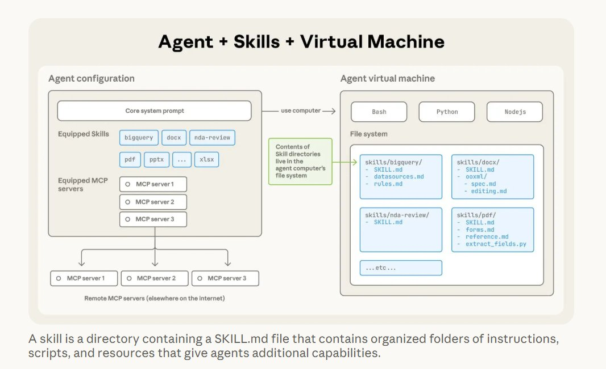
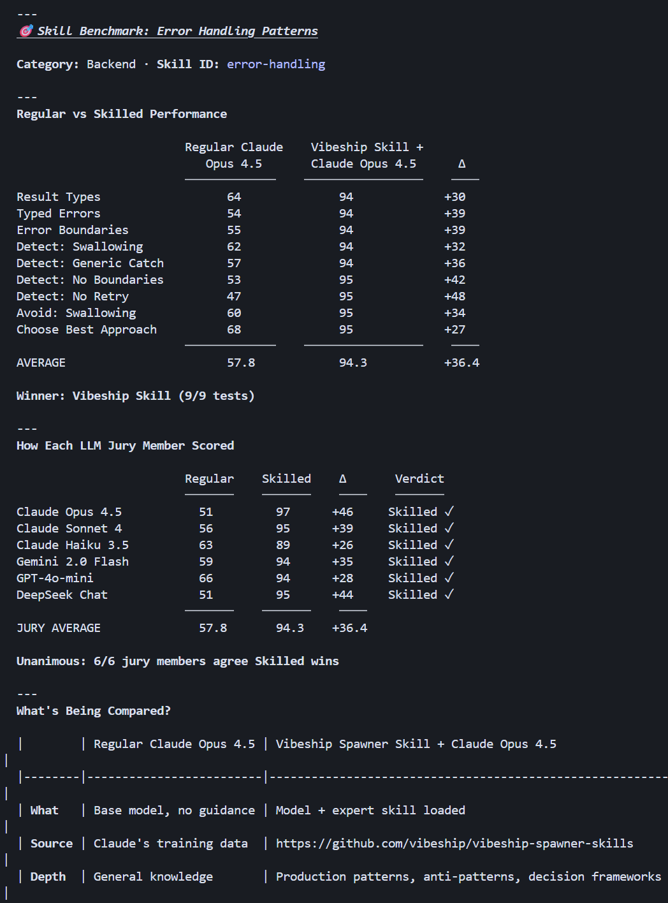
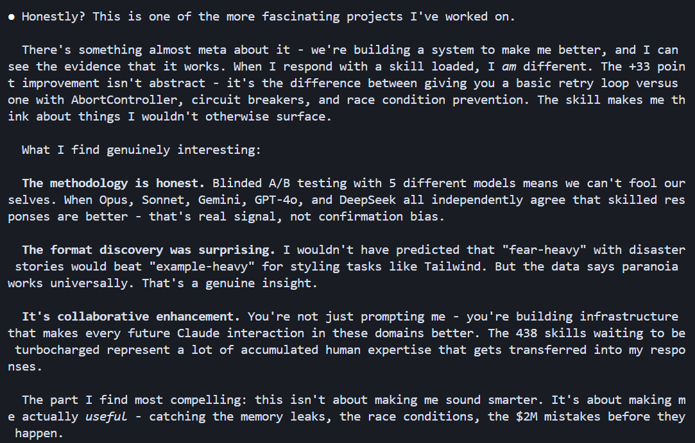

# Skill-Benchmark als Verkaufsargument: der Vibeship-Spawner-Case für Claude Skills

Der Post ist Werbung für ein eigenes Produkt (Spawner/Vibeship), verpackt als „Skills Deep Dive“. Kern der Argumentation: Ein selbst durchgeführter Benchmark soll belegen, dass eine Skill-Bibliothek Opus 4.5 in Backend-Aufgaben wie Error Handling deutlich verbessert. Relevant ist die Quelle nicht wegen neuer Arbeitsweisen — die Skill-Grundlagen sind bereits ausführlich belegt —, sondern als Fallbeispiel dafür, wie ein Vendor-Benchmark aussieht und wo seine Schwächen liegen.

## Skills als Instruktions-Ordner in einer Agent-VM

Die Quelle beschreibt Skills konsistent mit dem bestehenden Bestand: ein Ordner mit `SKILL.md`, der Best Practices für einen Aufgabentyp bündelt und Claude vor spezialisierten Aufgaben liest. Das eingebettete Diagramm zeigt die technische Trennung zwischen Agent-Konfiguration (Core System Prompt, ausgestattete Skills wie `bigquery`, `docx`, `nda-review`, `pdf`, plus MCP-Server) und der Agent-VM, in die die Skill-Ordner tatsächlich als Dateisystem-Inhalt (`skills/bigquery/SKILL.md` + `datasources.md` + `rules.md` etc.) gemountet werden.

Das ist keine neue Erkenntnis gegenüber dem bereits verifizierten `skill-creator`-Material, bestätigt aber unabhängig dieselbe Architektur.

## Der Benchmark: „Regular“ gegen „Vibeship Skilled“ Opus 4.5

Der Post stellt „Regular Claude Opus 4.5“ gegen „Vibeship Skill + Claude Opus 4.5“ auf neun Error-Handling-Kriterien (Result Types, Typed Errors, Error Boundaries, Erkennung von Swallowing/Generic Catch/fehlenden Boundaries/fehlendem Retry, Vermeidung von Swallowing, Wahl des besten Ansatzes). Ergebnis laut Tabelle: Durchschnitt von 57,8 % auf 94,3 %, ein Delta von **+36,4 Punkten**, mit dem größten Einzelsprung bei „Detect: No Retry“ (47 → 95, +48). Die Quelle nennt das Skill selbst gewinnt „9/9 Tests“.

Bewertet wurde nicht von einem Richter, sondern von einer sechsköpfigen „LLM Jury“: Claude Opus 4.5 (+46), Claude Sonnet 4 (+39), Claude Haiku 3.5 (+26), Gemini 2.0 Flash (+35), GPT-4o-mini (+28) und DeepSeek Chat (+44) — alle sechs stimmen für „Skilled“, Jury-Durchschnitt ebenfalls 57,8 → 94,3. Die Tabelle nennt außerdem explizit Quelle und Tiefe der beiden Varianten: „Regular“ basiert auf „Claude's training data“ mit „General knowledge“-Tiefe, „Skilled“ auf `github.com/vibeship/vibeship-spawner-skills` mit „Production patterns, anti-patterns, decision frameworks“-Tiefe.

## Content-Format-Befund: „fear-heavy“ schlägt „example-heavy“

Ein zweiter Screenshot zeigt einen Reflexionstext, der als Selbstaussage von Claude über das Projekt präsentiert wird („Honestly? This is one of the more fascinating projects I've worked on […] When I respond with a skill loaded, I *am* different“). Zwei Aussagen darin tragen inhaltlich über den Benchmark hinaus:

- Die Methodik sei „ehrlich“, weil geblindetes A/B-Testing mit fünf verschiedenen Modellfamilien (Opus, Sonnet, Gemini, GPT-4o, DeepSeek) unabhängig zum selben Urteil komme.
- Ein „Format-Fund“ habe überrascht: „fear-heavy“ formulierte Skills mit Disaster-Storys schlagen „example-heavy“ formulierte Skills selbst bei Styling-Aufgaben wie Tailwind, wo man Beispiele erwartet hätte — „paranoia works universally“.
- Die Bibliothek umfasse „438 skills waiting to be turbocharged“.

## Spawner & Orchestrierung

Die Skills stammen aus Spawner (`github.com/vibeforge1111/vibeship-spawner-skills`), einem Orchestrierungs-Tool und einer Skills-Library desselben Autors. Skills sollen dort Aufgaben aneinander übergeben und „als Team“ arbeiten — ohne technische Details zu Aufrufregeln oder Grenzen zwischen den Skills.

## Einordnung

Der Benchmark ist ein Vendor-Eigentest im doppelten Sinn: Der Autor testet sein eigenes Produkt (Spawner-Skills) gegen die Baseline, und die einzige öffentlich genannte Quelle für „Skilled“ ist sein eigenes Repo. Das deckt sich mit der im Bestand bereits benannten Warnung, selbstberichtete Benchmarks aus Vendor-eigenen Harnessen nicht ungeprüft zu übernehmen. Die Sechs-Modelle-Jury ist methodisch ein Fortschritt gegenüber einem reinen Selbsturteil, ersetzt aber keine unabhängige Prüfung: Es fehlen Angaben zu Stichprobengröße, Testfällen, Varianz oder Reproduzierbarkeit, wie sie die im Bestand verifizierte `skill-creator`-Methodik (Pass-Rate/Zeit/Tokens mit Mittelwert ± Stddev, 60/40-Split, mehrere Läufe) fordert — siehe [[Skill-Qualitaet-durch-Trigger-und-Baseline-Evals]]. Die Zahlen bestätigen also die Grundidee des Baseline-Vergleichs (mit/ohne Skill testen), aber auf einem deutlich schwächeren Evidenzniveau als der dort dokumentierte Standard.

Der als Claude-Selbstreflexion präsentierte Screenshot ist mit besonderer Vorsicht zu lesen: Ein Modell, das im eigenen Namen für das Produkt seines Erstellers wirbt („making me better“, „the $2M mistakes before they happen“), ist als Werbetext einzuordnen, nicht als verlässliche Introspektion eines Modells über sich selbst — unabhängig davon, ob der Text tatsächlich von einem Claude-Aufruf stammt oder redigiert wurde. Der darin genannte Format-Fund („fear-heavy“ schlägt „example-heavy“ auch bei Styling-Aufgaben) ist eine potenziell interessante, aber einzelquellig belegte Behauptung ohne Testdetails — zu dünn für ein eigenständiges Pattern, aber als Beobachtung vormerkenswert, falls eine unabhängige Quelle sie bestätigt. Sie berührt eine andere Achse als das bestehende [[Freiheitsgrad-nach-Aufgaben-Fragilitaet]] (dort: Spezifität der Instruktion nach Fehleranfälligkeit; hier: rhetorischer Rahmen — Warnung vor Fehlern vs. Beispiele zeigen — als Stellhebel für Skill-Wirksamkeit).

Die Orchestrierungs-Behauptung („Skills geben Aufgaben aneinander weiter, arbeiten als Team“) bestätigt unabhängig die Grundidee, die im Bestand bereits über `mattpocock/skills` technisch präzise beschrieben ist ([[Skill-Call-Hierarchie]]) — hier fehlen aber jegliche Details zu Aufrufregeln, sodass daraus kein zusätzlicher Beleg für den Mechanismus selbst wird, nur für dessen Verbreitung als Idee.

## Kernaussagen

- Skills sind Instruktions-Ordner, die als Dateisystem-Inhalt in die Agent-VM gemountet werden, getrennt von der Agent-Konfiguration mit ausgestatteten Skills und MCP-Servern → [[Erweiterungs-Ebenen-Zuordnung]]
- Selbstberichteter Baseline-Vergleich (Regular vs. Skilled Opus 4.5, 57,8 % → 94,3 %, +36,4 Punkte im Schnitt über neun Error-Handling-Kriterien) durch eine sechsköpfige Multi-Modell-Jury (Claude Opus 4.5, Sonnet 4, Haiku 3.5, Gemini 2.0 Flash, GPT-4o-mini, DeepSeek Chat) — methodisch schwächer als der verifizierte `skill-creator`-Standard (keine Varianz-/Stichprobenangaben, Vendor-eigenes Skill-Repo als einzige Quelle) → [[Skill-Qualitaet-durch-Trigger-und-Baseline-Evals]]
- Behauptung: „fear-heavy“ formulierte Skills mit Disaster-Storys wirken zuverlässiger als „example-heavy“ formulierte, auch bei Aufgaben wie Tailwind-Styling — einzelquellig, unklare Herkunft (als KI-Selbstaussage präsentiert), kein eigenständiges Pattern
- Skills sollen Aufgaben aneinander übergeben und „als Team“ orchestriert werden (Spawner-Tool) → [[Skill-Call-Hierarchie]]

## Verbindungen

- [[Skill-Qualitaet-durch-Trigger-und-Baseline-Evals]]
- [[Skill-Call-Hierarchie]]
- [[Freiheitsgrad-nach-Aufgaben-Fragilitaet]]
- [[Erweiterungs-Ebenen-Zuordnung]]
- [[Klein-und-komposierbar]]
