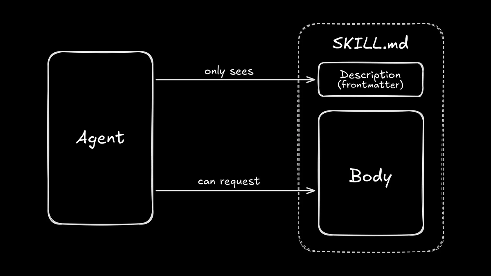
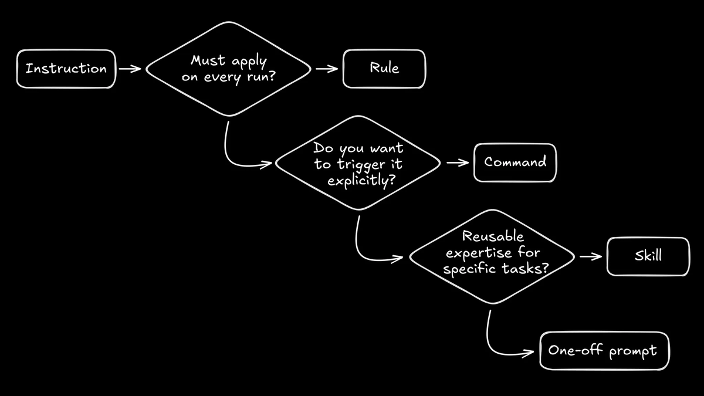
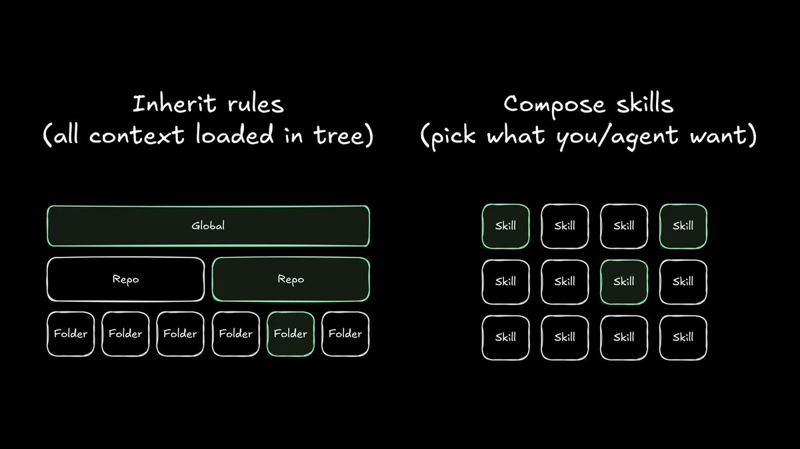
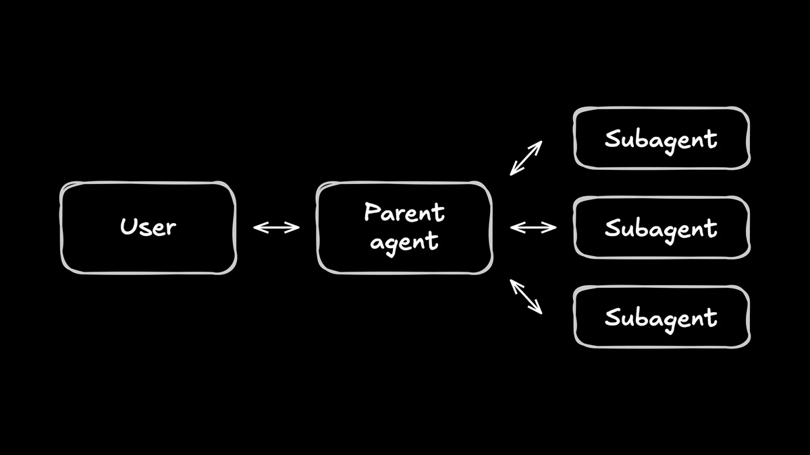

# Rules, Commands, Skills und Subagents: eine Entscheidungslogik für Agent-Setups

Wenn sich AI-Coding-Tools wie ein Ordner voller magischer Markdown-Dateien anfühlen, ist das keine Einbildung: Die Labels unterscheiden sich zwischen den Tools, aber die Verwirrung ist überall gleich. Der Artikel ordnet vier Bausteine eines Agent-Setups — Rules, Commands, Skills, Subagents — entlang zwei klarer Achsen ein: Muss die Instruktion *immer* gelten oder nur *optional*, und wird sie *explizit* ausgelöst oder *vom Modell selbst* entdeckt.

## Skills als Container mit Progressive Disclosure

Ein Skill ist ein Ordner mit genau zwei Bestandteilen: einer `SKILL.md` mit Metadaten und Instruktionen, plus optionalen Extras (Skripte, Templates, Referenzdokumente). Der Agent liest beim Sessionstart nicht jeden Skill vollständig — er scannt nur Name und Beschreibung aus dem Frontmatter. Erst wenn er entscheidet, dass ein Skill zur aktuellen Aufgabe passt, lädt er den vollen Inhalt nach.

Das hat direkte Konsequenzen dafür, wie man einen Skill schreibt: Die `description` ist fürs **Routing** gedacht, nicht zum Lesen — kurz, spezifisch, mit den Stichworten formuliert, die in echten Aufgaben tatsächlich vorkommen; eine vage oder literarische Beschreibung wird vom Modell übersehen. Der Body ist eine **Prozedur**, keine Wiki-Seite — Checklisten und Erfolgskriterien statt Fließtext, lange Referenzdokumente gehören in separate, nur bei Bedarf nachgeladene Dateien. Als aktuelle Parallele nennt der Artikel Claude Codes Tool Search, das dasselbe Progressive-Disclosure-Prinzip auf MCP-Tool-Definitionen anwendet, damit sie nicht ungefragt den Kontext füllen.

## Rule, Command oder Skill: der Litmus-Test

Der Artikel liefert ein einfaches mentales Modell für drei der vier Bausteine: **Rules** sind unveränderlich und gelten ausnahmslos immer. **Commands** sind expliziter Nutzerwille — man tippt `/command`, weil man bewusst das Steuer übernehmen will. **Skills** sind optionale Expertise, die der Agent nur zieht, wenn die konkrete Aufgabe es verlangt.

Als Daumenregel für den Rule/Skill-Grenzfall nennt der Artikel einen Litmus-Test: **Würdest du wollen, dass diese Instruktion auch gilt, wenn du gerade nicht daran denkst? Ja → Rule. Nein → Skill.** Konkrete Beispielpaare aus der Primärquelle: „Never commit `.env` files“ ist eine Rule, „Wenn du Billing-Code änderst, führe diese drei Integrationstests aus“ ist ein Skill; „Das Design-System nutzt diese Token-Namen“ ist eine Rule, „Beim Schreiben von Release Notes dieses Format und diese Checkliste befolgen“ ist ein Skill. Ein empfohlenes Muster ist, Rules als **Routing-Logik** zu formulieren, die auf Skills verweist: „Wenn du UI-Komponenten änderst, lade den `ui-change`-Skill“ — das hält den immer geladenen Prompt klein und macht den Agenten trotzdem anpassungsfähiger.

## Hierarchische Regeln vs. komponierbare Skills

Viele Tools erlauben vererbte Regeln entlang eines Verzeichnisbaums (Global → Repo → Folder, wie bei Cursor). Das funktioniert zunächst, wird aber über die Zeit unübersichtlich, weil jeder Agent in jedem Repo den gesamten geerbten Regelbaum kennen muss — auch Regeln, die für die aktuelle Aufgabe irrelevant sind.

Skills bieten laut Artikel eine komponierbare Alternative: Statt alles im Baum zu laden, wählt man gezielt die Skills aus, die zur Aufgabe passen. Eine Randnotiz zur Terminologie: Wer den Regel-Begriff über Cursor gelernt hat, meint mit „Rule“ dort teils genau das, was andere Tools „Skill“ nennen (Cursor kennt sowohl immer aktive als auch per Beschreibung intelligent zugeschaltete Rules) — ein Hinweis, dass die Begriffe zwischen Tools nicht deckungsgleich sind.

## Commands als Ergonomie-Schicht über Skills

Ein Command ist deterministisch: Man ruft ihn auf, das Tool injiziert den Prompt, der Agent führt ihn aus. Ein Skill ist ein Vorschlag: Der Agent entscheidet selbst, ob und wann er ihn lädt. Das stärkste Muster kombiniert beides — komplexe, langlebige Logik bleibt in Skills, Commands sind kurze, einprägsame Trigger, die eine oder mehrere Skills dahinter aufrufen. Beispiele aus der Primärquelle: ein `/release`-Command lädt den Release-Skill und arbeitet dessen Checkliste ab; ein `/refactor`-Command lädt zwei fachliche Skills (`tanstack`, `panda-css`) und erlaubt zusätzlich Rückgriff auf einen MCP-Server für Dokumentationsfragen. Command-Parameter lassen sich in vielen Tools — auch in Claude Codes eigenen Custom Slash Commands — positionell per `$1`, `$2` referenzieren, sodass der Prompt kurz bleibt und nur der variable Teil explizit angegeben wird.

## Skills vs. Subagents: was der Agent weiß, gegen wer die Arbeit macht

Ein Skill ändert, **was** der aktuelle Agent weiß. Ein Subagent ändert, **wer** die Arbeit macht — eigener System-Prompt, eigene Tool-Rechte, oft ein anderes Modell oder eine andere Temperatur.

Die Primärquelle nennt drei konkrete Agentenprofile als Beispiel: ein „Plan“-Agent mit reinem Lesezugriff, dessen System-Prompt ihn zu Rückfragen und einem detaillierten Umsetzungsplan anhält; ein „Build“-Agent mit einem schnelleren, günstigeren Modell, optimiert auf reine Umsetzung; ein „Review“-Agent mit einem langsameren, teureren Modell für Code-Diffs. Verbreitet ist außerdem das Subagent-Muster, bei dem ein Parent-Agent mehrere Subagents parallel startet, typischerweise für Recherche (z.B. das Auffinden verteilter Dark-Mode-Logik über mehrere Ripgrep-Suchen). Die Empfehlung der Primärquelle lautet, zuerst mit einem komponierbaren Skill zu starten und erst bei einem der folgenden Signale auf einen eigenen Agenten zu wechseln: ein grundlegend anderes Modell wird benötigt, es entstehen Rechte-Scoping-Probleme, oder der Hauptagent zeigt spürbare Kontext-Verschmutzung.

## Checkliste für gute Skills und vier Fehlermodi

Für jeden Skill sollten laut Artikel sechs Fragen beantwortet sein: **Trigger** (Description — wann genau soll geladen werden?), **Inputs** (welche Angaben braucht der Skill von Nutzer oder Repo vorab?), **Steps** (die Prozedur selbst), **Checks** (wie wird der Erfolg nachgewiesen?), **Stop conditions** (wann hält der Skill an und fragt einen Menschen?), **Recovery** (was passiert, wenn ein Check fehlschlägt?).

Vier wiederkehrende Fehlermodi werden benannt: **The Encyclopedia** — ein Skill liest sich wie eine Wiki-Seite und muss in kleinere Dateien zerlegt werden, aus denen nur das Nötige nachgeladen wird. **The Everything Bagel** — ein Skill, der auf jede einzelne Aufgabe zutrifft, ist gar kein Skill mehr, sondern gehört als Rule oder Repo-Konvention eingeordnet. **The Secret Handshake** — lädt der Agent den Skill nie, ist die Beschreibung zu abstrakt und muss an die tatsächliche Sprache der Aufgaben angepasst werden. **The Fragile Skill** — bricht ein Skill bei jeder Repo-Änderung, stecken zu viele Spezifika direkt im Skill statt in ausgelagerten Referenzdateien.

Als Starter-Bibliothek nennt der Artikel sechs Basis-Skills, die praktisch jedes Projekt braucht: Repo Orientation (wo liegen Einstiegspunkte, Tests, Konventionen), UI Changes (Design Tokens, Accessibility-Checks), Debugging (Reproduktion, relevante Logs), Verification (welche Befehle beweisen, dass etwas funktioniert), PR Hygiene (Commit-Format, Changelog) und Safety (was darf nicht gelöscht werden).

## Einordnung

Diese Notiz verschmilzt zwei Fassungen zu einer: den vollständigen englischen Original-X-Artikel (Primärquelle, per X-API erfasst inklusive „Artikel-Volltext“) und eine deutsche Aufarbeitung aus dem vibedeck-Projekt (Sekundärquelle). Prüfung ergab: Die Primärquelle ist vollständig — anders als bei mehreren anderen, sechs Monate alten Einzelposts aus demselben Erfassungs-Batch schlug hier keine Thread-Auflösung fehl, weil es sich um einen echten X-Artikel mit vollem Text handelt. Alle fünf inhaltstragenden Diagramme liegen in beiden Inbox-Ordnern bytidentisch vor (nur umbenannt). Jede Aussage der deutschen vibedeck-Fassung — inklusive der Bild-Auswahl — findet sich im vollständigen Primärtext wieder; die deutsche Fassung ist eine verkürzende Paraphrase derselben Quelle, keine eigenständige zweite Beobachtung. Sie lässt dabei die Checkliste, die vier Fehlermodi und die konkreten Rule/Skill-Beispielpaare weg, die nur im englischen Original stehen. Diese Notiz stützt sich deshalb durchgehend auf den Primärtext; es gibt keine Behauptung, die ausschließlich über die Sekundärfassung belegt wäre.

Der Artikel ist eine Meinungsäußerung einer Einzelperson, kein Benchmark. Die Autorin schreibt sichtbar im Umfeld von Builder.io (wiederholte Verweise auf `.builder/`-Pfade und Builder-Dokumentation) — das ist bei den generischen Skill-Prinzipien unproblematisch, sollte aber bei jeder produktspezifischen Aussage mitgedacht werden. Die Rule/Command/Skill-Dreiteilung und der Litmus-Test sind als Heuristik plausibel und intern konsistent, aber selbst unbelegt (`meinung`). Bemerkenswert ist die unabhängige Konvergenz mit bereits vorhandenem Bestand: Die Empfehlung „zuerst Skill versuchen, erst bei Modellwechsel/Rechte-Problemen/Kontext-Verschmutzung auf einen eigenen Agenten eskalieren“ deckt sich mit der in [[Kontrollierte-Agent-Parallelisierung]] bereits belegten Eskalationsreihenfolge Hauptthread → Subagents → Agent Teams, ohne dass die beiden Quellen sich überschneiden.

Eine Lücke im eigenen Bestand wird sichtbar: [[Erweiterungs-Ebenen-Zuordnung]] modelliert fünf Ebenen (Agent-Datei, Skills, Subagents, Hooks, MCP), aber keine eigene Ebene für Commands/Slash-Commands als expliziten, deterministischen Trigger — genau die Lücke, die dieser Artikel mit seiner Rule/Command/Skill-Dreiteilung füllt.

## Kernaussagen

- Ein Skill lädt seinen vollen Inhalt erst bei Bedarf; Agent sieht beim Start nur Name und Description → [[Skill-Qualitaet-durch-Trigger-und-Baseline-Evals]]
- Die Skill-`description` ist für Routing gemacht, nicht zum Lesen — kurz, spezifisch, mit den Stichworten echter Aufgaben → [[Skill-Qualitaet-durch-Trigger-und-Baseline-Evals]]
- Litmus-Test für den Rule/Skill-Grenzfall: Soll die Instruktion auch gelten, wenn niemand aktiv daran denkt? Ja → Rule, Nein → Skill → [[Erweiterungs-Ebenen-Zuordnung]]
- Rules lassen sich als Routing-Logik formulieren, die gezielt auf passende Skills verweist, statt selbst die volle Logik zu enthalten → [[AGENTS-md-Onboarding-Design]]
- Skills sind eine komponierbare Alternative zu vererbten, mit der Zeit unübersichtlichen Regelbäumen (Global/Repo/Folder) → [[Klein-und-komposierbar]]
- Commands sind deterministisch und explizit ausgelöst, Skills sind ein Vorschlag, den der Agent selbst zieht — dieselbe Unterscheidungsachse wie user-invoked vs. model-invoked → [[Skill-Call-Hierarchie]]
- Ein Skill ändert, was der aktuelle Agent weiß; ein Subagent ändert, wer arbeitet (System-Prompt, Tools, Modell); zuerst Skill versuchen, erst bei Modellwechsel, Rechte-Scoping-Problemen oder Kontext-Verschmutzung eskalieren → [[Kontrollierte-Agent-Parallelisierung]]
- Vier Skill-Fehlermodi mit Namen: The Encyclopedia (zu lang, nicht zerlegt), The Everything Bagel (gehört als Rule, nicht als Skill), The Secret Handshake (Description zu abstrakt, wird nie geladen), The Fragile Skill (zu viele Spezifika direkt im Skill statt ausgelagert) → [[Skill-Qualitaet-durch-Trigger-und-Baseline-Evals]]

## Verbindungen

- [[Skill-Qualitaet-durch-Trigger-und-Baseline-Evals]]
- [[Skill-Call-Hierarchie]]
- [[Klein-und-komposierbar]]
- [[Erweiterungs-Ebenen-Zuordnung]]
- [[AGENTS-md-Onboarding-Design]]
- [[Kontrollierte-Agent-Parallelisierung]]
