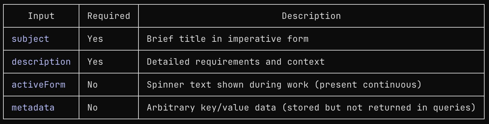
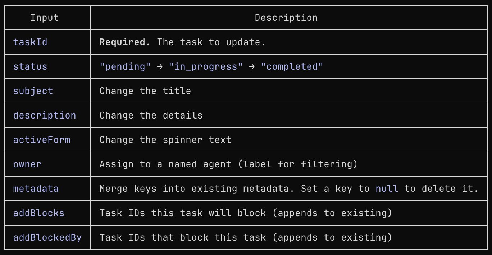
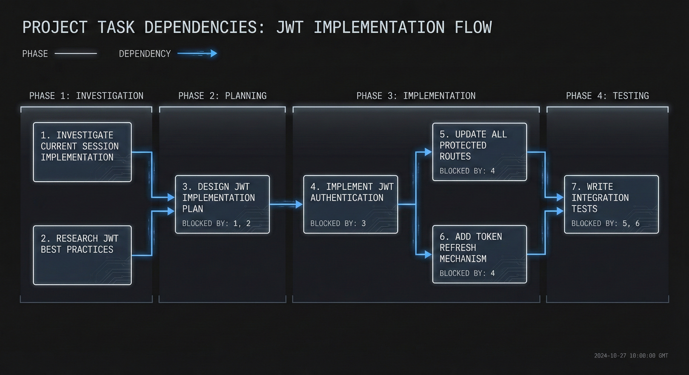
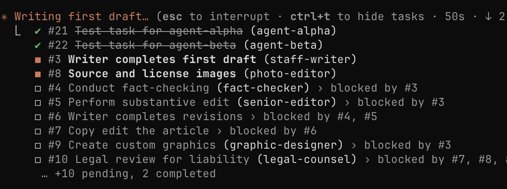
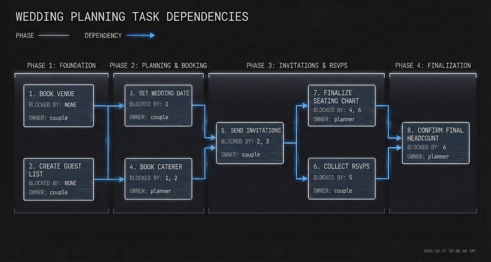

# Claude Codes Task-System: Abhängigkeitsgraph statt flacher Liste

Claude Code hat seine To-Do-Verwaltung von einer flachen Liste zu einer Orchestrierungs-Ebene mit vier eigenen Tools ausgebaut: Tasks können sich gegenseitig blockieren, überleben Context Compaction und Session-Neustarts, lassen sich benannten Agenten zuweisen und laufen parallel ab, ohne sich gegenseitig zu überschreiben. Der Artikel von Numman Ali beschreibt das Feature anhand der vier neuen Funktionsaufrufe `TaskCreate`, `TaskUpdate`, `TaskGet` und `TaskList` sowie mehrerer Screenshots aus einer echten Session.

## Vier Tools und der Abhängigkeitsgraph

`TaskCreate` legt einen neuen Task mit `subject` und `description` (beide Pflicht) sowie optional `activeForm` (Spinner-Text während der Bearbeitung, in Present Continuous, z. B. „Running database migrations“ statt „Doing stuff“) und `metadata` (beliebige Key-Value-Daten, werden gespeichert, aber nicht in Abfragen zurückgegeben) an.

`TaskUpdate` ändert einen bestehenden Task über die Pflichtangabe `taskId`. Der Status läuft strikt `pending → in_progress → completed`. `addBlocks` und `addBlockedBy` **ergänzen** die bestehenden Abhängigkeitslisten, sie ersetzen sie nicht — ein wiederholter Aufruf verliert also keine bereits gesetzte Abhängigkeit.

Der eigentliche Kern ist die Blockierlogik: `addBlockedBy: ["1", "2"]` an Task #3 bedeutet, dass #3 nicht beginnen kann, bevor #1 **und** #2 auf `completed` stehen. Am Beispiel einer JWT-Migration zeigt der Artikel sieben Tasks über vier Phasen (Investigation, Planning, Implementation, Testing): #1 (Session-Implementierung prüfen) und #2 (JWT-Best-Practices recherchieren) laufen parallel, weil sie sich nicht gegenseitig blockieren; #3 (Implementierungsplan) wartet auf beide. Nach #4 (JWT-Auth implementieren) verzweigt der Graph erneut in zwei parallele Zweige (#5 Routen aktualisieren, #6 Token-Refresh), bevor #7 (Integrationstests) beide zusammenführt.

Sobald eine Voraussetzung erfüllt ist, werden abhängige Tasks automatisch freigegeben; die Terminal-UI markiert blockierte Tasks mit einem Warnsymbol. Damit verhindert das System laut Artikel gezielt den Fehler, an einer Aufgabe zu beginnen, deren Voraussetzung noch nicht fertig ist — etwa Auth-Routen zu bauen, bevor die Datenbank steht.

## Persistenz: Zustand in Dateien statt im Chatverlauf

Jeder Task wird als eigene JSON-Datei unter `~/.claude/tasks/<list-id>/` abgelegt (`1.json`, `2.json`, … in einem gezeigten Beispiel bis `22.json`). Die `list-id` ist standardmäßig eine Session-UUID und existiert nur für die aktuelle Session. Über die Umgebungsvariable `CLAUDE_CODE_TASK_LIST_ID` — pro Terminal-Session gesetzt oder dauerhaft in `.claude/settings.json` unter `env` — bekommt die Liste eine feste, projektbezogene ID und überlebt damit auch komplette Neustarts. Weil jeder Task eine eigene Datei ist, lassen sich Task-Listen per Git versionieren, sichern/wiederherstellen und von externen Tools lesen oder schreiben. Der Artikel benennt selbst eine Grenze dieses Ansatzes: Bei dauerhaft gesetzter `CLAUDE_CODE_TASK_LIST_ID` sieht Claude jedes Mal die volle Historie, weshalb abgeschlossene Task-Sets manuell archiviert oder aufgeräumt werden müssen.

## Agent-Zuweisung, Parallelität und Modellwahl

Das Feld `owner` ist laut Artikel **ausschließlich ein Filter-Label, kein automatischer Spawn-Auslöser** — eine Klarstellung, die einer naheliegenden Fehlannahme vorbeugt. Der Ablauf: Claude legt Tasks an und weist Owner-Namen zu, spawnt dann Agenten mit dem Auftrag „finde deine Tasks und erledige sie“, und jeder Agent ruft selbst `TaskList` auf, filtert nach seinem eigenen Namen, setzt seine Tasks auf `in_progress`, arbeitet und schließt sie ab. Mehrere Agenten können in einer einzigen Nachricht gespawnt werden und aktualisieren dieselbe Liste gleichzeitig — laut Artikel ohne Konflikte, ein Mechanismus dafür wird nicht beschrieben.

Für gespawnte Agenten unterscheidet der Artikel vier Typen: **General Purpose** (lesen/schreiben/editieren/suchen/ausführen, meist implementierungslastig, üblich Sonnet), **Bash** (nur Terminal, für Git/Tests/Build, üblich Haiku), **Explore** (nur lesend, für „Wo ist X?“-Fragen, mit Gründlichkeitsstufen „quick“/„medium“/„very thorough“) und **Plan** (nur lesend, entwirft Umsetzungsstrategien vor dem eigentlichen Edit). Als Faustregel nennt der Autor: Haiku für Befehle und einfache Suche, Sonnet für die meiste Implementierungsarbeit, Opus für Architekturentscheidungen und mehrstufiges Schließen. Das Modell lässt sich pro Agent-Aufruf explizit festlegen, auch über `CLAUDE.md` oder Skills.

## Praxisbeispiel jenseits von Code

Damit die Abhängigkeitslogik nicht auf Programmieraufgaben beschränkt wirkt, zeigt der Artikel eine Hochzeitsplanung mit acht Tasks über vier Phasen: „Venue buchen“ und „Gästeliste erstellen“ haben keine Abhängigkeit und laufen parallel; „Einladungen senden“ ist blockiert durch Datum **und** Gästeliste; „Sitzordnung finalisieren“ durch Caterer **und** RSVP-Rückläufe. Das Owner-Feld unterscheidet hier zwischen `couple` und `planner` als Rollen.

Der Artikel benennt klare Einsatzgrenzen: Tasks lohnen sich ab drei Schritten, bei jeglichen Abhängigkeiten, bei Arbeit über mehrere Sessions, bei komplexen Refactorings und bei Delegation an mehrere Agenten — nicht bei schnellen Einzelfragen oder einfachen Single-File-Edits.

## Einordnung

Diese Notiz führt zwei Fassungen zusammen: die vollständige Primärquelle (X-Artikel, per API erfasst, inklusive „Artikel-Volltext“ und aller acht Originalbilder) und die deutsche vibedeck-Aufarbeitung als Sekundärquelle. Abweichend von der batch-weiten Einschätzung im Verarbeitungsplan („nur Einzelpost“ bei allen sechs sechs Monate alten Tweets dieser Charge) erwies sich die Primärquelle bei genauer Prüfung hier als **vollständig**: Sie enthält den gesamten Artikeltext samt Fazit und sogar einen zusätzlichen Abschnitt („Quick Start for Beginners“), den die Sekundärfassung weglässt. Alle acht Bilder beider Fassungen sind pixelidentisch bis auf Zuschnitt/Titelzeile — die Sekundärquelle fügt inhaltlich nichts hinzu, was sich nicht auch im Original findet, sie ist eine gekürzte deutsche Paraphrase. `beleg_art: sekundaerquelle` ist trotzdem gesetzt, weil Formulierungen dieser Notiz sich stellenweise an die vibedeck-Fassung anlehnen; anders als bei anderen Paaren dieser Charge ließ sich hier aber jede Sachaussage direkt gegen die vollständige Primärquelle prüfen.

Fachlich bleibt der Artikel eine **Produktbeschreibung aus Anwendersicht**, nicht Anthropics eigene Dokumentation und ohne jede Messung: keine Zahlen zu Erfolgsquote, Zeitersparnis oder Token-Mehrverbrauch gegenüber der alten flachen To-Do-Liste. Die Mechanik selbst (Dateispeicherung, Status-Kette, addBlocks/addBlockedBy als append-only) ist nüchtern und technisch plausibel beschrieben, deckt sich in beiden unabhängig gecrawlten Fassungen exakt und wirkt wie beobachtetes CLI-Verhalten, nicht wie Marketing. Eine Lücke bleibt: „mehrere Agenten aktualisieren dieselbe Liste ohne Konflikte“ wird behauptet, aber der Synchronisationsmechanismus (Datei-Locking? Last-Write-Wins? Merge?) nicht erklärt — im Repo-Abgleich (`external_repos/anthropics/claude-code/`) findet sich dazu nichts, das Repo enthält laut `external_repos/INDEX.md` ausdrücklich keinen Engine-Quellcode, nur Plugin-/Hook-Beispiele. Diese Aussage bleibt damit unverifizierte Anwenderbeobachtung. Die Faustregel zur Modellwahl (Haiku/Sonnet/Opus je Agent-Typ) ist ebenfalls unbelegte Erfahrung des Autors, deckt sich aber mit der bereits im Bestand notierten Spannung zu fester Rollenzuteilung vs. dynamischer Eskalation (siehe [[Modell-Eskalation-von-guenstig-nach-teuer]]).

## Kernaussagen

- Tasks können sich über `addBlockedBy`/`addBlocks` gegenseitig blockieren; abhängige Tasks werden erst nach Abschluss aller Voraussetzungen automatisch freigegeben → [[Blockierende-Task-Abhaengigkeiten]]
- Jeder Task ist eine eigene JSON-Datei unter `~/.claude/tasks/<list-id>/`; Zustand liegt damit außerhalb des Modells und ist git-versionierbar — verwandter Mechanismus zu [[Ralph-Loop-Frischer-Kontext-pro-Iteration]] (dort bewusste `.agent/`-Verzeichnisstruktur, hier native Plattform-Persistenz).
- `owner` ist reines Filter-Label; mehrere gespawnte Agenten lesen/schreiben dieselbe Liste parallel ohne beschriebenen Konflikt-Mechanismus — konkrete Umsetzung des „Shared-State/Whiteboard“-Koordinationsprinzips, das in [[Kontrollierte-Agent-Parallelisierung]] bereits diskutiert wird.
- Faustregel Haiku (Befehle/einfache Suche) → Sonnet (Implementierung) → Opus (Architektur) als feste Rollenzuteilung je Agent-Typ — dritte unabhängige Nennung derselben festen Zuordnung neben Eyad Khrais und Minty, siehe [[Modell-Eskalation-von-guenstig-nach-teuer]].
- Tasks lohnen sich erst ab drei Schritten, bei Abhängigkeiten, Cross-Session-Arbeit oder Multi-Agent-Delegation — explizite Einsatzgrenze, keine Universallösung.

## Verbindungen

- [[Task-basierte-Steuerung]] — Kontrast: dort iterative „Set Goal → Task → Adjust“-Schleife ohne vorab fixierten Graphen, hier expliziter, vorab modellierter Abhängigkeitsgraph mit festen Status-Übergängen.
- [[Kontrollierte-Agent-Parallelisierung]]
- [[Ralph-Loop-Frischer-Kontext-pro-Iteration]]
- [[Modell-Eskalation-von-guenstig-nach-teuer]]
