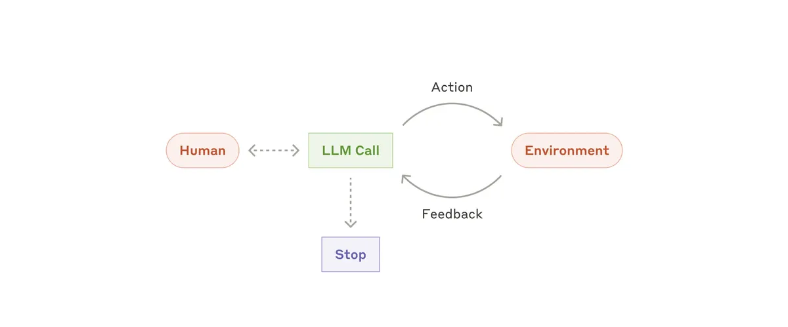
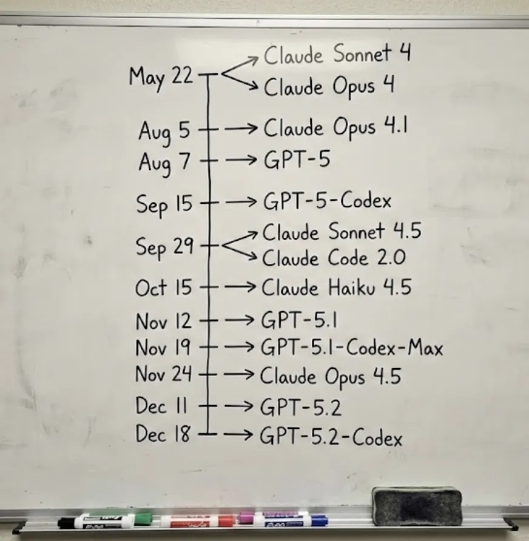
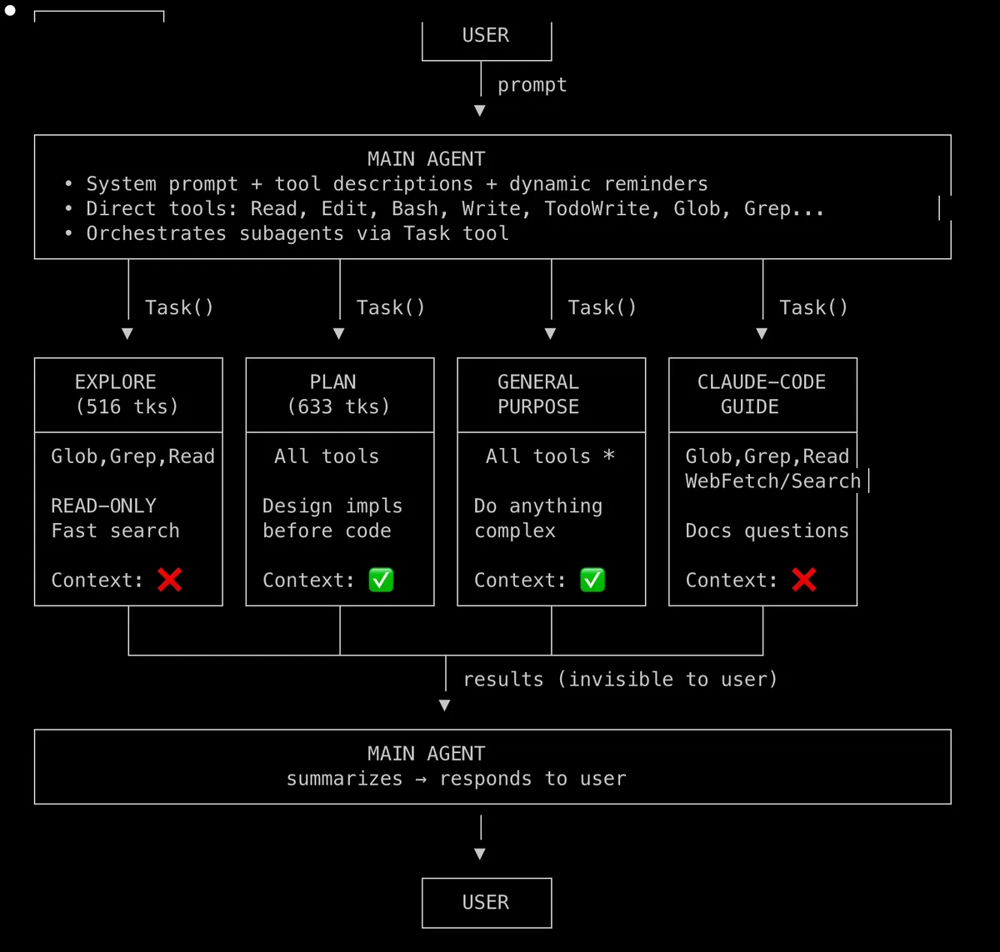
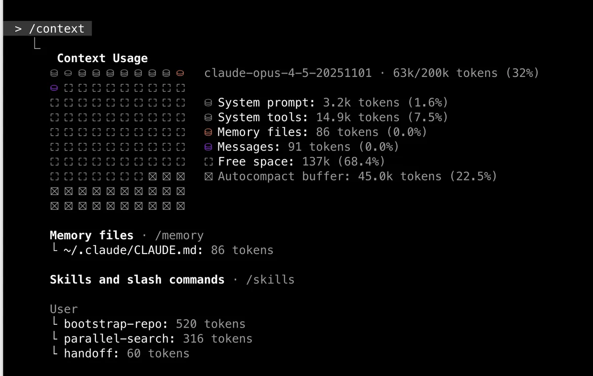
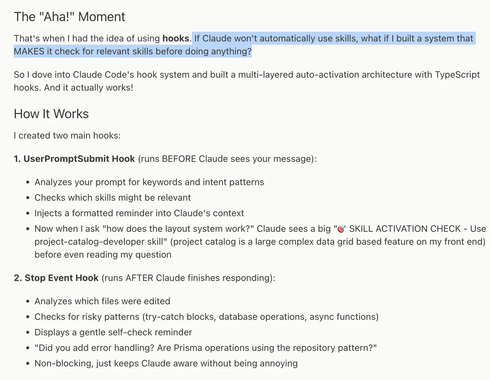

# Subagent-Kosten, Kontext-Haushalt und Cross-Model-Review: Praxisnotizen zu Claude Code 2.0

Sankalp beschreibt seinen eigenen Umstieg von einer Claude-Kündigung im September 2025 (wegen „Slop“ durch Sonnet 4.5) zurück zu Claude Code nach dem Erscheinen von Opus 4.5 im November 2025 und bündelt daraus einen praktischen Werkzeugkasten: was Subagents pro Aufruf an Kontext kosten, wie er den 200k-Token-Haushalt aktiv managt, wie er Skills per Hook technisch statt per Zufall triggert, und warum er zum Reviewen bewusst ein anderes Modell als zum Bauen einsetzt. Ein Agent ist dabei ein LLM, das proaktiv in einer Schleife Tools nutzt, um ein Ziel zu erreichen — Aktion und Feedback laufen zwischen LLM-Aufruf und Umgebung, bis das Modell selbst stoppt.

Den Hintergrund für den Stimmungswechsel liefert eine selbst gezeichnete Zeitleiste der Modell-Releases 2025: Claude Sonnet 4/Opus 4 (22. Mai), Opus 4.1 (5. August), GPT-5 (7. August), GPT-5-Codex (15. September), Claude Sonnet 4.5/Claude Code 2.0 (29. September), Claude Haiku 4.5 (15. Oktober), GPT-5.1 (12. November), GPT-5.1-Codex-Max (19. November), Claude Opus 4.5 (24. November), GPT-5.2 (11. Dezember), GPT-5.2-Codex (18. Dezember). Die Kadenz zeigt konkret, warum Sankalp von „Mithalten“ auf „sich selbst verbessern“ umgestellt hat: In sieben Monaten erschienen elf benannte Modell-Releases zweier Anbieter im Wechsel.

## Subagents mit gemessenen Kosten statt Bauchgefühl

Sankalp hat den System-Prompt des Explore-Agenten reverse-engineered und legt für einen konkreten Task-Aufruf offen, was die vier ihm sichtbaren Subagent-Typen kosten und ob sie den Hauptkontext erben:

- **Explore** — `Glob`, `Grep`, `Read`, strikt read-only, 516 Tokens Overhead, **kein** Kontext-Erbe (startet mit frischem Slate).
- **Plan** — alle Tools, für Architekturentwürfe vor dem Code, 633 Tokens Overhead, erbt den vollen Kontext.
- **General-Purpose** — alle Tools, für komplexe Mehrschritt-Recherche, erbt den vollen Kontext.
- **Claude-Code-Guide** — `Glob`, `Grep`, `Read`, `WebFetch`/`Search`, für Fragen zu Claude Code selbst, **kein** Kontext-Erbe.

Die Begründung für Explores fehlendes Kontext-Erbe: Der Hauptagent (Opus) soll die relevanten Dateien am Ende selbst lesen, nicht nur Explores Zusammenfassung — Self-Attention braucht die konkreten Details, um Paar-Beziehungen zwischen Textstellen zu bilden, die eine reine Zusammenfassung verwischt. Wer Sonnet statt Haiku für die Suche will, muss das laut Sankalp explizit anfordern („Launch explore agent with Sonnet 4.5“); `run_in_background` eignet sich für lange Skripte, deren Logs man nebenher beobachten will.

## Kontext-Haushalt: feste Puffer, aktive Checkpoints, früher Handoff

Ein `/context`-Screenshot aus einer laufenden Session bei `claude-opus-4-5-20251101` zeigt 63k von 200k Token belegt (32 %): System Prompt 3,2k Token (1,6 %), System Tools 14,9k Token (7,5 %), Memory Files 86 Token (0,0 %, aus `~/.claude/CLAUDE.md`), drei geladene Skills/Commands (`bootstrap-repo` 520 Token, `parallel-search` 316 Token, `handoff` 60 Token), 137k Token frei (68,4 %) und ein Autocompact-Puffer von 45,0k Token (22,5 %).

Bemerkenswert im Abgleich mit dem bereits erfassten `/context`-Screenshot von Jarrod Watts ([[2026-01-06-jarrodwatts-context-engineering-guide]], 80k/200k Token, 40 % Auslastung): Dort beträgt der Autocompact-Puffer ebenfalls exakt 45k Token bei ebenfalls 22,5 %. Zwei unabhängige Screenshots mit unterschiedlicher Gesamtauslastung (63k vs. 80k belegt) landen beim selben absoluten Puffer von 45k Token — das stützt die Lesart, dass der Autocompact-Puffer ein fixer Anteil des 200k-Fensters ist (22,5 % = 45k), nicht ein Anteil der jeweils aktuell belegten Tokens.

Auf die tägliche Praxis wirkt sich das über drei konkrete Werkzeuge aus: **Checkpointing** (`Esc+Esc` oder `/rewind`) springt zu einem früheren Punkt zurück und setzt dabei laut Sankalp explizit Code *und* Konversation gemeinsam zurück, nicht nur den Chatverlauf. Einen eigenen `/handoff`-Custom-Command löst Sankalp aus, bevor er die Session killt und neu startet — als bewusste Alternative zu `/compact` — und tut das nach eigener Angabe typischerweise bei rund 60 % Kontextauslastung, also deutlich vor einem erzwungenen Autocompact. Dahinter steht die generelle Beobachtung, dass ein 200k-Fenster wegen „Context Rot“ effektiv oft nur 50-60 % nutzbar ist, bevor komplexe Aufgaben an Präzision verlieren — eine Zahl, die Sankalp als Erfahrungswert nennt, nicht misst.

## Skills per Hook technisch erzwingen statt auf Trigger-Zufall zu hoffen

Ein zitiertes Beispiel aus einem anderen Blogpost zeigt einen Mechanismus, der die üblichen Skill-Beschreibungs-Trigger technisch abstützt: Ein `UserPromptSubmit`-Hook analysiert den Prompt auf Keywords und Intent, bevor Claude die Nachricht überhaupt sieht, und injiziert bei Treffer eine formatierte Erinnerung in den Kontext (Beispiel: Frage nach dem Layout-System löst „SKILL ACTIVATION CHECK — Use project-catalog-developer skill“ aus). Ein zweiter, nach der Antwort laufender `Stop`-Hook prüft die geänderten Dateien auf riskante Muster (try-catch-Blöcke, Datenbank-Operationen, async-Funktionen) und zeigt eine nicht-blockierende Selbstprüfungs-Erinnerung („Did you add error handling?“).

Sankalps eigene Advanced-Combo dazu: `CLAUDE.md` in kleine Skills aufteilen und Hooks nutzen, um Claude an die Nutzung bestimmter Skills zu erinnern, sobald bestimmte Dateien angefasst werden — ein "Do more"-Hook nach jedem `Stop` kann zusätzlich stundenlange autonome Läufe erzwingen, indem er automatisch "Mach weiter" nachschiebt.

Getrennt davon erwähnt der Artikel die MCP-Kontextfalle aus umgekehrter Richtung: Viele geladene Tool-Definitionen blähen den Kontext auf, bevor überhaupt ein Tool genutzt wird. Als Lösung nennt Sankalp knapp „MCP Code Exec“ — Claude bekommt statt vieler Tool-Definitionen eine Sandbox und schreibt selbst Code, der die MCP-Tools aufruft, statt deren Schemas dauerhaft im Kontext zu halten.

## Cross-Vendor-Rollentrennung: Claude baut, Codex prüft

Für Code-Reviews und Bug-Finding hält Sankalp GPT-5.2-Codex (Reasoning-Stufe `xhigh`) für überlegen — einfach per `/review` aufgerufen. Nach seiner Erfahrung findet es Bugs zuverlässiger, markiert Severity-Stufen (P1, P2) und liefert weniger False Positives als Claude selbst. Seine Faustregel: „Claude für die Arbeit, GPT für die Kontrolle.“ Für Backend-lastige Aufgaben lässt er zudem manchmal Codex (`xhigh`) statt Claude den Plan generieren.

## Einordnung

Der belastbarste Teil der Quelle sind die beiden echten Artefakte: der `/context`-Screenshot (bestätigt unabhängig den 45k-Token-Autocompact-Puffer aus der Watts-Quelle) und das zitierte Hook-Beispiel für Skill-Aktivierung. Die Subagent-Tokenzahlen (516/633 Token) und der reverse-engineerte Explore-System-Prompt sind dagegen Sankalps eigene, nicht offiziell dokumentierte Rekonstruktion einer einzelnen Session — plausibel, aber ein Einzelbeleg ohne Versionsangabe, der sich mit dem nächsten Claude-Code-Release ändern kann. Die 60-%-Handoff-Schwelle und die 50-60-%-Context-Rot-Heuristik sind explizit Erfahrungswerte, keine Messungen; sie reihen sich in bereits im Bestand dokumentierte, uneinheitliche Schwellenwerte ein (vgl. die Spannung in [[Kontext-Hygiene-Entscheidungsbaum]] zwischen 20-40 % und 300-400k-Token-Heuristiken). Der Cross-Vendor-Review-Vergleich (Codex findet mehr Bugs, weniger False Positives) ist reine, unbelegte Selbsteinschätzung ohne Benchmark — passt aber inhaltlich exakt zur bereits dokumentierten Praxisregel „ein Hauptagent Code, der andere Review“ in [[Kontrollierte-Agent-Parallelisierung]]. Die Meta-Erzählung um Opus 4.5 („Soul“, Amanda Askells Training auf „Persönlichkeits“-Dokumenten, der Dario-Amodei-Meme mit 538 gegen 0 Elektorenstimmen) ist erkennbar subjektive Fan-Stimmung ohne Beleg und wurde deshalb nicht als Kernaussage übernommen; das zugehörige Bild (`dario.webp`) ist reine Deko/Meme ohne Erklärwert und wurde nicht eingebettet.

## Kernaussagen

- Subagent-Typen unterscheiden sich messbar in Tool-Zugriff, Kontext-Overhead und Kontext-Vererbung: Explore (516 Token, read-only, kein Kontext-Erbe) vs. Plan (633 Token, alle Tools, volles Kontext-Erbe) → [[Action-Space-Design-nach-Modellfaehigkeit]]
- Der Autocompact-Puffer ist ein fixer 45k-Token-Anteil (22,5 %) des 200k-Fensters, unabhängig von der aktuell belegten Tokenmenge — unabhängig von zwei verschiedenen Sessions bestätigt → [[Kontext-Hygiene-Entscheidungsbaum]]
- `/rewind`/Checkpointing setzt Code und Konversation gemeinsam zurück, nicht nur den Chatverlauf → [[Kontext-Hygiene-Entscheidungsbaum]]
- Ein aktiv ausgelöster `/handoff` bei ca. 60 % Kontextauslastung wird als bewusste Alternative zum automatischen `/compact` eingesetzt → [[Handoff-Doc]], [[Kontext-Hygiene-Entscheidungsbaum]]
- Cross-Vendor-Rollentrennung beim Coden: ein Modell/Anbieter baut, ein anderer reviewt (Claude Code + GPT-5.2-Codex `xhigh` für Severity-getaggtes Review mit weniger False Positives) → [[Kontrollierte-Agent-Parallelisierung]]
- Skills laden spezialisiertes Wissen per Progressive Disclosure nach, Plugins bündeln Skills, Commands und MCPs zu einem Paket → [[Skill-Call-Hierarchie]], [[Klein-und-komposierbar]]
- Ein `UserPromptSubmit`-Hook kann Skill-Relevanz vor jeder Antwort technisch erzwingen (Keyword-/Intent-Analyse, injizierte Erinnerung), ein `Stop`-Hook danach riskante Code-Muster gegenprüfen → neu vorgeschlagen: [[Hook-erzwungene-Skill-Aktivierung]], verwandt: [[Skill-Qualitaet-durch-Trigger-und-Baseline-Evals]]
- MCP Code Execution ersetzt viele dauerhaft geladene Tool-Definitionen durch eine Sandbox, in der das Modell selbst Aufruf-Code schreibt → neu vorgeschlagen: [[MCP-Code-Execution-statt-Tool-Definitionen]], verwandt: [[Erweiterungs-Ebenen-Zuordnung]]

## Verbindungen

- [[Kontext-Hygiene-Entscheidungsbaum]]
- [[Action-Space-Design-nach-Modellfaehigkeit]]
- [[Kontrollierte-Agent-Parallelisierung]]
- [[Handoff-Doc]]
- [[Skill-Call-Hierarchie]]
- [[Erweiterungs-Ebenen-Zuordnung]]
- [[2026-01-06-jarrodwatts-context-engineering-guide]]
