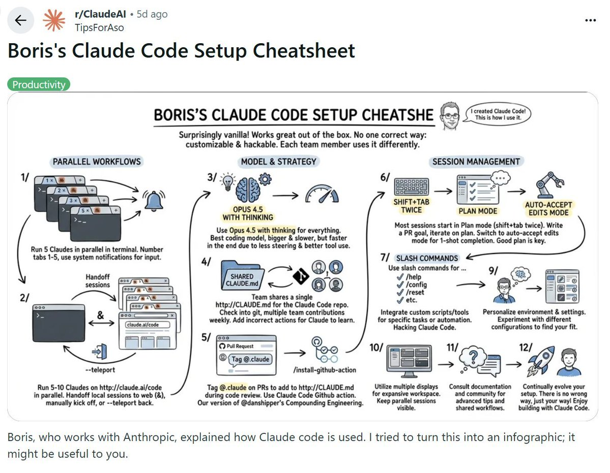
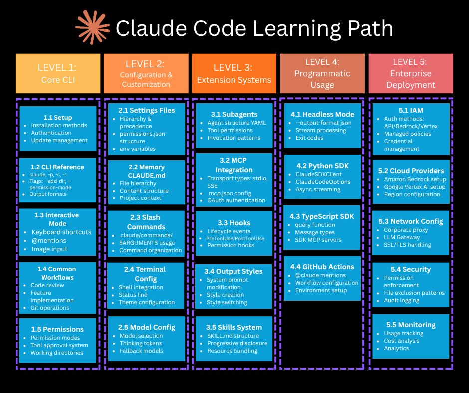
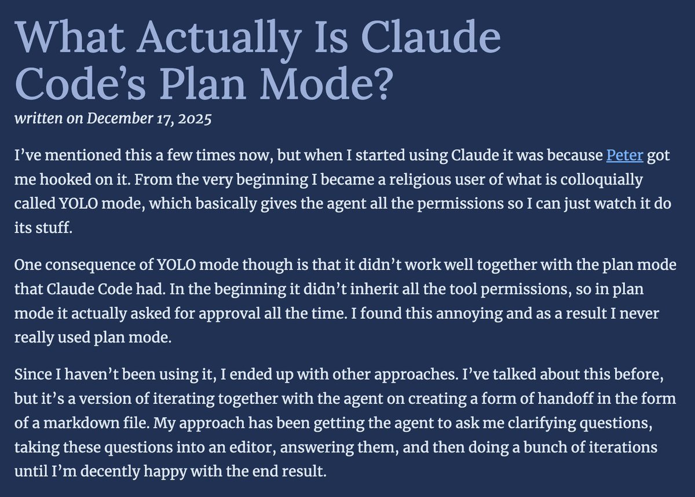
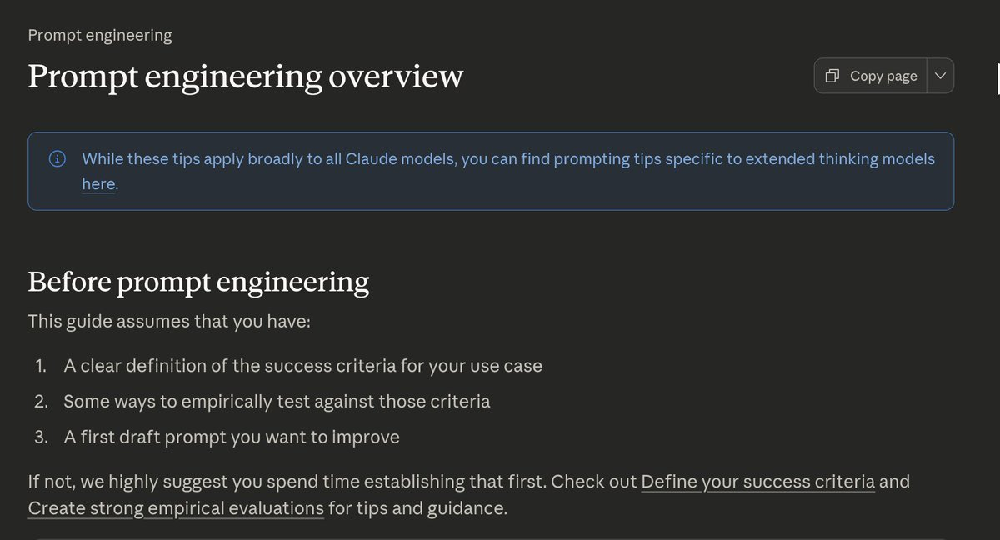

# Claude Code Starter Pack: Boris' Setup, ein Fünf-Stufen-Lernpfad und ein zweifelhafter „bester Prompt“

Der „Claude Code Starter Pack“ ist eine kuratierte Linkliste — vier bis sechs Kategorien mit Verweisen auf fremde Threads, Artikel und Repos, angeblich das „1%“ aus über 50 gelesenen Quellen. Für diese Notiz zählt nicht die Kuration selbst (unbelegte Selbstauskunft des Autors), sondern der Inhalt der eingebetteten Bilder: Zwei davon enthalten eigenständige, übertragbare Aussagen, die im Fließtext des Tweets fehlen. Der Rest der Liste sind reine Ressourcen-Verweise ohne eigenen Methodengehalt.

## Boris Chernys Setup: Parallelität, Modellwahl und eine geteilte CLAUDE.md

Das zweite verlinkte Bild ist ein von einem Reddit-Nutzer (u/TipsForAso) aus einem Thread des Claude-Code-Schöpfers Boris Cherny erstelltes Infografik-Cheatsheet — also schon zwei Weiterverarbeitungsstufen von der Primäraussage entfernt (Boris → Reddit-Infografik → aiedge-Kuration → vibedeck-Übersetzung).

Drei Cluster mit echtem Arbeitsweise-Gehalt:

**Parallelität.** Fünf Claude-Instanzen laufen in nummerierten Terminal-Tabs, System-Notifications signalisieren, wenn eine Instanz Eingabe braucht. Parallel dazu 5-10 Sessions über `claude.ai/code` im Browser, mit `--teleport` zwischen lokaler und Web-Session wechselbar.

**Modellwahl.** Boris nutzt laut Cheatsheet „Opus 4.5 mit Thinking für (praktisch) alles“ — Begründung: das größere Modell sei zwar langsamer pro Antwort, aber durch weniger Steering-Aufwand und besseres Tool-Use am Ende schneller. Das ist eine unbelegte Selbsteinschätzung ohne Zahl, aber sie widerspricht der Grundrichtung von [[Modell-Eskalation-von-guenstig-nach-teuer]] direkt: Dieses Pattern empfiehlt, mit dem günstigsten plausiblen Modell zu starten und erst bei Stillstand hochzuschalten. Boris' Position deckt sich stattdessen eher mit der bereits im Pattern dokumentierten Anthropic-Gegenposition „beim Default starten, nach Fehlerbild diagnostizieren“ — mit dem Zusatz, dass er den Default für praktisch alle Aufgaben bereits auf das teuerste Modell legt.

**Geteilte CLAUDE.md und GitHub-Review-Automation.** Das Team pflegt eine einzelne, ins Git-Repo eingecheckte `CLAUDE.md`, an der mehrere Personen wöchentlich mitschreiben („add incorrect actions so Claude can learn“). Zusätzlich ist eine GitHub Action installiert, die auf `@claude`-Tags in Pull-Request-Kommentaren reagiert — im Cheatsheet ausdrücklich als „unsere Version von @danshipper's Compounding Engineering“ bezeichnet. Das ist im Kern exakt der bereits belegte Mechanismus aus [[CI-Agent-mit-Review-Gate]] (Event-Trigger per Kommentar, Ergebnis läuft über den bestehenden PR-Prozess), hier zusätzlich mit der Praxis aus [[AGENTS-md-Onboarding-Design]] verbunden: die Agent-Datei wird nicht einmalig geschrieben, sondern laufend aus beobachteten Fehlern heraus gepflegt.

**Session-Handling.** `Shift+Tab` zweimal für Plan Mode, danach Wechsel in den Auto-Accept-Edits-Mode für „One-Shot Completion“ — plus Slash Commands zum Personalisieren/Hacken des eigenen Setups.

## Fünf-Stufen-Lernpfad: von der CLI bis zum Enterprise-Deployment

Die Grafik ordnet Claude-Code-Wissen in eine Reihenfolge nach Reifegrad statt nach Verantwortung: **Level 1 Core CLI** (Setup, Auth, CLI-Referenz, interaktiver Modus, Permissions), **Level 2 Configuration & Customization** (Settings-Hierarchie, `CLAUDE.md`-Memory-Hierarchie, Slash Commands, Terminal-Konfiguration, Modellwahl/Thinking-Tokens), **Level 3 Extension Systems** (Subagents, MCP-Integration, Hooks mit Lifecycle-Events, Output Styles, Skills-System mit Progressive Disclosure und Resource Bundling), **Level 4 Programmatic Usage** (Headless-Modus mit `--output-format json`, Python-/TypeScript-SDK, GitHub Actions) und **Level 5 Enterprise Deployment** (IAM, Cloud-Provider-Setup, Netzwerkkonfiguration, Security, Monitoring).

Die Level 2 und 3 dieser Grafik decken sich inhaltlich fast vollständig mit den fünf Erweiterungsebenen aus [[Erweiterungs-Ebenen-Zuordnung]] (Agent-Datei, Skills, Subagents, Hooks, MCP) — eine weitere, unabhängige Quelle, die dieselbe Kategorisierung bestätigt, wenn auch aus der Perspektive einer Lernreihenfolge statt einer Verantwortungs-Heuristik. Neu gegenüber dem bestehenden Pattern sind die zusätzlichen Achsen Level 4 (SDK/Headless/CI als eigene Kompetenzstufe) und Level 5 (Enterprise-Betrieb: IAM, Netzwerk, Monitoring) — beides Themen, die im bestehenden Pattern nicht als eigene Ebene, sondern gar nicht auftauchen. Diese Grafik selbst nennt aber keine Begründung oder Erfahrungswert dazu, warum genau diese Reihenfolge oder Gruppierung sinnvoll ist — sie ist eine Gliederung, kein Erfahrungsbericht.

## Plan Mode in der Praxis: warum ein Power-User sie umgeht

Der verlinkte Artikel (lucumr.pocoo.org, 17.12.2025) beschreibt eine Ablehnung von Plan Mode aus der Praxis: Der Autor arbeitet standardmäßig im „YOLO-Modus“ (volle Tool-Rechte). Frühe Versionen von Plan Mode erbten diese Rechte nicht automatisch, sodass Plan Mode ständig neue Freigaben anfragte — das empfand der Autor als störend genug, um Plan Mode dauerhaft zu meiden. Stattdessen etablierte er ein eigenes Vorgehen: den Agenten Klärungsfragen stellen lassen, diese Fragen in eine Markdown-Datei übertragen, dort beantworten, dann iterieren, bis das Ergebnis passt.

Das ist in der Funktionsweise eine eigenständige, funktional passende Umsetzung von [[Handoff-Doc]] (Zustand und offene Fragen landen in einem Dokument statt im flüchtigen Kontext) — hier nicht zur Session-Fortsetzung genutzt, sondern als bewusste Alternative zu Plan Mode selbst. Das steht in Spannung zu [[Plan-first-mit-getrenntem-Review]], das Plan Mode als sinnvollen Standardschritt vor der Ausführung beschreibt: Diese Quelle zeigt einen Fall, in dem eine frühere technische Einschränkung (fehlende Rechte-Vererbung) einen erfahrenen Nutzer dauerhaft von Plan Mode weggetrieben hat, obwohl das Grundbedürfnis (klären vor Ausführen) dasselbe blieb — nur über ein anderes Werkzeug gelöst. Ob die Rechte-Vererbung in aktuellen Claude-Code-Versionen weiterhin fehlt, sagt der Artikel (Stand Dezember 2025) nicht; das ist eine zeitgebundene Beobachtung, keine grundsätzliche Kritik an Plan Mode als Konzept.

## Vor dem Prompt: Erfolgskriterien und Evals

Die verlinkte Anthropic-Dokumentation zu Prompt Engineering benennt explizit drei Voraussetzungen, bevor Prompt-Iteration überhaupt sinnvoll ist: eine klare Definition von Erfolgskriterien, eine Methode, um empirisch gegen diese Kriterien zu testen, und einen ersten Prompt-Entwurf, den man verbessern will. Das ist eine offizielle Bestätigung des Grundgedankens aus [[Testharness-als-staerkster-Hebel]] — dass nicht der Prompt selbst, sondern die Qualität der Verifikation den Fortschritt bestimmt — hier allerdings auf Prompt-Iteration im Allgemeinen bezogen, nicht spezifisch auf autonome Coding-Agenten.

## Der „beste Claude Code Prompt“: Vision statt Klärung

Das dritte Bild zeigt einen vollständigen, zum Kopieren gedachten System-Prompt, den die Quelle als „The Single Best Claude Code Prompt“ bewirbt. Der Prompt weist das Modell an, sich als „Craftsman“, „Artist“ und „engineer who thinks like a designer“ zu verstehen, ruft `ultrathink` auf, verlangt sechs Prinzipien (u. a. „Plan Like Da Vinci“, „Craft, Don't Code“, „Iterate Relentlessly“) und schließt mit einem Abschnitt „The Reality Distortion Field“, der explizit an Steve-Jobs-Rhetorik anschließt („the people who are crazy enough to think they can change the world are the ones who do“).

Fachlich einzuordnen: Das ist ein reiner Persona-/Vision-Priming-Prompt ohne jede Klärungslogik — er fragt nichts, benennt keine Erfolgskriterien und adressiert keine Unknowns. Das steht in direktem Gegensatz zur Kernthese von [[Fable-Unknowns-vor-Prompt-Qualitaet]], wonach der Engpass agentischer Arbeit nicht die Prompt-Qualität, sondern unausgesprochenes Wissen und blinde Flecken sind — und dass stärkere Modelle Ambiguität selbstbewusst auflösen, statt sie offenzulegen. Ein Prompt, der das Modell explizit zu größerer Gewissheit und Selbstüberzeugung anstacheln soll („Make me feel the beauty of the solution before it exists“), verschärft dieses Risiko eher, als es zu mindern. Die Quelle selbst liefert keinen Vorher-Nachher-Vergleich, keine Zahl und keinen Hinweis, wie „der beste Prompt“ gemessen wurde — die Behauptung ist reine Werbesprache.

## Einordnung

Von den neun im Frontmatter angekündigten lokalen Medien liegen tatsächlich acht Dateien vor (Befund, siehe Abschlussbericht); zwei davon (`header-p1.jpg`, `header-p2.jpg`) sind reine Trenngrafiken ohne Aussagewert und wurden entsprechend der Bildregeln aus `artikel-format.md` nicht referenziert. Die Quelle ist eine kuratierte Linkliste — der Großteil der referenzierten Ressourcen (System-Prompt-Release-Notes, SkillsMP, Chrome Extension, Anthropic Academy, diverse Reddit-/Medium-Artikel ohne eingebettetes Bild) enthält keinen eigenen Methodengehalt, den diese Notiz prüfen könnte, sondern nur einen Link. Substanz liefern ausschließlich die eingebetteten Bilder selbst, nicht der umgebende Fließtext des Tweets.

Bemerkenswert ist die Belegkette bei Boris Chernys Setup: Bereits die Source-Notiz [[2026-01-21-aiedge-claude-50-pro-tips]] desselben Autors (AI Edge) zitiert Boris' „vanilla“-Setup und denselben humanlayer.dev-CLAUDE.md-Guide. Das ist keine unabhängige Zweitbestätigung — derselbe Autor zitiert sich über zwei Threads hinweg selbst. Die hier vorliegende Infografik liefert aber tatsächlich neue Details (Parallelitäts-Mechanik, Modellwahl-Begründung, GitHub-Action-Review-Gate), die in der früheren Notiz fehlten; diese Details werden entsprechend als eigenständige Belege behandelt, ohne die Konfidenz der betroffenen Patterns anzuheben, wenn sie bereits auf `mehrfach-belegt` oder höher stehen.

Der „beste Prompt“ ist der schwächste Teil dieser Quelle: eine unbelegte Superlativ-Behauptung mit Marketing-Sprache, die der bereits dokumentierten Kritik an reiner Prompt-Qualität als Hebel widerspricht, ohne diese Spannung selbst zu erwähnen. Die Lernpfad-Grafik und der Plan-Mode-Artikelausschnitt sind dagegen sachlich und decken sich gut mit dem Bestand.

## Kernaussagen

- Fünf Claude-Instanzen laufen parallel in nummerierten Terminal-Tabs mit System-Notifications; zusätzlich 5-10 Web-Sessions über `claude.ai/code`, mit `--teleport` zwischen lokal und Web wechselbar → [[Kontrollierte-Agent-Parallelisierung]]
- Boris Cherny nutzt laut Cheatsheet Opus 4.5 mit Thinking für praktisch alles, mit der unbelegten Begründung, weniger Steering-Aufwand mache das größere Modell am Ende schneller → Spannung zu [[Modell-Eskalation-von-guenstig-nach-teuer]]
- Team pflegt eine einzelne, ins Repo eingecheckte `CLAUDE.md` mit wöchentlichen Beiträgen mehrerer Personen, ergänzt aus beobachteten Fehlern → [[AGENTS-md-Onboarding-Design]]
- GitHub Action reagiert auf `@claude`-Tags in PR-Kommentaren, als eigene Umsetzung von „Compounding Engineering“ bezeichnet → [[CI-Agent-mit-Review-Gate]]
- Fünf-Stufen-Lernpfad (Core CLI → Configuration → Extension Systems → Programmatic Usage → Enterprise Deployment) bestätigt die Kategorisierung aus dem Bestand und ergänzt zwei zusätzliche Reifegrad-Stufen (SDK/Headless, Enterprise-Betrieb) → [[Erweiterungs-Ebenen-Zuordnung]]
- Autor meidet Plan Mode wegen fehlender Tool-Rechte-Vererbung (Stand Dez. 2025) und ersetzt sie durch Klärungsfragen des Agenten, die in einer Markdown-Datei beantwortet werden → [[Handoff-Doc]], Spannung zu [[Plan-first-mit-getrenntem-Review]]
- Anthropics Prompt-Engineering-Doku nennt Erfolgskriterien und empirische Tests als Voraussetzung vor jeder Prompt-Iteration → [[Testharness-als-staerkster-Hebel]]
- „Bester Claude Code Prompt“ ist ein reiner Persona-/Vision-Priming-Prompt ohne Klärungslogik, unbelegt als „bester“ beworben → Spannung zu [[Fable-Unknowns-vor-Prompt-Qualitaet]]

## Verbindungen

- [[Kontrollierte-Agent-Parallelisierung]]
- [[Modell-Eskalation-von-guenstig-nach-teuer]]
- [[AGENTS-md-Onboarding-Design]]
- [[CI-Agent-mit-Review-Gate]]
- [[Erweiterungs-Ebenen-Zuordnung]]
- [[Handoff-Doc]]
- [[Plan-first-mit-getrenntem-Review]]
- [[Testharness-als-staerkster-Hebel]]
- [[Fable-Unknowns-vor-Prompt-Qualitaet]]
- [[2026-01-21-aiedge-claude-50-pro-tips]]
