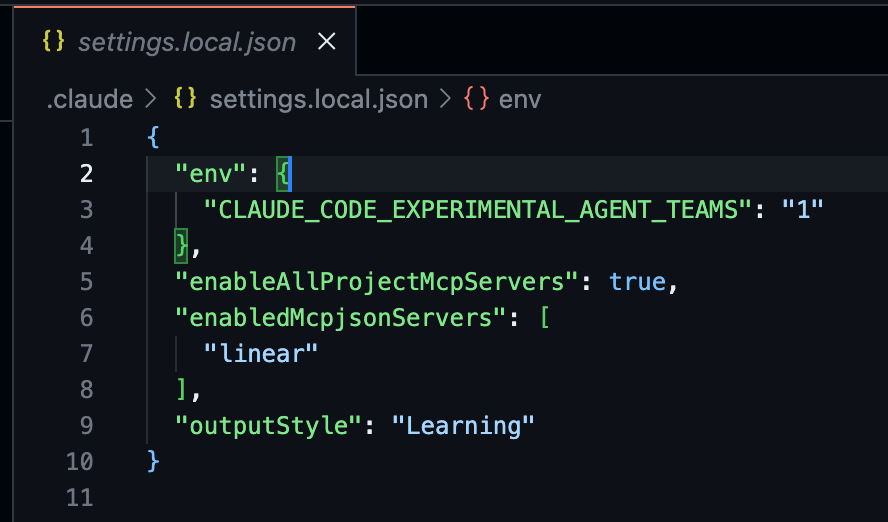
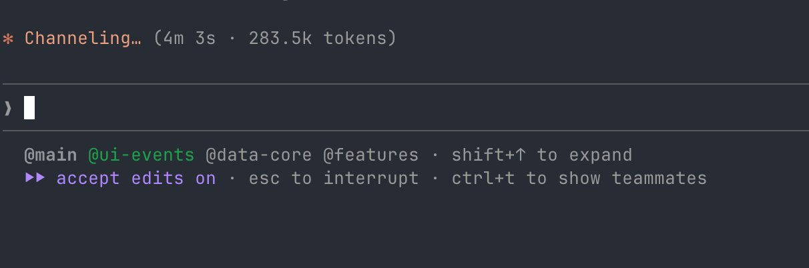
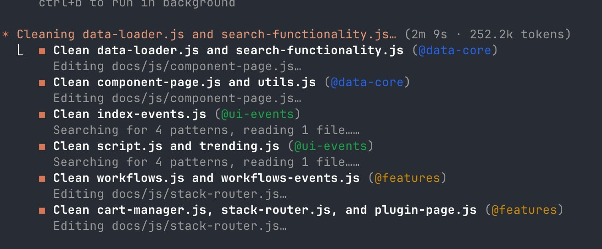
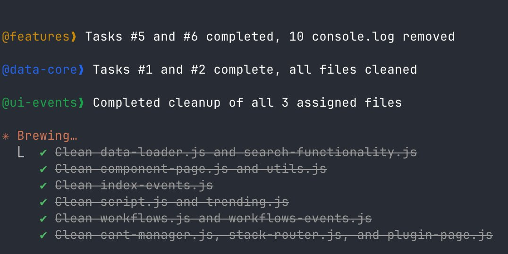
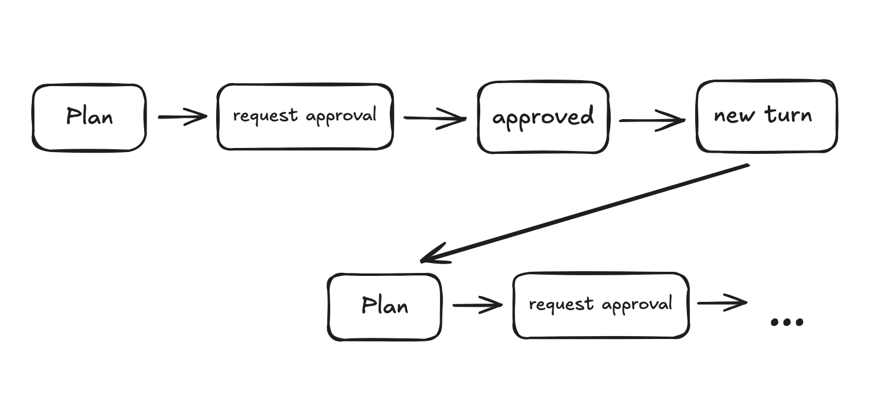

# Agent Teams in Claude Code: drei Regeln und die Rolle des Plan Mode

Daniel San beschreibt seine Praxiserfahrung mit Claude Codes experimentellen Agent Teams: mehrere Teammates arbeiten unter einem Team-Lead an einer Aufgabe, koordiniert nicht durch Konversation, sondern durch Struktur — geteilte Task-Liste, Nachrichten und eine gemeinsam geladene `CLAUDE.md`. Die Quelle liegt als vollständiger X-„Artikel“ mit eigenem Volltext-Abschnitt und sechs Originalbildern vor (nicht nur als abgeschnittener Einzelpost); die deutsche vibedeck-Aufarbeitung übersetzt denselben Inhalt, ergänzt aber keine eigenständigen Fakten. Eine Ausnahme: die vibedeck-Fassung lässt ein Bild und eine Detailaussage zum Plan Mode aus, die nur im englischen Original stehen (siehe unten).

## Aktivierung und Grundhaltung

Die Aktivierung ist eine einzeilige Konfiguration: `"CLAUDE_CODE_EXPERIMENTAL_AGENT_TEAMS": "1"` in der `settings.json`, keine weiteren Abhängigkeiten.



Teams werden nicht manuell zusammengestellt, sondern per Aufgabenbeschreibung angefordert, zum Beispiel: „Entferne alle Debug-`console.log`-Statements aus `docs/js/`. Erstelle ein Agent-Team, teile die Arbeit nach Datei-Zugehörigkeit auf, damit niemand dieselbe Datei editiert.“ Claude Code erstellt daraufhin das Team, zerlegt die Arbeit in Tasks, spawnt Teammates und koordiniert den weiteren Ablauf selbst.

## Wie Teammates tatsächlich koordinieren

Drei Beobachtungen werden laut Autor schnell klar: Jeder Teammate läuft in einem eigenen, isolierten Context Window; es gibt keine geteilte Konversationshistorie zwischen den Teammates; und alle Teammates laden beim Start automatisch dieselbe `CLAUDE.md`. Kommunikation läuft über Nachrichten und eine gemeinsame Task-Liste, nicht über freie Konversation — Koordination entsteht also durch Struktur, nicht durch Dialog.



## Die drei Regeln für den Team-Split

### 1. Modulgrenzen definieren

Der Team-Lead liest die `CLAUDE.md`, um zu entscheiden, wie er Dateien auf Teammates verteilt. Je klarer die Modulgrenzen dort beschrieben sind, desto präziser der Split — zum Beispiel als Tabelle:

```markdown
## Independent Modules
| Module  | Directory | Notes                     |
|---------|-----------|---------------------------|
| API     | api/      | Jede Datei ist unabhängig |
| CLI     | src/      | Kernlogik                 |
| Website | docs/js/  | Statischer Content        |

**Shared Files (Koordination vor Bearbeitung nötig):**
- package.json
- tsconfig.json
```

Im konkreten Testlauf des Autors wies Claude Code, nachdem es die Projektstruktur gelesen hatte, jedem Teammate eine explizite Dateiliste zu und bereinigte `console.log`-Aufrufe in **9 Dateien ohne einen einzigen Konflikt**. Das ist ein selbstberichtetes Einzelergebnis (n=1, eigener Testlauf des Autors), keine Benchmark-Messung — aber ein konkreter Beleg dafür, dass eine explizite Modulgrenzen-Tabelle den Split tatsächlich verbessert.



### 2. Projektkontext kurz und operational halten

Jeder Teammate lädt die `CLAUDE.md` beim Start, erbt aber nicht die Konversation des Leads. Ist die `CLAUDE.md` vage, exploriert jeder Teammate die Codebase eigenständig und verbrennt dabei Tokens. Empfohlenes Format:

```markdown
## Quick Context
- **Stack**: Node.js CLI + Statische Seite + Vercel Serverless
- **Entry Point**: src/index.js
- **Tests**: Jest (`npm test`)
- **Database**: Neon
```

Der Autor nennt den Multiplikator explizit: Drei Teammates, die gleichzeitig Kontext laden, bedeuten die dreifache Token-Kostenbasis, wenn dieser Kontext erst durch eigenständige Exploration statt durch schnelles Lesen erschlossen werden muss.

### 3. Verifikation für das Projekt definieren

Listet die `CLAUDE.md` auf, wie Erfolg geprüft wird (z.B. `npm test`, `npm run lint`, `npm run build`), nutzen Teammates diese Signale, um ihre eigene Arbeit zu bestätigen. Im beschriebenen Cleanup-Fall verifizierten die Teammates selbstständig per `grep`, weil die Aufgabe das Entfernen von `console.log`-Aufrufen war — Claude Code wählte laut Autor die passende Prüfmethode automatisch zur Aufgabe.



Ohne Eingreifen des Leads meldeten die Teammates danach selbstständig, was sie getan hatten (Beispiel aus dem Bild: „Tasks #5 and #6 completed, 10 console.log removed“). Klare Regeln in der `CLAUDE.md`, klare Reports zurück.

## Plan Mode: pro Zug neu bewertet, aber pro Teammate fixiert

Eine Detailbeobachtung, die **nur im englischen Original steht und in der vibedeck-Fassung fehlt**: Plan Mode wird in Agent Teams bei jedem Zug neu evaluiert, nicht nur einmal beim Start eines Teammates.



Das macht Plan Mode laut Autor geeignet für reine Design-Rollen (ein Teammate, der nur Architektur prüft) und für die anfängliche Formung komplexer Aufgaben. Für die eigentliche Ausführung ist es dagegen effizienter, Teammates gleich im Standard-Modus zu spawnen, um den Workflow flüssig zu halten. Wichtig — und im Original explizit, in der Sekundärfassung nicht übernommen: **Der Modus eines Agenten bleibt für dessen gesamte Lebensdauer fixiert.** Man wählt Plan- oder Standard-Modus also pro Teammate beim Spawnen, nicht als laufend umschaltbare Einstellung.

## Einordnung

Das ist ein Erfahrungsbericht einer einzelnen Person über einen einzelnen Cleanup-Task (Debug-Statements aus `docs/js/` entfernen), kein kontrollierter Vergleich. Die Zahl „9 Dateien, null Konflikte“ ist selbstberichtet und nicht gegen eine Kontrollgruppe ohne Modulgrenzen-Tabelle getestet — plausibel, aber nicht gemessen. Die drei Regeln (Modulgrenzen, kurzer Kontext, klare Verifikation) sind als Mechanik glaubwürdig, weil sie sich unmittelbar aus der beschriebenen Architektur ergeben (isolierte Context Windows, keine geteilte Historie, gemeinsam geladene `CLAUDE.md`), decken sich aber auch inhaltlich fast wortgleich mit einem bereits vorhandenen internen Wiki-Kompilat ([[2026-04-17-wiki-compiler-agent-teams-in-claude-code]]), das laut eigenem Vermerk unter anderem genau diesen Autor (@dani_avila7) zusammenfasst. Diese Notiz ist also die direkte Primärquelle hinter jenem bereits vorhandenen Beleg in [[Kontrollierte-Agent-Parallelisierung]] — keine unabhängige Zweitbestätigung, auch wenn sie hier erstmals im Volltext mit Bildern vorliegt und zusätzliche Details (Modulgrenzen-Tabelle, 9-Dateien-Beispiel, Token-Multiplikator, Plan-Mode-Mechanik) beisteuert, die im Wiki-Kompilat nicht stehen.

Neu und in keinem der bestehenden Patterns abgedeckt ist die Plan-Mode-Mechanik in Agent Teams: dass die Bewertung pro Zug erfolgt, der gewählte Modus (Plan vs. Standard) aber für die gesamte Lebensdauer eines Teammates fest ist. Das ist ein eigenständiger Mechanismus, kein Duplikat von [[Plan-first-mit-getrenntem-Review]] (das behandelt Planung/Review als Prozessschritt, nicht die Laufzeit-Semantik des Plan-Mode-Feature in Claude Code) und auch kein Duplikat der bereits belegten Team-Mechanik aus jasonzhou (`TeamCreate`/`TaskCreate`/`SendMessage`) in [[Kontrollierte-Agent-Parallelisierung]].

## Kernaussagen

- Drei Voraussetzungen für kollisionsfreie Agent Teams — klare Modulgrenzen, kurzer operationaler Kontext, definierte Verifikationssignale — bestätigt mit konkretem Einzelbeispiel (9 Dateien, 0 Konflikte, selbstberichtet) → [[Kontrollierte-Agent-Parallelisierung]]
- Jeder Teammate lädt die `CLAUDE.md` unabhängig; N Teammates bedeuten den N-fachen Token-Kostenfaktor für Kontext-Exploration, wenn die Datei vage bleibt → [[Kontrollierte-Agent-Parallelisierung]]
- Teammates verifizieren ihre eigene Arbeit anhand von in der `CLAUDE.md` gelisteten Signalen und berichten das Ergebnis selbstständig, ohne Eingreifen des Leads → [[Kontrollierte-Agent-Parallelisierung]]
- Plan Mode wird in Agent Teams bei jedem Zug neu evaluiert, aber der gewählte Modus eines Teammates ist für dessen gesamte Lebensdauer fixiert — nur im Original belegt, in der Sekundärfassung nicht übernommen → [[Kontrollierte-Agent-Parallelisierung]]

## Verbindungen

- [[Kontrollierte-Agent-Parallelisierung]]
- [[AGENTS-md-Onboarding-Design]]
- [[2026-04-17-wiki-compiler-agent-teams-in-claude-code]]
- [[2026-02-07-jasonzhou-claude-code-agent-teams]]
