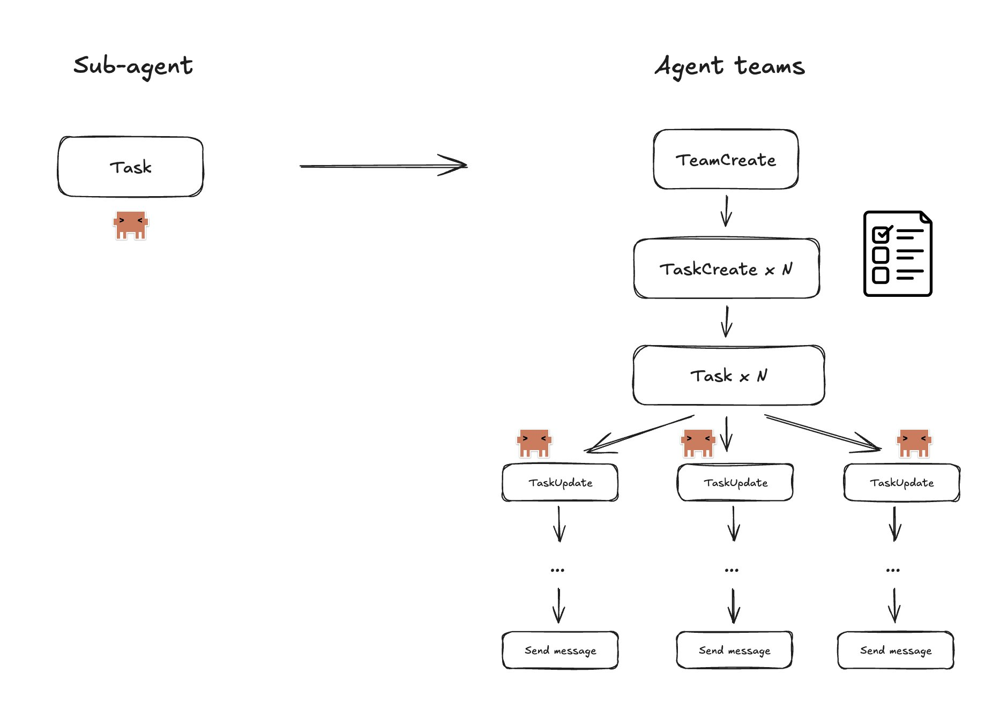
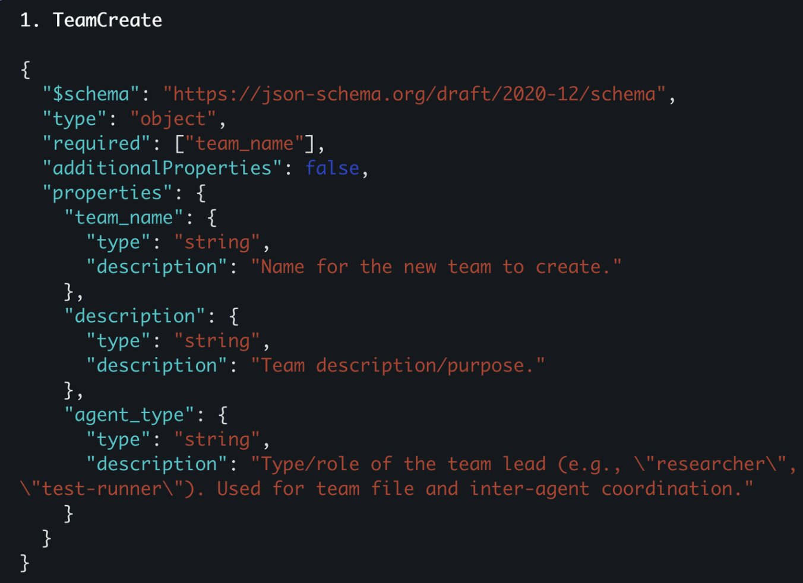
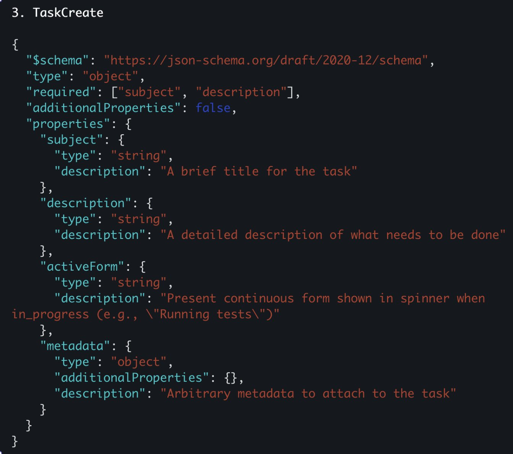
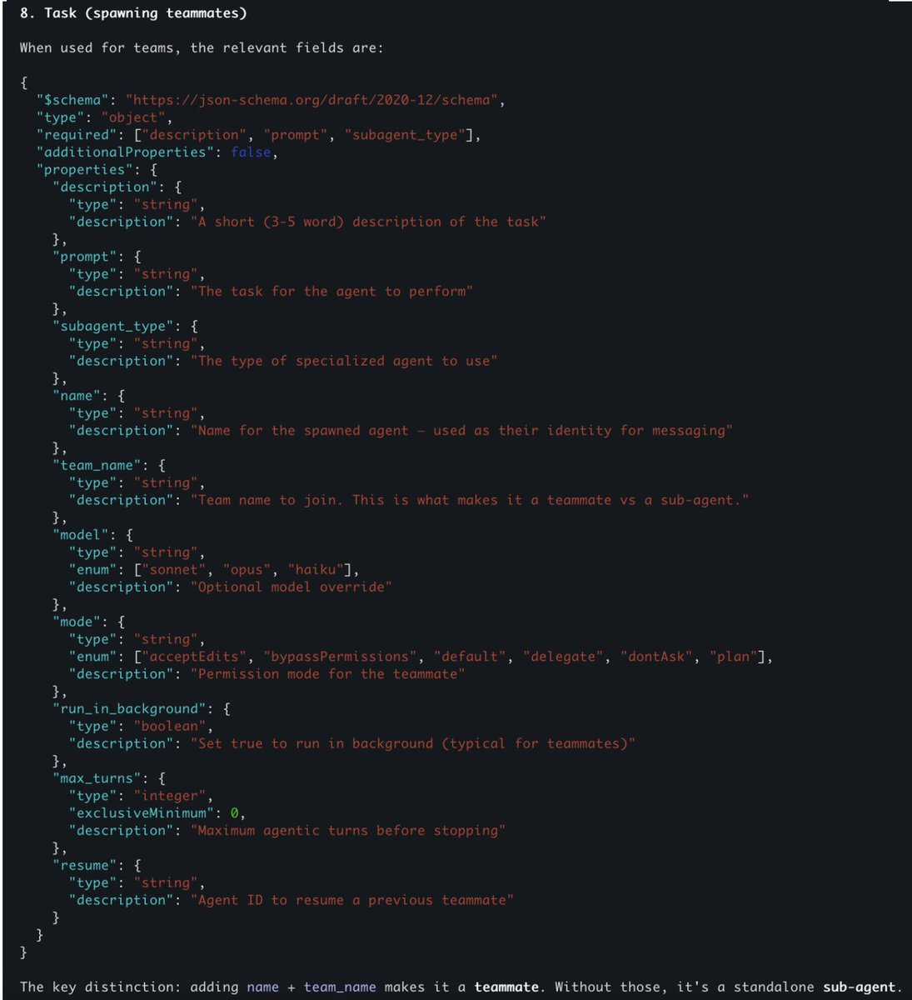
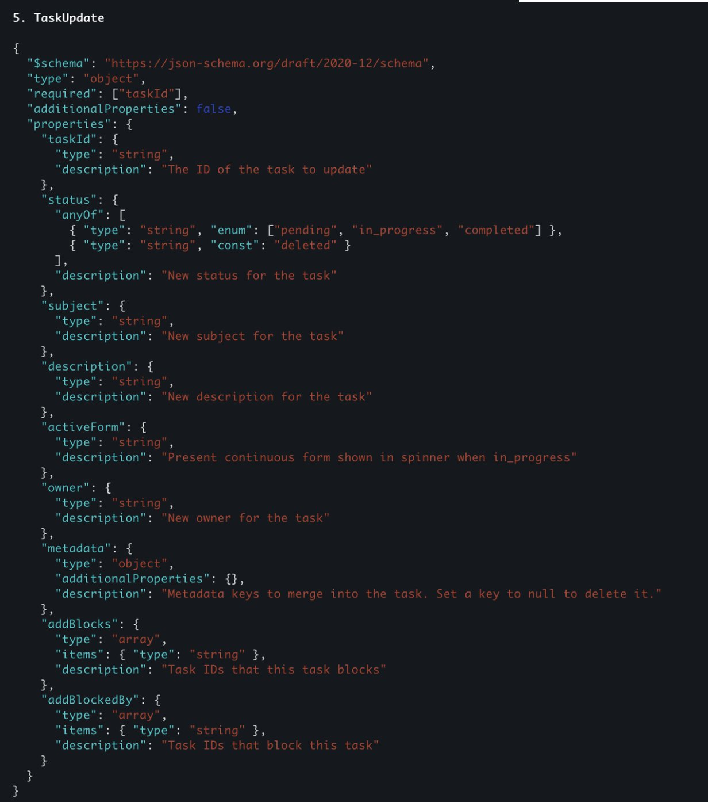
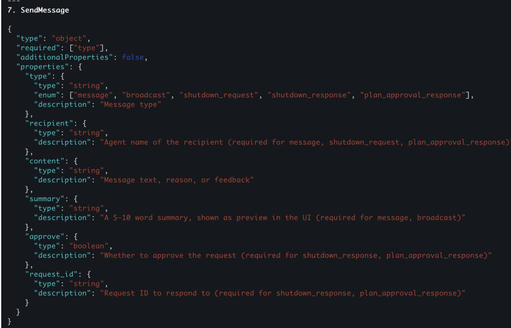

# Agent Teams in Claude Code: geteilte Task-Liste statt isolierter Sub-Agent

Jason Zhou hat Agent Teams — das damals neue, hinter einem Feature-Flag versteckte Koordinationsmodell von Claude Code — durch Log-Tracing und Beobachtung der Dateisystemänderungen unter `.claude/` reverse-engineert. Die Kernaussage: Agent Teams sind keine kleine Iteration des Sub-Agenten-Modells, sondern ersetzen die reine Task-Tool-Isolation durch eine geteilte Task-Liste, direkte Nachrichten zwischen Agenten und eine explizite Lifecycle-Kontrolle (Startup, Shutdown).

## Installation und Freischaltung

Agent Teams liegen zum Zeitpunkt der Quelle hinter einem Experimental-Flag und werden erst aktiv, wenn der Prompt explizit ein Team fordert — Beispiel aus der Quelle, wortgleich in Primär- und Sekundärfassung: *„Ich entwerfe ein CLI-Tool, das TODO-Kommentare im Code trackt. Erstelle ein Agenten-Team, um dies aus verschiedenen Blickwinkeln zu untersuchen: ein Teammitglied für UX, eines für die technische Architektur, eines, das den Advocatus Diaboli spielt.“* Erkennt Claude Code diese Absicht, legt es die Teammitglieder automatisch an.

Der Primärtext selbst nennt nur die Schritte „Claude Code aktualisieren“, „Experimental Flag in `settings.json` aktivieren“ und „Terminal neu starten“ — an den Stellen, wo im Original vermutlich eingebettete Screenshots standen, ist beim Ingest nur eine Leerzeile übrig geblieben. Der konkrete Flag-Name `CLAUDE_CODE_EXPERIMENTAL_AGENT_TEAMS: "1"` in `~/.claude/settings.json` sowie der Startbefehl `claude --teammate-mode tmux` stehen **nur in der deutschen vibedeck-Aufarbeitung** und ließen sich am Wortlaut der Primärquelle nicht prüfen.

## Live-Ansicht mit tmux oder iTerm2

Der Autor empfiehlt, Teams dort zu betreiben, wo man jedem Agenten beim Arbeiten zusehen kann: entweder tmux oder iTerm2 auf macOS (Settings → General → Magic → Python API aktivieren, danach Neustart). Das öffnet einen Pane für den Team-Lead und einen eigenen Pane pro Teammitglied — man kann in jeden Pane klicken, live zusehen und einzelnen Agenten direkt Nachrichten schicken.

## Sub-Agenten vs. Agent Teams

Vor Agent Teams kannte Claude Code nur ein lineares Modell: Der Hauptagent ruft das Task-Tool auf, ein Sub-Agent arbeitet isoliert, die Session terminiert, und nur eine Zusammenfassung geht an den Hauptagenten zurück.

Agent Teams ersetzen das durch geteilte Task-Listen, Nachrichten zwischen Agenten (direkt oder als Broadcast) und eine explizite Lifecycle-Kontrolle für Start und Beendigung einzelner Teammitglieder.

## Die fünf internen Tools

Zhou hat die JSON-Schemas der fünf Tools aus dem Traffic extrahiert, die die Zusammenarbeit tragen.

**TeamCreate** legt einen neuen Team-Ordner unter `.claude/teams/` an — reines Scaffolding, noch ohne zugewiesene Agenten. Pflichtfeld ist nur `team_name`; optional sind `description` und `agent_type` (Rolle des Team-Leads, z. B. „researcher“ oder „test-runner“, genutzt für Team-Datei und Koordination).

**TaskCreate** ist von TeamCreate zu unterscheiden — es legt einzelne To-Dos als JSON-Datei unter `.claude/tasks/<team-id>` an. Pflicht sind `subject` (kurzer Titel) und `description` (was zu tun ist); optional `activeForm` (Text, der während `in_progress` im Spinner läuft, z. B. „Running tests“) und ein freies `metadata`-Objekt. Aufgaben lassen sich vom Team-Lead top-down zuweisen oder von Teammitgliedern selbst per `taskList`/`getTask` beanspruchen.

**Task (Upgrade)** bleibt das bekannte Sub-Agenten-Tool, bekommt aber zusätzliche Parameter. Pflicht sind weiterhin `description`, `prompt` und `subagent_type`. Neu: `name` (Identität des Agenten für Messaging) und `team_name` — genau dieses Feld entscheidet, ob aus dem Aufruf ein Teammate statt eines gewöhnlichen Sub-Agenten wird. Dazu kommen `model` (`sonnet`/`opus`/`haiku`), `mode` (`acceptEdits`/`bypassPermissions`/`default`/`delegate`/`dontAsk`/`plan`), `run_in_background` (bei Teammates typischerweise `true`), `max_turns` und `resume` (um einen vorherigen Teammate-Agenten fortzusetzen).

**TaskUpdate** claimt oder aktualisiert eine Aufgabe. Pflicht ist nur `taskId`. Optional: `status` (`pending`/`in_progress`/`completed` oder `deleted`), neue `subject`/`description`/`activeForm`, ein neuer `owner`, ein `metadata`-Merge (ein Key auf `null` löscht ihn) sowie `addBlocks`/`addBlockedBy` — Arrays von Task-IDs, mit denen Abhängigkeiten zwischen Aufgaben explizit modelliert werden.

**SendMessage** trägt die Kommunikation. Pflicht ist `type` — einer von `message`, `broadcast`, `shutdown_request`, `shutdown_response`, `plan_approval_response`. Je nach Typ werden weitere Felder Pflicht: `recipient` (Agentenname) für direkte Nachrichten und Shutdown-Anfragen, `content` als Text/Grund/Feedback, `summary` (5–10 Wörter, UI-Vorschau) für `message`/`broadcast`, `approve` (Boolean) und `request_id` für Antworten auf Shutdown- oder Plan-Approval-Anfragen. Technisch landen Nachrichten in einem `inbox/`-Ordner pro Agent unter `.claude/teams/<team_id>/` und werden dort als neue User-Nachricht in die Konversationshistorie des Zielagenten injiziert (`<teammate-message teammate_id="team-lead">…</teammate-message>`). Den Shutdown-Handshake beschreibt die Quelle so: Der Team-Lead schickt `shutdown_request`, das Teammitglied bestätigt mit `shutdown_response`, vermutlich per `postToolCall`-Hook, der die Agent-Session danach automatisch beendet — diese Hook-Vermutung kennzeichnet der Autor selbst als Annahme, nicht als beobachtete Tatsache.

## Wann sich Agent Teams lohnen

Agent Teams verbrauchen laut Autor deutlich mehr Tokens und sind langsamer als einfache Sub-Agenten — sie lohnen sich vor allem bei Deep Debugging oder komplexen Architekturentscheidungen, nicht als Standardmodus. Anthropics eigenes Beispiel dafür, das Zhou zitiert: Statt einen Agenten allein suchen zu lassen, spawnt man fünf Teammitglieder, die unterschiedliche Hypothesen zu einem Bug untersuchen, sich gegenseitig zu widerlegen versuchen wie in einer wissenschaftlichen Debatte, und den entstehenden Konsens in einem gemeinsamen Dokument festhalten.

Zhou berichtet, dieses Muster selbst bei seinem Projekt @SuperDesignDev eingesetzt zu haben — ein Screenshot aus dieser eigenen Anwendung zeigt das Ergebnis einer solchen Debatte konkret: Fünf Agenten untersuchten unabhängig voneinander einen Race-Condition-Bug und stellten ihre Befunde anschließend gegenseitig infrage. Der „v1“-Befund („Error Rollback: P0“) wurde in „v2“ präzisiert und auf drei betroffene Tools statt einem ausgeweitet (P0-A); ein „Canvas Lock Race“-Bug wuchs von einem auf drei nachgewiesene Schwachstellen (P0-B), darunter zwei zuvor unentdeckte: ein veralteter Projekt-Verweis (Lesezugriff außerhalb des Locks in Zeile 57, ein irreführender Kommentar in Zeile 64) und vier Tools, die den Canvas-Lock komplett umgehen. Zwei ursprüngliche v1-Verdachtsfälle wurden im Zuge der Debatte dagegen abgestuft oder verworfen: ein „SSE Skip“-Fehler von P0 auf P1 herabgestuft, weil ein Agent selbst nachwies, dass der Skip neue Nodes nicht betrifft; ein „Action Merge“-Fehler von P1 auf P2, weil ein anderer Agent bewies, dass er den gegenteiligen Effekt auslöst (Wiederauftauchen statt Verschwinden); eine dritte Theorie zum Timing von Page-Refreshes wurde vollständig widerlegt. Die zentrale Erkenntnis aus der Debatte laut Bildtext: „disappears after refresh“ bedeutet, dass die Daten in der Datenbank falsch sind — ein reiner Frontend-Bug würde durch einen Refresh behoben, nicht ausgelöst; dieser eine logische Schluss eliminierte die Hälfte der Verdächtigen.

Zhou hält offen, ob Agent Teams Sub-Agenten langfristig ersetzen — aktuell sieht er sie als Ergänzung für extrem lang laufende, komplexe Aufgaben, und denkt selbst über eine Kombination mit einem Ralph-Loop-artigen Ansatz nach.

## Einordnung

Die Quelle ist eine selbst durchgeführte Reverse-Engineering-Untersuchung (Log-Tracing, Dateisystembeobachtung) eines einzelnen Autors, keine offizielle Dokumentation — plausibel und mit konkreten Schema-Feldnamen belegt, aber nicht im Sinne des hiesigen Konfidenz-Modells `verifiziert` (keine Bestätigung in einem geklonten Repo dieses Wissenssystems). Die Primärquelle (der X-Artikel selbst) bestätigt Wortlaut, Werkzeugliste, Beispiel-Prompt, den Deep-Debugging-Anwendungsfall und die eigene Nutzung bei @SuperDesignDev vollständig — anders als beim Verarbeitungsplan zunächst vermerkt („nur Einzelpost“), liegt hier tatsächlich ein vollständiger Artikeltext mit allen acht zugehörigen Bildern vor, keine gescheiterte Thread-Auflösung. Nur zwei sehr konkrete Konfigurationsdetails — der genaue Name des Feature-Flags und der genaue CLI-Befehl für den Teammate-Modus — fehlen im Primärtext (dort stehen an diesen Stellen nur Leerzeilen, wo ursprünglich wohl weitere Screenshots eingebettet waren) und stammen ausschließlich aus der vibedeck-Sekundärfassung; das ist der Grund für `beleg_art: sekundaerquelle` in dieser Notiz.

Eine Ungenauigkeit der Sekundärfassung: Sie beschriftet das Debatten-Screenshot (Bild 4 oben) als „Setup Agent Teams“ und ordnet es dem Installationsabschnitt zu — inhaltlich zeigt das Bild aber eindeutig das Ergebnis der Deep-Debugging-Debatte (Panes wie „Vulnerability map correction“, „Root cause verdict“, Vergleichstabelle v1/v2), nicht die Einrichtung. In dieser Notiz ist das Bild deshalb im Abschnitt „Wann sich Agent Teams lohnen“ platziert.

Der Shutdown-Mechanismus per `postToolCall`-Hook ist ausdrücklich eine Vermutung des Autors, keine bestätigte Beobachtung — hier bewusst als solche gekennzeichnet übernommen. Wie jede Feature-Flag-Funktionalität ist der gesamte Befund ein Snapshot von Anfang Februar 2026 und kann sich seither verändert haben; die offizielle Anthropic-Dokumentation bestätigt „Agent Teams“ als Feature erst ab August 2026 (siehe [[2026-08-04-anthropic-docs-claude-code-best-practices]]), ohne die hier beschriebenen internen Tool-Namen zu nennen.

## Kernaussagen

- Agent Teams ersetzen die reine Zusammenfassungs-Rückgabe isolierter Sub-Agenten durch geteilte Task-Listen, direkte Nachrichten/Broadcasts und eine explizite Lifecycle-Kontrolle (Startup, Shutdown) → [[Kontrollierte-Agent-Parallelisierung]]
- Ein Sub-Agenten-Aufruf wird allein durch die zusätzlichen Task-Tool-Parameter `name` und `team_name` zum Teammate — dieselbe Aktivierungsmechanik, nur mit Team-Zugehörigkeit
- Die Koordination läuft über eine geteilte, dateibasierte Task-Registry (`.claude/tasks/<team-id>`, JSON pro Aufgabe mit Status, Owner, `addBlocks`/`addBlockedBy`) statt über freie Konversation zwischen den Agenten
- Nachrichten zwischen Agenten werden nicht in Echtzeit gepusht, sondern als neue User-Turns aus einem Pro-Agent-`inbox/`-Ordner in die jeweilige Konversationshistorie injiziert
- Agent Teams kosten laut Autor deutlich mehr Tokens und Zeit als Sub-Agenten und lohnen sich vor allem bei Deep Debugging mit konkurrierenden Hypothesen oder komplexen Architekturfragen, nicht als Standardmodus → [[Kontrollierte-Agent-Parallelisierung]]
- Eine konkrete Fünf-Agenten-Debatte zu einem Race-Condition-Bug erweiterte einen Befund von einem auf drei betroffene Tools, deckte zwei neue Schwachstellen auf und widerlegte zwei ursprüngliche Verdachtsfälle — ein Beleg dafür, dass gegenseitiges Widerlegen in der Praxis Befunde verändert, nicht nur beschleunigt

## Verbindungen

- [[Kontrollierte-Agent-Parallelisierung]]
- [[Ralph-Loop-Frischer-Kontext-pro-Iteration]]
- [[2026-04-17-wiki-compiler-agent-teams-in-claude-code]]
- [[2026-08-04-anthropic-docs-claude-code-best-practices]]
