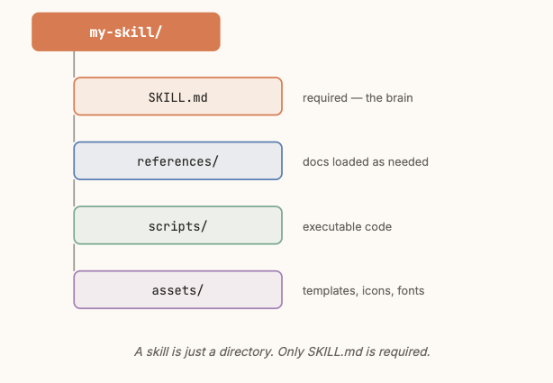
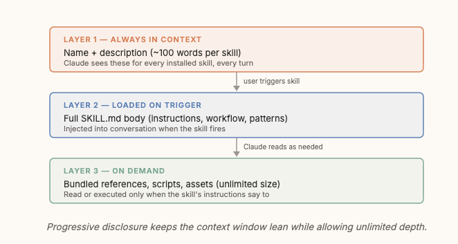
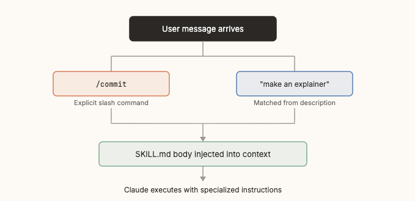
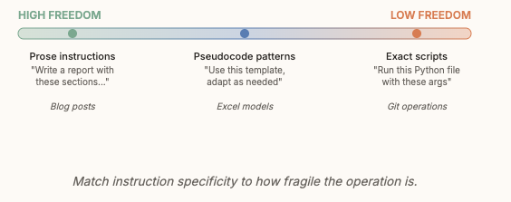

# Claude-Code-Skills: vom Generalisten zum Spezialisten per Progressive Disclosure

Pedram (Anthropic-nahes Produktumfeld, X-Handle @pdrmnvd) erklärt die Mechanik von Claude-Code-Skills von innen: warum es sie gibt, wie ihr dreistufiges Ladesystem das Context Window schont, wie Aktivierung funktioniert und welchen Tradeoff jede `SKILL.md` beim Formulieren eingeht. Der Kernsatz: Skills verwandeln ein generalistisches Reasoning-Modell mitten im Gespräch in einen Spezialisten, indem sie Fachwissen erst dann laden, wenn es tatsächlich gebraucht wird.

## Das Problem: Fachwissen vs. begrenztes Context Window

Ein Modell kann nicht im Voraus alles über eine spezifische Domäne wissen — ein Investmentbanking-Pitchdeck, ein DCF-Modell, ein Styleguide für eine bestimmte Dokumentation erfordern jeweils hunderte Zeilen an Anweisungen, Formatregeln, Referenzdokumenten und Skripten. Das bei jeder Konversation neu einzufügen sprengt das Context Window; es dauerhaft in die Agent-Datei zu schreiben, verbraucht Kontext auch in Konversationen, die es nicht brauchen. Skills lösen das, indem sie in sich geschlossene Wissenspakete sind, die nur bei tatsächlichem Bedarf geladen werden.

## Anatomie eines Skills und das Drei-Ebenen-Ladesystem

Ein Skill ist ein Verzeichnis mit einer `SKILL.md` an der Basis (YAML-Frontmatter für Metadaten, Body für die Anweisungen) und optional weiteren Unterordnern (`references/`, `scripts/`, `assets/`).

Dahinter steht ein Drei-Ebenen-Ladesystem, das Progressive Disclosure heißt: **Layer 1** (Name + `description`, laut Grafik rund 100 Wörter pro Skill) ist bei jedem installierten Skill in jedem Turn im Kontext. **Layer 2** (der vollständige `SKILL.md`-Body — Anweisungen, Workflow, Muster) wird erst injiziert, wenn der Skill tatsächlich auslöst. **Layer 3** (gebündelte Referenzen, Skripte, Assets — laut Grafik von unbegrenzter Größe) wird nur gelesen oder ausgeführt, wenn die Anweisungen in Layer 2 es verlangen.

Dieses System erklärt, warum ein Skill für ein umfangreiches Design-System (viel Referenzmaterial, Skripte, Spezifikationen) trotzdem günstig im Kontext bleibt: Der Ballast liegt in Layer 3 und wird nur bei Bedarf abgerufen.

## Zwei Wege der Aktivierung

Ein Skill feuert entweder explizit über einen Slash-Command (`/commit`) oder automatisch, indem Claude die Nutzeranfrage gegen die `description`-Felder aller installierten Skills abgleicht (z. B. matcht „make an explainer“ auf einen passenden Skill). In beiden Fällen wird danach der `SKILL.md`-Body als System-Nachricht in die Konversation injiziert, und Claude folgt den Anweisungen wie jedem anderen Prompt.

Die `description` ist damit der Schlüssel zur automatischen Aktivierung — sie muss sowohl **was** der Skill tut als auch **wann** er zu nutzen ist benennen, inklusive konkreter Trigger-Phrasen. Weil sie permanent in Layer 1 steht, gleicht Claude sie in jedem Turn neu ab.

## Der Design-Tradeoff: Präzision gegen Kontextkosten

Jedes Wort in `SKILL.md` kostet Platz im geteilten Context Window, zu vage Anweisungen erzeugen aber inkonsistente Ergebnisse. Pedram bildet das als Skala zwischen High Freedom und Low Freedom ab: Prosa-Anweisungen („Write a report with these sections…“) für robuste Aufgaben wie Blogposts, Pseudocode-Muster („Use this template, adapt as needed“) für mittelfeste Fälle wie Excel-Modelle, und exakte Skripte („Run this Python file with these args“) für fragile Operationen wie Git-Befehle.

Die begleitende Faustregel: das **Warum** erklären, nicht nur das **Was**. Versteht Claude die Logik hinter einer Anweisung, generalisiert es auch auf Grenzfälle, die der Skill-Autor nicht vorhergesehen hat. Starre „Tue IMMER X“-Regeln sind laut Pedram ein Warnsignal — die Motivation zu erklären, sei fast immer wirksamer. Als Lernquelle für reale Umsetzungen verweist er im Originalartikel konkret auf den offiziellen `skill-creator`-Skill im Repo `anthropics/skills`.

## Einordnung

Ungewöhnlich für dieses Batch: Bei den meisten sechs Monate alten Tweet-Paaren in diesem Verarbeitungslauf ist die automatische Thread-Auflösung gescheitert, sodass nur die vibedeck-Sekundärfassung den vollen Inhalt trägt. Hier ist das anders — die Primärquelle ist ein X-„Artikel“ (Langform, kein Tweet-Thread) und enthält im Abschnitt „Artikel-Volltext“ den kompletten englischen Originaltext. Ein Zeile-für-Zeile-Abgleich zeigt: Jede Aussage dieser Notiz ist direkt in der Primärquelle nachlesbar. Die deutsche Aufarbeitung aus vibedeck folgt inhaltlich eng dem Original, lässt aber zwei Details aus, die nur in der Primärquelle stehen: den konkreten Verweis auf den `skill-creator`-Skill als Lernbeispiel und den Hinweis, bei ausbleibendem Triggering zuerst die Frontmatter zu prüfen. Diese Notiz übernimmt beide Details aus der Primärquelle; der Rest ist durch Primär- und Sekundärquelle gemeinsam gedeckt.

Fachlich ist das eine klare, in sich stimmige Innensicht auf ein bereits mehrfach beschriebenes Prinzip — sie deckt sich fast vollständig mit dem bereits `verifiziert` belegten Pattern zu Skill-Trigger-Qualität und Progressive Disclosure (dort direkt aus der `skill-creator`-`SKILL.md` bestätigt: Metadaten immer sichtbar, Body erst bei Aktivierung, Bundled Resources nur bei Bedarf). Neu und konkret ist vor allem die Zahl „~100 Wörter pro Skill-Description in Layer 1“ aus der Grafik — eine Präzisierung, die im Bestand bisher nicht als Zahl vorlag. Die Design-Tradeoff-Skala (Freiheitsgrad nach Fragilität der Operation, „Warum vor Was“) ist dagegen unbelegte Autorenmeinung ohne Messung und deckt inhaltlich einen Aspekt ab, der im bestehenden Pattern-Bestand noch fehlt. Die Schlussbehauptung „Domain-Experten sind die besten Skill-Ersteller“ bleibt eine unbelegte Plausibilitätsaussage.

## Kernaussagen

- Skills sind in sich geschlossene Wissenspakete, die nur bei Bedarf geladen werden und ein Modell mitten im Gespräch vom Generalisten zum Spezialisten machen → [[Erweiterungs-Ebenen-Zuordnung]]
- Drei-Ebenen-Ladesystem: Layer 1 (Name+Description, ~100 Wörter, immer im Kontext) → Layer 2 (voller `SKILL.md`-Body, bei Trigger injiziert) → Layer 3 (Referenzen/Skripte/Assets, unbegrenzte Größe, nur on-demand) → [[Skill-Qualitaet-durch-Trigger-und-Baseline-Evals]]
- Zwei Aktivierungswege (expliziter Slash-Command, automatischer Description-Match); die `description` ist der Schlüssel zur automatischen Aktivierung und steht permanent in Layer 1 → [[Skill-Qualitaet-durch-Trigger-und-Baseline-Evals]]
- Instruktions-Spezifität sollte an die Fragilität der Operation angepasst werden (Prosa für robuste Aufgaben, exakte Skripte für fragile) und das Warum statt nur das Was erklären, damit Claude auf unvorhergesehene Grenzfälle generalisieren kann → [[Freiheitsgrad-nach-Aufgaben-Fragilitaet]] (neu vorgeschlagen)
- Reale Implementierungen (Beispiel: der offizielle `skill-creator`-Skill) sind laut Autor die beste Lernquelle für Skill-Design → [[Skill-Qualitaet-durch-Trigger-und-Baseline-Evals]]

## Verbindungen

- [[Skill-Qualitaet-durch-Trigger-und-Baseline-Evals]]
- [[Erweiterungs-Ebenen-Zuordnung]]
- [[Klein-und-komposierbar]]
- [[2026-04-16-wiki-compiler-skill-creator-skill]]
- [[2026-07-01-anthropic-skill-creator-skill-md]]
