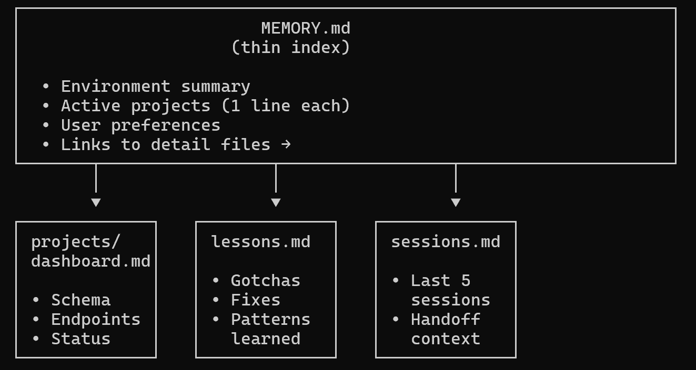
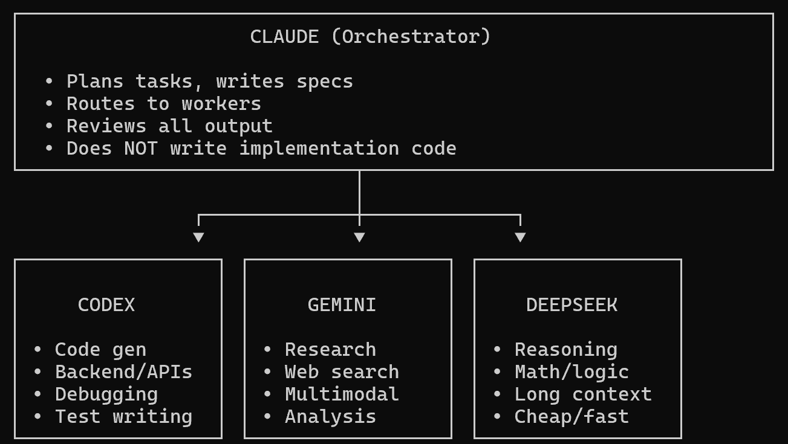

# Mastering Claude Code: Memory-System, Orchestrator-Modell und Skills

Minty beschreibt den Übergang von Claude Code als reinem Chat-Interface zu einem systemischen Setup mit drei tragenden Bausteinen: einem Memory-System gegen den täglichen Fresh-Context-Neustart, einem Orchestrator-Modell zur Kostensteuerung über mehrere LLMs und Skills als kodierten, wiederholbaren Prozessen.

## Das Fresh-Context-Problem und die Config-Datei

Jede Session startet „blank“ — Projektwissen, Präferenzen und Ordnerstruktur müssen sonst täglich neu erklärt werden. Die Basislösung ist eine Claude-Config-Datei, die zu Beginn jeder Session automatisch eingelesen wird und persönliche Präferenzen, Projektstruktur, häufige Befehle und Coding-Stil enthält. Das löst laut Minty aber nur die halbe Aufgabe: Statische Konfiguration bewahrt kein dynamisches Wissen aus vergangenen Sessions.

## Das Memory-System: Thin Index statt Monolith-Datei

Für dynamisches Wissen empfiehlt Minty ein Memory-System mit einer schlanken Index-Datei, die auf Detaildateien verweist statt alles selbst zu enthalten — eine 500-zeilige Memory-Datei verschwendet Token, ein 30-zeiliger Index lädt gezielt nur das für die aktuelle Aufgabe Relevante nach.

Konkret verweist `MEMORY.md` (Environment Summary, Active Projects mit je einer Zeile, User Preferences, Links zu Detaildateien) auf drei Detaildateien: `projects/dashboard.md` (Schema, Endpoints, Status), `lessons.md` (Gotchas, Fixes, gelernte Patterns) und `sessions.md` (die letzten fünf Sessions, Handoff-Kontext). Operationalisiert wird das, indem man Claude während der Session aktiv anweist, etwas „ins Memory-System unter [Kategorie]“ zu speichern, und am Sessionende kurz zusammenfasst, was erreicht wurde. Wichtiger Hinweis: Da diese Dateien in der Codebase liegen, dürfen sie nie Secrets oder sensible Daten enthalten.

## Das Orchestrator-Modell: Claude plant, günstigere Worker implementieren

Claude Code ist teurer als Standard-Modelle — Minty nutzt es deshalb als Koordinator statt als reinen Worker.

Claude plant, was gebaut wird, wie es strukturiert ist und welche Edge-Cases zu beachten sind, schreibt aber selbst keinen Implementierungscode. Die Bulk-Generierung übernehmen spezialisierte, günstigere Worker: Codex für Code-Generierung, Backend/APIs, Debugging und Tests; Gemini für Research, Web-Suche, Multimodal-Aufgaben und Analyse; DeepSeek für Reasoning, Mathematik/Logik, lange Kontexte und als günstige/schnelle Option. Anschließend prüft Claude den Worker-Output gegen die ursprüngliche Spezifikation. Minty begründet das mit der Aufgabenverteilung nach Ermessen: Claude entscheidet Fragen wie „Klasse oder Funktion?“ oder „Ist das Error-Handling ausreichend?“, während 500 Zeilen Boilerplate keine Aufgabe für Premium-Preise sind.

## Skills: Wiederholbare Workflows kodieren

Wiederkehrende Muster (Artikel-Brainstorming, Debugging, Dokumenten-Editing) werden als Skill definiert — eine Markdown-Datei, die die Schritte eines mehrstufigen Prozesses festlegt, nicht nur einen Prompt umformuliert.

Ein guter Skill kodiert laut Minty den Prozess, nicht nur den Prompt: Was muss vor dem Start geprüft werden, wie werden Checkpoints gesetzt, was muss bewahrt werden, wann muss der Nutzer gefragt werden.

## Operational Discipline

Drei Regeln, die Minty „auf die harte Tour“ gelernt hat: kein langes Schweigen bei komplexen Aufgaben (regelmäßige Updates als Lebenszeichen), Checkpoints nach jedem einzelnen Edit statt großer Batches (damit ein Absturz mitten im Batch nicht den Überblick über den Fortschritt kostet), und eine Warnung vor großen Operationen (große Dateien lesen/bearbeiten), damit der Nutzer die Chance hat, abzubrechen. Ergänzend zur Anweisungsgebung: Statt „Mach diesen Teil kürzer“ konkret „Kürze Absatz 3 von 80 auf 40 Wörter“ sagen, Grenzen explizit benennen („Rühre die Einleitung nicht an“) und visuelle Änderungen immer selbst verifizieren — Claude „sieht“ den Bildschirm nicht und schließt einen CSS-Fix rein logisch aus dem Code, nicht aus dem tatsächlichen Rendering.

## Einordnung

Das Header-Bild (stilisierte Zug-Grafik) wurde nicht übernommen, es hat reinen Deko-Charakter ohne Erklärwert. Die drei übrigen Bilder enthalten konkrete Strukturinformation und wurden vollständig in den Text übertragen.

Das Memory-System ist inhaltlich keine neue Erkenntnis, sondern eine unabhängige Bestätigung von Progressive Disclosure (dünne Hauptdatei, Verweise auf Details) aus [[AGENTS-md-Onboarding-Design]], kombiniert mit einem rollierenden Session-Log, das funktional [[Handoff-Doc]] entspricht. Das Orchestrator-Modell ist dagegen eine persönliche, unbelegte Konfiguration: Warum genau DeepSeek für „cheap/fast“ und nicht Gemini, ist Mintys subjektive Zuordnung, keine gemessene Modellwahl — übertragbar ist nur das Prinzip „starkes Modell plant/reviewt, günstigere Modelle implementieren“, nicht die konkrete Modell-Rollenverteilung. Dieses Prinzip ist bereits als Ergänzung im Bestand vermerkt. Die Operational-Discipline-Regeln sind plausible Praxisregeln ohne Messung, decken sich aber mit der bereits an anderer Stelle belegten Warnung, dass Claude visuelle Änderungen nicht selbst sehen kann.

## Kernaussagen

- Memory-System als schlanker Index (`MEMORY.md`), der auf Detaildateien (Dashboard, Lessons, Sessions) verweist, statt Wissen in einer einzigen langen Datei zu horten → [[AGENTS-md-Onboarding-Design]], [[Handoff-Doc]] (Sessions-Log als rollierendes Handoff)
- Orchestrator-Modell: das teure Modell plant und reviewt, günstigere/spezialisierte Modelle übernehmen die Bulk-Implementierung nach jeweiliger Stärke → [[Modell-Eskalation-von-guenstig-nach-teuer]]
- Skills kodieren einen mehrstufigen Prozess (Vorbedingungen, Checkpoints, Rückfragepunkte), nicht nur einen umformulierten Prompt → [[Klein-und-komposierbar]], [[Skill-Call-Hierarchie]]
- Claude „sieht“ den Bildschirm nicht — visuelle Änderungen müssen vom Menschen verifiziert werden, nicht nur logisch aus dem Code erschlossen → [[Testharness-als-staerkster-Hebel]]
- Checkpoints nach jedem einzelnen Edit statt großer Batches, damit ein Absturz nicht den Fortschrittsüberblick kostet → [[Kontext-Hygiene-Entscheidungsbaum]]

## Verbindungen

- [[AGENTS-md-Onboarding-Design]]
- [[Handoff-Doc]]
- [[Modell-Eskalation-von-guenstig-nach-teuer]]
- [[Testharness-als-staerkster-Hebel]]
