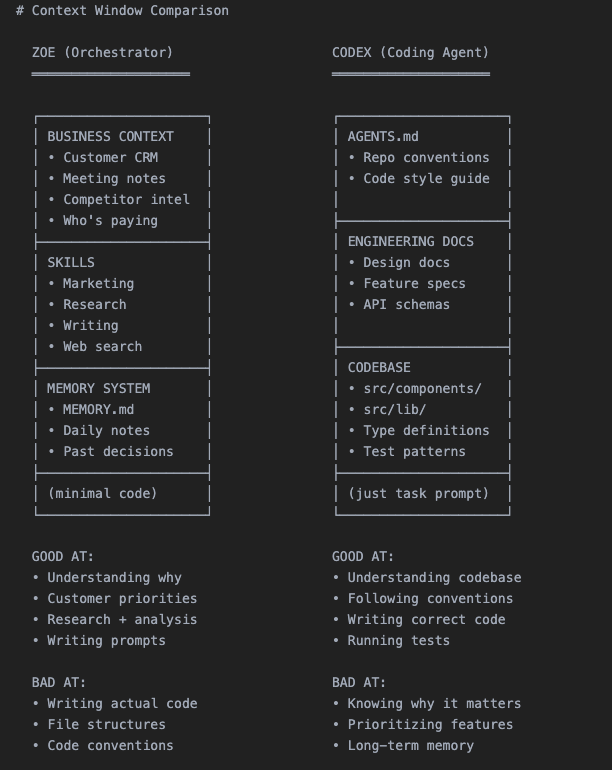

# Zwei-Tier-Orchestrierung: Ein Business-Orchestrator steuert eine Flotte paralleler Coding-Agents

Elvis beschreibt ein selbstgebautes Setup, in dem ein Orchestrator-Agent („Zoe“, auf OpenClaw) Business-Kontext hält und daraus Prompts für parallel laufende Coding-Agents (Codex, Claude Code, Gemini) erzeugt. Die Kernidee: Business-Kontext und Codebase-Kontext konkurrieren im selben Context Window und werden deshalb auf zwei Agent-Ebenen getrennt. Es ist ein Erfahrungsbericht ohne Gegenprobe; die Zahlen sind selbstberichtet. Diese Notiz stützt sich auf eine deutsche Aufarbeitung (vibedeck) des X-Threads, nicht auf das Original.

## Kontext-Trennung als Begründung

Das Context Window ist ein Nullsummenspiel: Wer es mit Code füllt, hat keinen Platz für Kundenhistorie, und umgekehrt. Der Orchestrator hält deshalb Kunden-CRM, Meeting-Notizen, Wettbewerbsinfos, Skills und ein Memory-System (`MEMORY.md`, Tagesnotizen, frühere Entscheidungen) in einem Obsidian-Vault, kaum Code. Der Coding-Agent bekommt `AGENTS.md`, Engineering-Docs (Design Docs, Feature Specs, API-Schemas) und die Codebase, dazu nur den Task-Prompt. Ein Schaubild der Quelle ordnet die Stärken zu: Der Orchestrator versteht das Warum und schreibt Prompts, ist aber schwach im Code; der Coding-Agent kennt Codebase und Konventionen, aber nicht Priorität und Langzeitgedächtnis.

## Ablauf und Absicherung

- **Isolation:** Jeder Agent läuft in einem eigenen Git Worktree und einer `tmux`-Session. Der Vorteil laut Quelle: Mid-task Redirection per `tmux send-keys`, ohne den Lauf neu zu starten.
- **Registry und Monitoring:** Aktive Tasks stehen in `.clawdbot/active-tasks.json`. Ein Cronjob prüft alle 10 Minuten tmux-Sessions, offene PRs und CI-Status und startet fehlgeschlagene Agents bis zu dreimal neu.
- **Definition of Done:** PR erstellt, Branch synchron mit `main`, CI grün (Lint, Types, Unit, E2E), bei UI-Änderungen Screenshot in der PR-Beschreibung.
- **Drei AI-Reviewer:** Codex (Logikfehler, Race Conditions, laut Quelle wenige False Positives), Gemini (Security, Skalierung), Claude Code (oft übervorsichtig, eher Bestätigung). Erst danach meldet Telegram „PR ready“; der menschliche Review dauert laut Quelle 5–10 Minuten.
- **Rechteschnitt:** Nur der Orchestrator hat Read-only-Zugriff auf die Produktionsdatenbank und Admin-APIs; Coding-Agents bekommen das nie.

## Proaktive Variante des Ralph Loop

Zoe wartet nicht auf Aufträge: morgens Sentry-Scan mit Fix-Agents, nach Meetings Scan der Notizen für Feature-Requests, abends Git-Log für Changelogs. Scheitert ein Agent, analysiert der Orchestrator den Grund und passt den Prompt für den nächsten Versuch an.

## Modellrollen und Hardware

Codex 5.3 ist das „Workhorse“ für rund 90 % der Aufgaben (Backend, Refactoring), Claude Code für Frontend und Git-Operationen, Gemini erstellt HTML/CSS-Spezifikationen, die Claude Code im Komponentensystem umsetzt. Engpass ist RAM, weil jeder Agent eigene Node-Module, Compiler und Test-Runner lädt: bei 16 GB etwa 4–5 parallele Agents, Ziel 128 GB für 20+.

## Einordnung

Belastbar ist das Architekturprinzip (Kontext-Trennung, Rechteschnitt, mehrstufige Gates vor dem Menschen), weil es zu bekannten Mustern passt. Selbstberichtet und ungeprüft sind „94 Commits an einem Tag“, durchschnittlich 50 pro Tag und die Modellurteile; Commit-Zahlen sagen nichts über Qualität oder Wert. Das mitgelieferte Contribution-Bild belegt nur 62 Beiträge an einem Tag im Februar, nicht die 94. Kosten fehlen komplett: Token-Verbrauch dreier Reviewer pro PR, 20+ parallele Agents und Hardware werden nicht beziffert. Die Kernrisiken sind ein Orchestrator mit Produktionszugriff und automatische Neustarts ohne Kostendeckel. Die Schlussfolgerung „Einzelperson führt Millionenunternehmen“ ist Ausblick, kein Ergebnis.

## Kernaussagen

- Business-Kontext und Code-Kontext gehören in getrennte Agents, weil sie um dasselbe Context Window konkurrieren → [[Kontext-Hygiene-Entscheidungsbaum]]
- Parallele Agents brauchen Worktree-Isolation, eine Task-Registry und einen Monitor; RAM begrenzt die Parallelität → [[Kontrollierte-Agent-Parallelisierung]]
- Ein PR gilt erst nach grüner CI, mehreren AI-Reviews und Beweis (Screenshot) als fertig, der Mensch reviewt zuletzt → [[CI-Agent-mit-Review-Gate]]
- Proaktive Trigger (Sentry, Meeting-Notizen, Git-Log) und Prompt-Anpassung nach Fehlversuch erweitern den Ralph Loop → [[Ralph-Loop-Frischer-Kontext-pro-Iteration]]

## Verbindungen

- [[Kontrollierte-Agent-Parallelisierung]]
- [[Ralph-Loop-Frischer-Kontext-pro-Iteration]]
- [[CI-Agent-mit-Review-Gate]]
- [[2026-02-23-d4m1n-ralph-loop-setup-primaer]]
- [[2026-02-07-jasonzhou-claude-code-agent-teams]]
