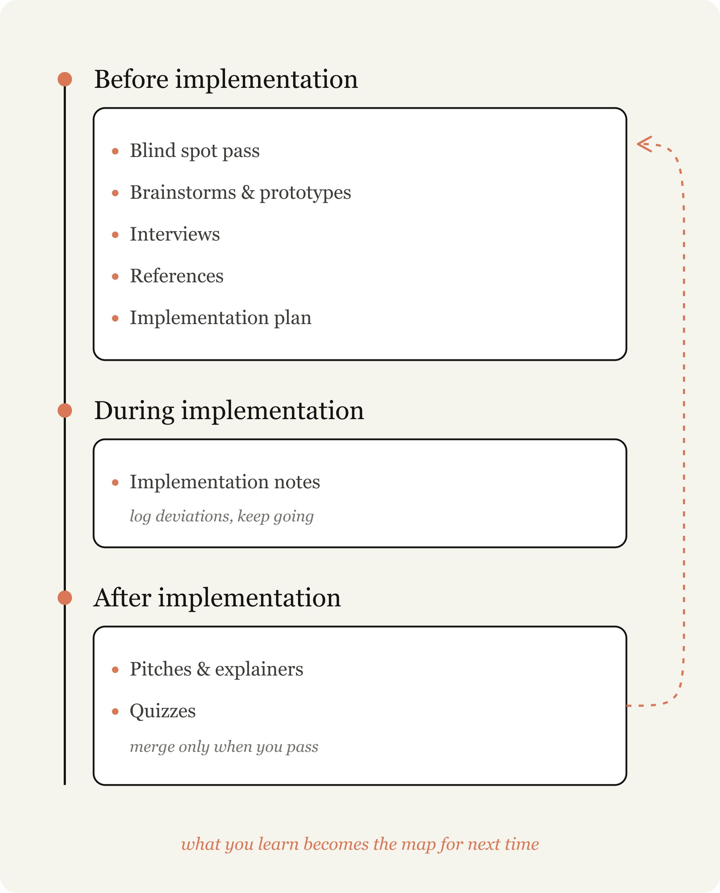

# Unknowns finden: Thariqs Werkzeugkasten für Fable-Sessions, vor, während und nach der Implementierung

Thariq (Anthropic) beschreibt in einem langen X-Artikel, wie er mit Claude Fable 5 arbeitet. Seine These: Die Qualität langer Aufgaben hängt weniger am Modell als daran, ob du die Lücke zwischen deiner Beschreibung der Arbeit (der „Karte“) und der tatsächlichen Codebasis (dem „Territorium“) kennst. Diese Lücke nennt er Unknowns. Der Artikel ist erfahrungsbasiert, ohne Messwerte; die Techniken sind plausibel, aber nicht gegen Alternativen getestet.

## Karte und Territorium

Prompts, Skills und Kontext sind die Karte; Codebasis und reale Randbedingungen das Territorium. Trifft Claude auf einen Unknown, entscheidet es nach bester Vermutung. Je mehr Arbeit läuft, desto mehr Unknowns tauchen auf. Thariq nennt Fable das erste Modell, bei dem die Arbeitsqualität am Klären der eigenen Unknowns hängt. Planung vorab reicht nicht immer: Unknowns zeigen sich auch tief in der Implementierung und können zeigen, dass das Problem anders gelöst werden sollte.

Er sortiert vier Klassen (Grafik im Artikel):
- Known Knowns: steht im Prompt.
- Known Unknowns: bekannte offene Fragen.
- Unknown Knowns: zu offensichtlich zum Aufschreiben, aber du erkennst es beim Sehen („I’ll know it when I see it“).
- Unknown Unknowns: woran du nie gedacht hast, etwa wie gut etwas sein kann.

Zu präzise Anweisungen lassen Claude auch dann folgen, wenn ein Schwenk besser wäre; zu vage führen zu Annahmen nach Branchen-Standard. Wer Unknowns ignoriert, scheitert in beide Richtungen. Wichtig ist, Claude den eigenen Ausgangspunkt zu nennen: Wissensstand, Erfahrung mit Problem und Codebasis, Rolle als Denkpartner.

## Techniken nach Phase

Vor der Implementierung:
- **Blind Spot Pass:** Claude bitten, deine Unknown Unknowns zu finden und zu erklären, mit den wörtlichen Begriffen „blindspot pass“ und „unknown unknowns“ plus Kontext, wer du bist und was du weißt. Gedacht für fremde Codeteile oder fachfremde Aufgaben (Beispiel: Auth-Module, Color Grading).
- **Brainstorms und Prototypen:** Bei Kriterien, die du erst beim Sehen erkennst, mehrere Varianten als HTML-Artefakt bauen lassen, etwa vier stark verschiedene Design-Richtungen oder ein Mock mit Fake-Daten ohne Backend. Unknown Knowns früh zu finden ist billiger, weil kleine Spec-Änderungen große Code-Unterschiede erzeugen und Revert für den Agenten schwer ist. Thariq startet fast jede Session mit einer Explorationsphase; Claude findet dabei hochwertige Ansätze, übersieht aber manchmal das große Bild.
- **Interviews:** Claude befragt dich zu Unklarheiten, eine Frage nach der anderen, priorisiert nach Einfluss auf die Architektur.
- **References:** Wenn Beschreibung scheitert, ist die beste Referenz Quellcode, auch in anderer Sprache (Beispiel: Rust-Crate für Backoff-Verhalten, neu in TypeScript). Das entspricht laut Thariq der Arbeitsweise von Claude Design, das den Code eines Webmoduls liest statt nur den Screenshot.
- **Implementation Plan:** als HTML, mit den am ehesten änderbaren Teilen vorn (Datenmodell, Typ-Interfaces, Nutzerflüsse), mechanisches Refactoring hinten.

Während der Implementierung:
- **Implementation Notes:** Eine temporäre `implementation-notes.md` (oder HTML) hält Entscheidungen fest. Bei erzwungenen Abweichungen vom Plan die konservative Option wählen, unter „Deviations“ loggen und weitermachen. Die Umsetzung läuft in einer neuen Session, der Spec und Prototyp als Artefakte übergeben werden.

Nach der Implementierung:
- **Pitches und Explainer:** Prototyp, Spec und Notes zu einem Dokument bündeln, Demo zuerst. Reviewer starten mit denselben Unknowns wie du; Experten sehen, dass du ihre erwarteten Fehlerfälle bedacht hast.
- **Quiz:** Nach langen Sessions lässt du dir einen HTML-Report mit Kontext und ein Quiz zur Änderung erstellen. Thariq merged erst, wenn er das Quiz fehlerfrei besteht. Der Diff allein vermittelt wegen bestehender Codepfade nur oberflächliches Verständnis.

## Beispiel Fable-Launchvideo

Das Launch-Video wurde komplett von Claude Code geschnitten, in einem Gebiet, in dem Thariq kein Experte ist. Er ließ sich zuerst Whisper-Transkription und Schnitt per ffmpeg erklären, testete per Remotion-Prototyp, ob zeitlich getaktete UI machbar ist, und ließ sich Color Grading beibringen, weil er nicht wusste, wie „gut“ aussieht. Varianten zur Auswahl reichten dort nicht.

## Einordnung

Die Quelle ist selbstberichtet, ohne Vergleich oder Zahlen; die Reichweite (rund 3,8 Mio. Views) sagt nichts über die Wirksamkeit. Neu gegenüber Spec-Grilling und Prototyp-Arbeitsweisen ist vor allem die Einbettung in ein Phasenmodell mit Rückkopplung. Das Quiz als menschliche Merge-Hürde und die Deviations-Logs sind konkret übernehmbar. Kosten: Jede Technik erzeugt zusätzliche Artefakte und Sessions, und Thariq nennt weder Token- noch Zeitaufwand. Die Aussage, Fable sei das erste Modell mit diesem Engpass, ist eine Selbsteinschätzung. Das Fehlen eigener Verifikation durch Tests ist bemerkenswert: Das Quiz prüft Verständnis des Menschen, nicht Korrektheit des Codes.

## Kernaussagen

- Qualität langer Agent-Aufgaben hängt an geklärten Unknowns zwischen Prompt-Karte und Code-Territorium → [[Fable-Unknowns-vor-Prompt-Qualitaet]]
- Claude interviewt dich eine Frage nach der anderen, priorisiert nach Architekturwirkung → [[Spec-Grilling]]
- Quellcode als Referenz und mehrere HTML-Prototypen statt Prosa-Beschreibung → [[Screenshot-als-Spezifikationsmedium]]
- Quiz zur eigenen Änderung als Merge-Bedingung und Lern-Session zu fremden Fachgebieten → [[Claude-als-Lernwerkzeug]]

## Verbindungen

- [[Fable-Unknowns-vor-Prompt-Qualitaet]]
- [[Spec-Grilling]]
- [[2026-07-03-trq212-fable-field-guide-unknowns]]
- [[2026-06-02-trq212-2061907337154367865]]
