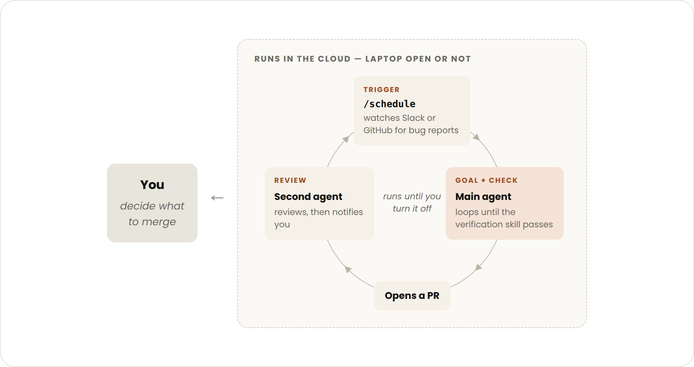

# Vier Loop-Typen in Claude Code: Trigger, Stop-Kriterium und Token-Grenzen

Das Claude-Code-Team definiert einen Loop als Agent, der Arbeitszyklen wiederholt, bis ein Stop-Kriterium greift, und sortiert Loops nach Trigger, Stop-Kriterium, verwendetem Primitive und passender Aufgabe. Der Beitrag ist ein Herstellerleitfaden (Autorin laut Text: delba_oliveira) ohne eigene Messdaten. Belastbar ist die Begriffsordnung, Wirkungsaussagen sind nicht gemessen. Die Empfehlung lautet ausdrücklich, mit der einfachsten Lösung zu starten.

## Die vier Typen

| Typ | Trigger | Stop | Primitive | Token-Steuerung laut Quelle |
|---|---|---|---|---|
| Turn-based | Dein Prompt | Claude hält die Aufgabe für erledigt oder braucht Kontext | Agentic Loop (Kontext sammeln, handeln, prüfen) | Spezifische Prompts, Verifikation per Skill, um Turns zu sparen |
| Goal-based | Manueller Prompt | Ziel erreicht oder Turn-Limit | `/goal` | Konkretes Kriterium plus explizites Limit, etwa „stop after 5 tries“ |
| Time-based | Zeitintervall | Du brichst ab oder die Arbeit endet (PR gemerged, Queue leer) | `/loop` lokal, `/schedule` in der Cloud | Lange Intervalle oder eventbasiert statt zeitbasiert |
| Proactive | Event oder Zeitplan, kein Mensch in Echtzeit | Jede Task endet bei Zielerreichung, die Routine läuft bis zum Abschalten | `/schedule`, `/goal`, Skills, Dynamic Workflows, Auto Mode (teils Research Preview) | Routinen an kleinere Modelle, das stärkste Modell nur für Urteilsfragen |

Beim `/goal`-Loop prüft ein Evaluator-Modell jedes Mal, wenn Claude aufhören will, die Bedingung und schickt es bei Nichterfüllung zurück an die Arbeit. Das Beispiel im Diagramm ist `/goal get the homepage Lighthouse score to 90 or above, stop after 5 tries`. Deterministische Kriterien (bestandene Tests, Score-Schwelle) funktionieren laut Quelle am besten, weil Claude dann nicht selbst über „gut genug“ entscheidet.

`/loop` läuft nur, solange dein Rechner läuft. Wer es in die Cloud verlegen will, legt eine Routine mit `/schedule` an.

## Qualität des Systems um den Loop

- Codebase sauber halten, weil Claude vorhandene Muster fortschreibt.
- Verifikation als Skill kodieren, mit Tools, die das Ergebnis sehen, messen oder bedienen können; je quantitativer, desto besser.
- Dokumentation leicht erreichbar machen.
- Ein zweiter Agent mit frischem Kontext reviewt (`/code-review` oder Code Review für GitHub), weil er nicht vom Denkweg des Hauptagenten beeinflusst ist.
- Fehler nicht nur einzeln beheben, sondern ins System kodieren, damit künftige Iterationen profitieren.

## Token-Grenzen

Passendes Primitive und Modell wählen. Erfolgs- und Stop-Kriterien klar definieren („sooner, but not too soon“). Vor großen Läufen an einem kleinen Ausschnitt pilotieren, weil Dynamic Workflows Hunderte Agents starten können. Deterministische Arbeit in Scripts auslagern, etwa ein Formular-Script in einem PDF-Skill. Routinen nicht häufiger laufen lassen, als sich das Beobachtete ändert. Verbrauch prüfen mit `/usage` (nach Skills, Subagents, MCPs), `/goal` ohne Argument (Turns und Tokens) und `/workflows` (Tokens je Agent, Agents stoppbar).

## Einordnung

Neu gegenüber dem Bestand ist keine einzelne Technik, sondern die offizielle Taxonomie samt Trigger-/Stop-Raster; der Goal-Loop mit Evaluator-Modell und Turn-Cap ist die herstellerseitige Variante dessen, was Ralph-Loops per Shell-Schleife leisten. Alle Wirkungsversprechen sind selbstberichtet, es gibt keine Kosten- oder Qualitätszahlen. Die Token-Hinweise bleiben Heuristiken. Der Evaluator ist selbst ein zusätzlicher Modellaufruf und kostet Tokens, die Quelle nennt dafür keine Größenordnung. Proaktive Loops mit Auto Mode setzen voraus, dass die Verifikation wirklich trägt, sonst läuft ungeprüfte Arbeit ohne Mensch durch.

## Kernaussagen

- Loop-Typ nach Trigger und Stop-Kriterium wählen; mit Turn-based beginnen, nur bei Bedarf eskalieren. → [[Ralph-Loop-Frischer-Kontext-pro-Iteration]]
- Deterministische, messbare Exit-Kriterien plus Turn-Cap machen autonome Iteration steuerbar. → [[Testharness-als-staerkster-Hebel]]
- Routinen auf kleine Modelle, Urteilsfragen auf das stärkste Modell. → [[Modell-Eskalation-von-guenstig-nach-teuer]]
- Reviewer mit frischem Kontext statt Selbstreview des Hauptagenten. → [[Plan-first-mit-getrenntem-Review]]

## Verbindungen

- [[2026-07-03-calebwritescode-loop-engineering-explained-in-7-min-and-simplified]]
- [[2026-05-18-agenticjames-using-goal-with-a-task-management-system-is-the-most-overpowered-way-to]]
- [[Ralph-Loop-Frischer-Kontext-pro-Iteration]]
- [[Modell-Eskalation-von-guenstig-nach-teuer]]
