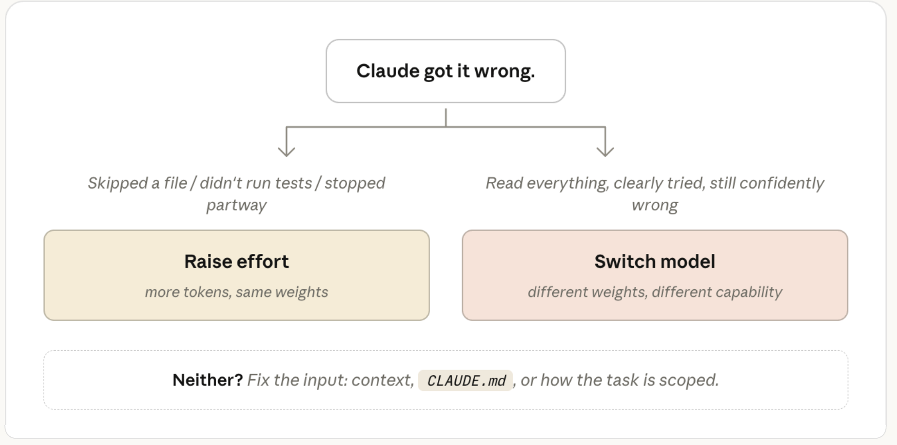

# Modell oder Effort: zwei Regler, zwei verschiedene Probleme

Anthropic beschreibt, warum Modellwahl und Effort Level in Claude Code unterschiedliche Ursachen adressieren — und warum der verbreitete Reflex, bei einem schlechten Ergebnis einfach das größere Modell zu wählen, oft an der falschen Stellschraube dreht. Die Leitfrage lautet: **Wusste Claude nicht genug, oder hat Claude nicht gründlich genug gearbeitet?**

Diese Notiz führt zwei Fassungen zusammen: den englischen Originalartikel als Primärquelle (per X-API erfasst) und eine deutsche Aufarbeitung aus dem vibedeck-Projekt als Sekundärquelle. Die Grafiken stammen aus dem Originalartikel.

## Die Unterscheidung

Das Modell bestimmt den **Fähigkeitsraum**: Die Gewichte enthalten die im Training erworbenen Muster und sind zur Inference-Zeit fest. Weder ein ausführlicher Prompt noch eine umfangreiche `CLAUDE.md` erweitern sie — sie lenken nur die nächste Vorhersage.

Effort bestimmt die **Arbeitstiefe**. Anthropic betont ausdrücklich, dass Effort mehr ist als Denkzeit: Es steuert, wie viele Dateien Claude liest, wie viel es verifiziert und wie weit es eine mehrstufige Aufgabe durchzieht, bevor es beim Nutzer nachfragt. Bei niedrigem Effort fragt Claude eher zurück, statt Tokens für eigene Ermittlung auszugeben.

Die Diagnose folgt dem Fehlerbild. **Effort erhöhen**, wenn Claude eine Datei übersprungen, Tests nicht ausgeführt, seine Änderung nicht kontrolliert, eine mehrstufige Aufgabe nur teilweise erledigt hat oder vorschnell nach Informationen fragt, die es selbst ermitteln könnte — das sind Symptome unzureichender Arbeitstiefe, nicht fehlenden Wissens. **Modell wechseln**, wenn Claude alles Relevante gelesen, die Tools tatsächlich eingesetzt und das Problem nachvollziehbar untersucht hat und trotzdem selbstbewusst falsch liegt.

## Der Regler, der vor beiden kommt

Die wichtigste Einschränkung steht vor der Modell-Effort-Entscheidung: Wenn eine Aufgabe eigentlich einfach sein sollte, ist mehr Rechenaufwand meist nur eine teure Behandlung des falschen Problems. Der Entscheidungsbaum führt diesen dritten Ausgang explizit: „Neither? Fix the input: context, `CLAUDE.md`, or how the task is scoped.“

Zu prüfen ist dann, ob die Aufgabe sinnvoll abgegrenzt ist, ob Claude alle relevanten Dateien und aktuelle Dokumentation hat, ob die nötigen Tools verfügbar sind, ob passende Skills eingebunden sind und ob die `CLAUDE.md` hilft oder Widersprüche erzeugt. Ein stärkeres Modell kann fehlenden Projektkontext nicht erraten, und mehr Effort arbeitet nur länger auf unvollständiger Grundlage.

## Das Kostenmodell

Die zentrale Formel des Artikels: **Das Modell wählt die Kurve, Effort bestimmt, wie weit nach rechts Claude auf ihr zu gehen bereit ist.**

Bei einer schwierigen Aufgabe kann das größere Modell bei mittlerem Effort dieselbe Qualität erreichen wie das kleinere bei maximalem — „same quality, fewer tokens“. Der höhere Preis pro Token wird dann durch weniger Umwege ausgeglichen, und manche Qualitätsstufe ist auf der kleineren Kurve überhaupt nicht erreichbar. Bei Routineaufgaben kehrt sich das um: Beide Modelle lösen sie, das größere führt aber zusätzliche Verifikationsschritte zum höheren Tokenpreis aus.

Zwei Präzisierungen, die der Artikel selbst macht: Die Kurven sind ausdrücklich **illustrativ und nicht aus Benchmarkdaten geplottet** — die Bildunterschrift sagt das explizit. Und Effort ist eine „spending disposition, not a token target“: kein festes Budget, das Claude zwingt, bei einer einfachen Aufgabe künstlich Arbeit zu erzeugen. Ein hartes `max_tokens` verhält sich anders und kann eine Ausgabe mitten in der Bearbeitung abschneiden.

Als Arbeitsweise empfiehlt Anthropic, mit dem Default zu starten, bei schlechtem Ergebnis zuerst den Kontext zu prüfen, dann das Fehlermuster zu benennen und nur die passende Stellschraube zu ändern. Effort solle als allgemeine Präferenz für die eigene Arbeitsweise gelten, nicht als Regler, an dem man bei jedem Prompt nachjustiert.

## Einordnung

Das ist eine Primärquelle vom Hersteller über sein eigenes Produkt — für die Mechanik (was Effort technisch steuert, dass Gewichte fest sind) belastbar, bei der Empfehlung naturgemäß nicht neutral. Bemerkenswert ist, dass Anthropic gegen den eigenen Umsatzanreiz argumentiert: Die Botschaft lautet nicht „nimm das größte Modell“, sondern „prüfe zuerst deinen Input“.

Die Kostenkurven sind als illustrativ gekennzeichnet und dürfen nicht als Messung gelesen werden. Wer eine belastbare Zahl zum Verhältnis von Aufwandsstufe und Kosten sucht, findet sie hier nicht — wohl aber in den Artificial-Analysis-Messungen bei [[2026-07-27-cerebras-gpt-5-6-modellwahl-und-reasoning]].

**Verhältnis zur Cerebras-Quelle:** Beide beschreiben unabhängig voneinander dieselbe Grundstruktur aus zwei getrennten Achsen — Modellwahl und Gründlichkeitsstufe. Das sind zwei verschiedene Anbieter über zwei verschiedene Produktfamilien, also eine echte unabhängige Bestätigung.

In der **Strategie** widersprechen sie sich jedoch. Cerebras empfiehlt, grundsätzlich beim günstigsten Modell zu starten und bei ausbleibendem Fortschritt zu eskalieren. Anthropic empfiehlt, beim Default zu starten und dann anhand des Fehlerbildes zu diagnostizieren, statt pauschal eine Richtung zu fahren. Anthropic ergänzt zudem eine Stufe, die bei Cerebras fehlt: den Input selbst. Diese Differenz ist der wertvollste Teil der Quelle und im Pattern als Spannung festgehalten.

## Kernaussagen

- Modellwahl und Gründlichkeitsstufe sind zwei getrennte Achsen, die verschiedene Ursachen adressieren; das Modell wählt die Qualitätskurve, die Aufwandsstufe die Position darauf → [[Modell-Eskalation-von-guenstig-nach-teuer]]
- Vor beiden Reglern steht der Input: unklarer Prompt, fehlende Dateien, fehlende Tools oder eine widersprüchliche `CLAUDE.md` lassen sich durch keine der beiden Einstellungen reparieren → [[Modell-Eskalation-von-guenstig-nach-teuer]]
- Das Fehlerbild entscheidet: übersprungene Arbeit spricht für mehr Aufwand, gründlich erarbeitete Fehlschlüsse für ein anderes Modell → [[Modell-Eskalation-von-guenstig-nach-teuer]]
- Eine widersprüchliche oder redundante `CLAUDE.md` ist ein eigenständiger Fehlergrund, nicht nur eine verpasste Chance → [[AGENTS-md-Onboarding-Design]]
- Bei schwierigen Aufgaben kann das größere Modell trotz höherem Tokenpreis günstiger sein, weil es weniger Iterationen braucht → [[Modell-Eskalation-von-guenstig-nach-teuer]]

## Verbindungen

- [[Modell-Eskalation-von-guenstig-nach-teuer]]
- [[2026-07-27-cerebras-gpt-5-6-modellwahl-und-reasoning]]
- [[Kontext-Hygiene-Entscheidungsbaum]]
- [[AGENTS-md-Onboarding-Design]]
- [[Action-Space-Design-nach-Modellfaehigkeit]]
