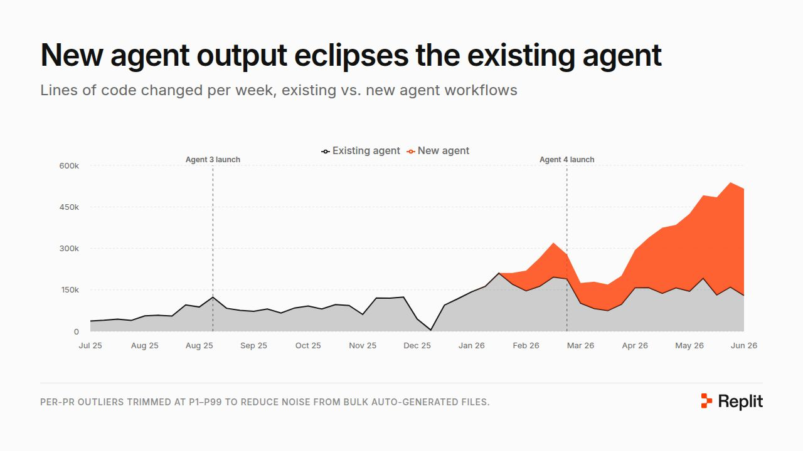
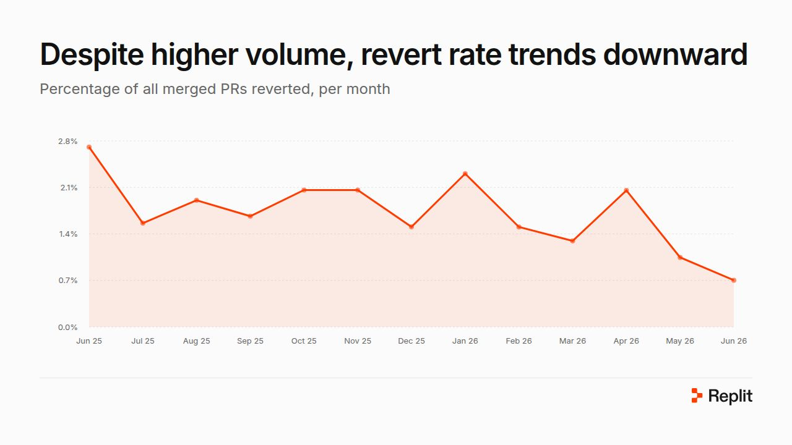

# Replit betreibt sich selbst mit Agents: Kennzahlen und Grenzen der „Self-Driving Company“

Replit-CEO Amjad Masad beschreibt, wie Replit zwischen Januar und Juni 2026 interne Agents in Engineering, Data, Sales, Marketing und Support eingeführt hat. Die Zahlen sind Selbstauskunft eines Anbieters, der seine eigene Agent-Plattform verkauft, ohne Methodik und ohne Gegenprüfung. Als Fallstudie für Setup und Metriken ist der Text trotzdem lehrreich, als Beleg für Produktivitätsgewinne nur eingeschränkt.

## Infrastruktur zuerst, dann Zugriff

Ende Januar baute Replit eine Umgebung, in der jeder Engineer Agent-Schwärme parallel starten kann: eigener Agent-Harness, microVMs, Remote-Filesystem. Erst danach wurde sie mit Access Policies, Token-Proxies, Audit-Logging und Zero-Trust-Netz abgesichert. Auf dieser Basis bekam der Agent Zugriff auf GitHub, GCP, Azure, Linear, Notion, Slack und ZenDesk. Jeder Mitarbeiter hat einen Manager-Agent, der weitere Agents spawnt, die in Loops an verifizierbaren Aufgaben arbeiten.

## Gemeldete Kennzahlen (Jan bis Jun 2026)

- **Code-Output:** Lines of Code laut Text 5,8-fach (alle Autoren, Chart wöchentlich bis rund 500k). Mit fester Kohorte aus 30 Engineers, die in der ersten und letzten gezeigten Woche je mindestens 5 PRs gemergt haben, 2,9-fach. Das Team hat sich laut Text verdoppelt.

- **Review:** Latenz laut Text unverändert. Der Agent schätzt das Risiko eines PR und holt nur bei Bedarf einen zweiten menschlichen Reviewer. Das spart laut Text 30 % der menschlichen Review-Zeit. Der Anteil agentisch freigegebener PRs steigt ab März auf etwa 29 bis 35 % pro Woche.
- **Qualität:** Revert-Rate laut Chart von rund 2,7 % (Jun 2025) auf rund 0,7 % (Jun 2026), im Text als „flat“ beschrieben. SEV-Untersuchungen pro Monat sinken von 22 auf etwa 11, die Mean Time to Mitigation von rund 68 auf rund 45 Minuten (auf P10 bis P90 getrimmt).

- **Wirkung:** Abgeschlossene Engineering-Projekte pro Monat von etwa 9 auf etwa 34, allerdings mit starker Streuung (Dezember 24, Februar 8). Eskalierte Support-Tickets werden laut Text 60 % schneller gelöst (Median etwa 33 auf 13 Geschäftsstunden).

## Wie die Agents eingesetzt werden

- **Loop Engineering:** Eine Flotte arbeitet an einer verifizierbaren Aufgabe. Beispiele: CSS-Migration (Slide: 423 PRs geöffnet, 309 gemergt, 1478 Dateien, +30k/−27k Zeilen in etwa zwei Monaten), Lokalisierungs-Migration, Wartung flaky Tests, ein Netzwerk-Bug.
- **Selbstverbesserung:** Das AI-Team koppelt Benchmarks vor dem Release mit A/B-Tests und geclusterten Traces nach dem Release in einer Schleife aus Reflect, Code, Review.
- **Fachbereiche:** Die Data-Abteilung stellte eine semantische Schicht über das Warehouse (Source-of-Truth-Tabellen und deren Beziehungen). Support gab dem Agent Playbooks als Skills, Marketing erzeugt Produkt-One-Pager aus Gesprächen und Dokumenten. Der Einstieg lief über einen Slack-Bot.
- **Build statt Buy:** Der interne Agent ersetzte ein SaaS-Produkt im siebenstelligen Bereich. Alert-Triage und Penetration Testing seien bei gleicher oder besserer Qualität etwa 10-mal günstiger. Belege oder Methodik nennt der Text nicht.

## Einordnung

Belastbar ist die Architekturreihenfolge: Sandbox und Zugriffskontrolle vor der Integration, Review mit Risikostufung statt Totalprüfung und Loops nur dort, wo ein Ergebnis maschinell prüfbar ist. Selbstberichtet sind alle Zahlen. Lines of Code ist eine schwache Output-Metrik, die Kohortenzahl (2,9-fach) ist die ehrlichere, und selbst sie erfasst nur Volumen. Die Qualitätsaussage stützt sich auf Revert-Rate und SEV-Zahl, nicht auf Defekte beim Kunden. Der Text widerspricht seinem eigenen Chart (Reverts „flat“ gegenüber sinkend). Der Chart „Individual throughput“ zeigt zwei handverlesene Engineers, einer fällt nach dem Peak zurück. Kosten der Arbeitsweise (Token-Verbrauch, Betrieb der Plattform) und das Review-Risiko bei agentischer Freigabe nennt der Autor nicht. Die Hackathon-Slides im Artikel stammen aus einem Kundenbericht und belegen die Engineering-Aussagen nicht.

## Kernaussagen

- Agents erst nach Sandbox, Audit-Logging und Zugriffsrichtlinien an Firmensysteme anbinden → [[Sandbox-Komposition-aus-OS-Primitiven]]
- Agent-Review schätzt das Risiko und holt Menschen nur bei Bedarf, ein Drittel der PRs wird agentisch freigegeben → [[CI-Agent-mit-Review-Gate]]
- Fleet-Loops an verifizierbaren Aufgaben (Migrationen, Flaky Tests) liefern den größten Output-Sprung → [[Kontrollierte-Agent-Parallelisierung]]
- Selbstverbesserung über Benchmarks vor dem Release plus A/B-Tests danach → [[Hillclimbing-mit-Holdout-Split]]

## Verbindungen

- [[Kontrollierte-Agent-Parallelisierung]]
- [[CI-Agent-mit-Review-Gate]]
- [[2026-08-30-alex-sprogis-loop-graph-engineering-das-letzte-video-was-du-s]]
- [[2026-07-03-calebwritescode-loop-engineering-explained-in-7-min-and-simplified]]
