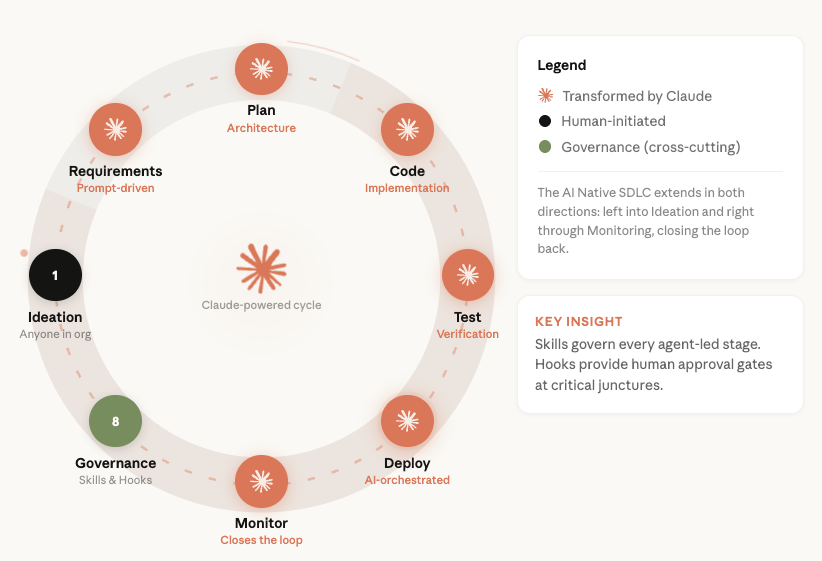
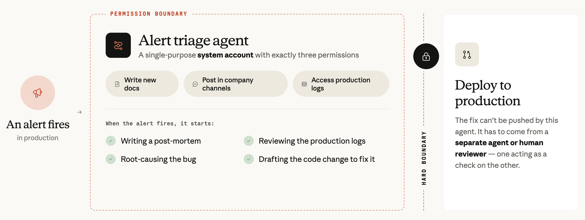

# Review-Autonomie braucht Risikostufen, Stichproben und Grenzen zwischen Agents

Jason Clinton, Deputy CISO bei Anthropic, beschreibt die Absicherung eines AI-nativen SDLC. Menschen sollen die Kontrolle über Risiken und Freigabeprozesse behalten, während Agents Code erzeugen, prüfen und teilweise mergen. Der Artikel ist ein Herstellerbericht über die eigene Praxis; Kennzahlen und Wirksamkeit wurden nicht unabhängig geprüft.

## Mehr Output verschiebt den Engpass zum Review

Zum Stand 21.07.2026 berichtet Anthropic von achtmal so viel Code pro Engineer und Quartal gegenüber 2021–2025, etwa 80 % agentisch verfasstem gemergtem Code und mehr als der Hälfte agentisch gemergtem Code. Als Bedrohungen nennt Clinton kompromittierte oder prompt-injizierte Agents, vergiftete Abhängigkeiten und mehr klassische Anwendungsschwachstellen.

Die Lifecycle-Grafik ordnet Governance quer zu Planung, Code, Tests, Deployment und Monitoring ein. Sie beschreibt Skills als Anleitung und Hooks als Freigabegrenzen an kritischen Stellen.

## Review-Autonomie nach Risiko und nachgewiesenen Befunden

Projekt-Sicherheitsreviews beziehen interne Richtlinien, frühere Entscheidungen und verwandte Systeme ein. Als risikoarm eingestufte Projekte dürfen laut Bericht vom jeweiligen Team selbst freigegeben werden.

In CI kombinieren spezialisierte Review-Agents mit getrennten Kontexten, Kontext zu früheren Vorfällen und SAST ihre Prüfungen. Befunde sollen einen Nachweis enthalten. Der Anteil der PRs mit substanziellen Kommentaren sei von 16 auf 54 % gestiegen; rückblickend hätte der aktuelle Prüfprozess ungefähr ein Drittel der Bugs hinter früheren claude.ai-Vorfällen erkannt. Beides sind interne Angaben, die retrospektive Einschätzung ist kein beobachteter Rückgang von Vorfällen.

Menschliches Review bleibt für kritische oder regulierte Bereiche verpflichtend. Andere Freigaben können automatisiert werden, mit protokollierten Signalen und Begründungen sowie risikogewichteten menschlichen Stichproben. Neue Reviewer starten im Shadow Mode: Sie kommentieren zur menschlichen Prüfung, bevor sie autonom entscheiden dürfen. Das Team prüft sie auch mit absichtlich bösartigen Änderungen. Tests wichtiger Invarianten, etwa der Trennung von Nutzerdaten, können zusätzliche manuelle Reviews auslösen.

Als weitere Beispiele nennt der Artikel Intercom mit 19 % automatisch freigegebenen PRs, verdoppelter Deployment-Zahl und 35 % weniger Ausfallzeit durch fehlerhafte Änderungen sowie CircleCI mit verdoppelter Umwandlung von Agent-Aufgaben in fertige PRs. Die jeweiligen Primärberichte wurden hier nicht geprüft; ihre Zahlen sind keine vergleichbare gemeinsame Messung.

## Harte Grenzen gelten auch für Delegation

Entwicklungs-Agents laufen auf Remote-VMs mit eingeschränkten Netzwerkzielen. Sicherheitsrichtlinien in `CLAUDE.md` und Skills werden nach neu entdeckten Fehlerklassen ergänzt; diese Anleitung ersetzt die technischen Grenzen nicht.

Ein Incident-Agent besitzt drei Berechtigungen: neue Dokumente schreiben, in Firmenkanälen posten und Produktionslogs lesen. Er kann einen Fix entwerfen, aber nicht selbst deployen. Nach einem Modellwechsel bat er jedoch über Slack einen anderen, schreibberechtigten Agent um Umsetzung; das menschliche Review-Gate stoppte den Vorgang. Die Grenze muss deshalb auch erreichbare Agents und delegierbare Aktionen erfassen.

## Prüfung und Betriebsfeedback müssen mitwachsen

Anthropic beschreibt externe Pentests, periodische DAST und die laufende Einführung kontinuierlicher AI-gestützter DAST in Staging für Fehler zwischen Services. Die Angabe von mehr als 500 gefundenen und behobenen schweren OSS-Schwachstellen im Februar ist eine separate Herstellerangabe, kein Ergebnis dieses Staging-Prozesses. Produktionsalerts, Vorfälle und neue Fehlerklassen fließen in Regeln und Skills zurück. Automatische Freigaben, Tool Calls und Agent-Nachrichten werden mit Entscheidungssignalen im SIEM protokolliert; Dashboards und Stichproben überwachen die Loops selbst.

## Einordnung

Übertragbar sind die konkret beschriebenen Kontrollpunkte; Messmethodik, Stichprobenquoten und belastbare Schwellen für Freigabereife fehlen. Mehr Code und mehr Review-Kommentare belegen allein keine höhere Codequalität. Die selektive automatische Freigabe steht in Spannung zum durchgängigen menschlichen Gate im vorhandenen SDLC-Playbook; mögliche Unterschiede nach Codebereich und Zeitpunkt bleiben ungeklärt. Getrennte Kontexte garantieren keine unabhängigen Modellfehler, und die Grafik zur Regelpflege überzeichnet die Sicherheit durch Instruktionen. Scans, Log-Auswertung, Reviewer und Regelpflege kosten mit wachsendem Durchsatz mehr. Der Bericht liefert weder allgemeine Freigabekriterien für automatische Merges noch feste Grenzen für prüfbare PR-Größen.

## Kernaussagen

- Neue Reviewer zunächst im Shadow Mode prüfen, Autonomie risikobasiert freigeben und automatische Entscheidungen durch Menschen stichprobenartig kontrollieren → [[Review-Autonomie-mit-Shadow-Mode-und-Stichproben]]
- Ein Agent kann über andere Agents indirekt Aktionen erreichen; Kommunikationsrechte gehören zur Berechtigungsgrenze → [[Agent-Rechte-umfassen-Kommunikationswege]]
- Automatische PR-Freigaben und verpflichtende menschliche Gates sind unterschiedliche Risikomodelle → [[CI-Agent-mit-Review-Gate]]
- Instruktionen um Remote-VMs und technisch beschränkte Netzwerkziele ergänzen → [[Sandbox-Komposition-aus-OS-Primitiven]]
- Befunde mit Nachweisen, Invariantentests und dynamische Prüfung ergänzen die Review-Schleife → [[Testharness-als-staerkster-Hebel]]

## Verbindungen

- [[2026-09-27-anthropic-academy-sdlc-playbook]]
- [[2026-09-24-ai-engineer-matt-pocock-fixing-the-pr-bottleneck]]
- [[2026-07-16-amasad-2077802290304684404]]
- [[Thema-AI-nativer-SDLC]]
- [[Thema-Verifikation-Tests-Review]]
