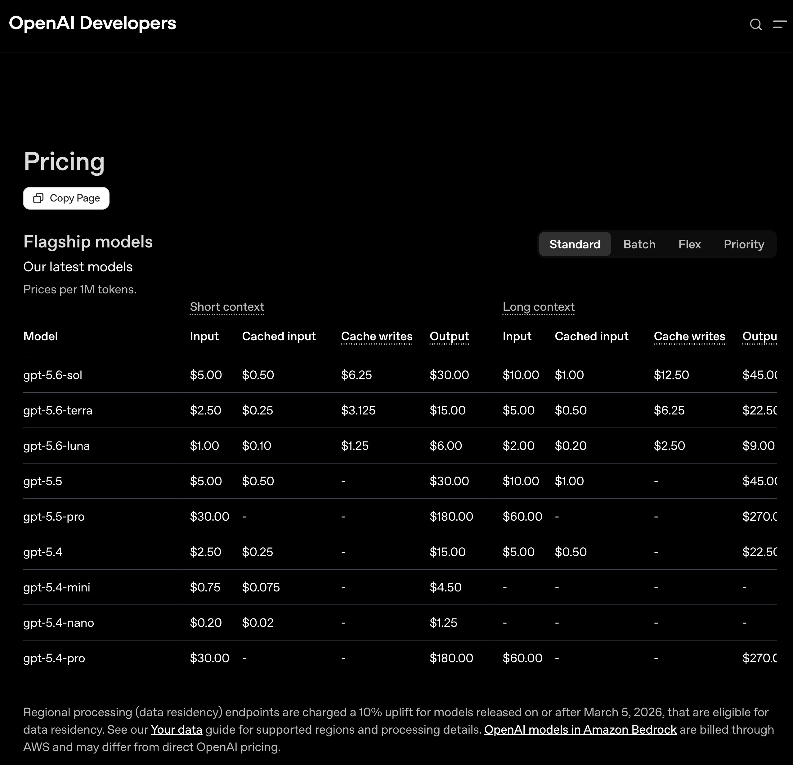
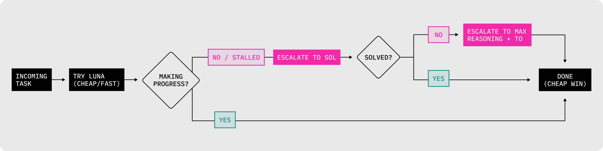
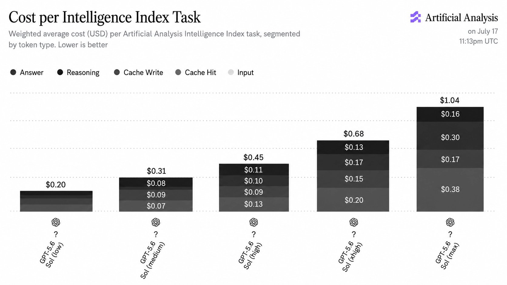
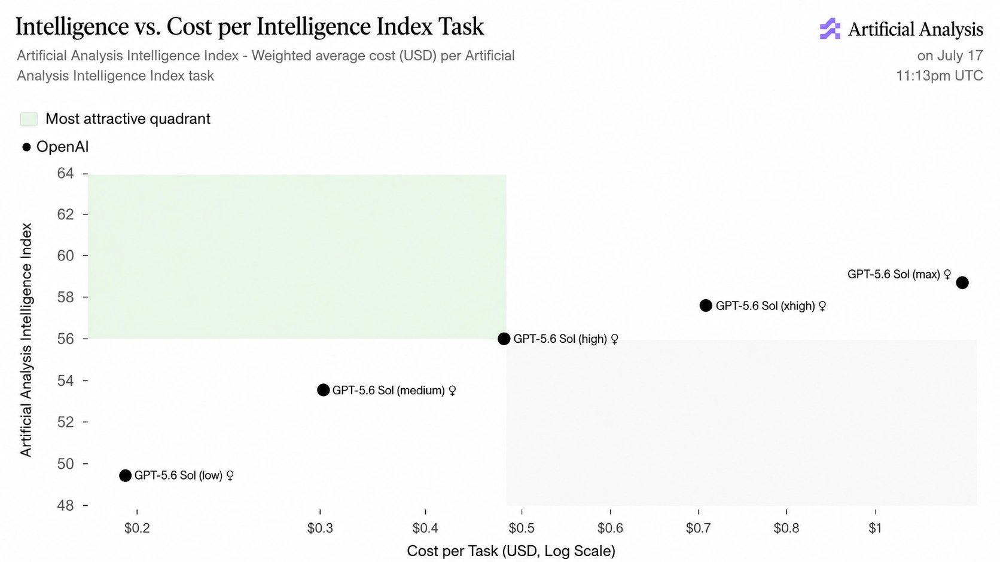
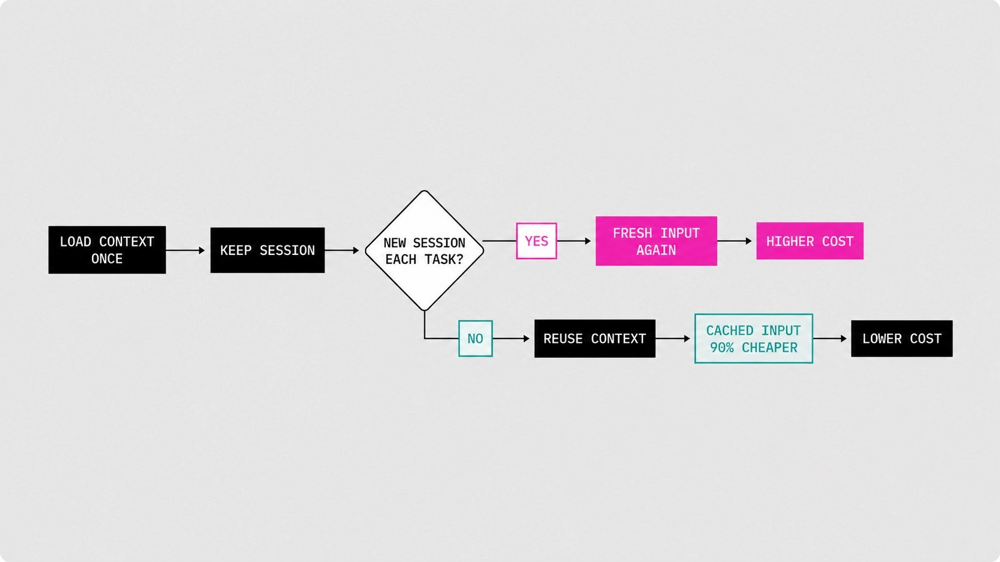
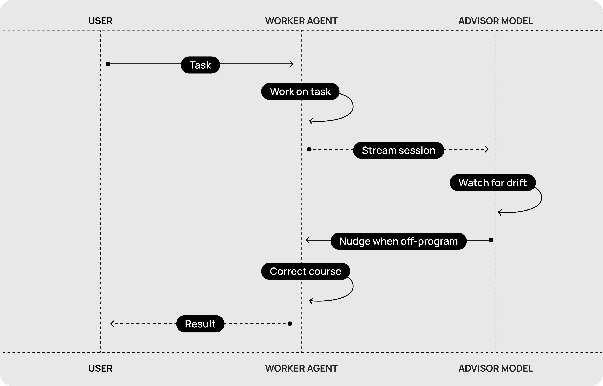

# Modellwahl und Reasoning-Stufen als Kostenhebel im Codex-Workflow

Cerebras beschreibt am Beispiel der drei GPT-5.6-Modelle Sol, Terra und Luna, wie man Modellwahl, Reasoning-Stufe und Prompt-Caching bewusst als Kostenhebel einsetzt statt reflexhaft das stärkste Modell zu nehmen. Der Artikel liefert drei konkrete Arbeitsweisen: Eskalation von unten, ein Advisor-Agent gegen Abdriften und Session-Wärme als Cache-Strategie. Die belastbarsten Zahlen stehen in den mitgelieferten Charts, nicht im Fließtext.

## Die Preisstaffel setzt den Rahmen

Die drei Modelle sind unabhängig trainiert und separat bepreist. Aus der mitgelieferten Preisseite (Stand 21. Juli 2026, Preise je 1M Tokens, Short Context):

| Modell | Input | Cached Input | Output |
|---|---|---|---|
| `gpt-5.6-sol` | 5,00 $ | 0,50 $ | 30,00 $ |
| `gpt-5.6-terra` | 2,50 $ | 0,25 $ | 15,00 $ |
| `gpt-5.6-luna` | 1,00 $ | 0,10 $ | 6,00 $ |

Terra kostet exakt die Hälfte von Sol, Luna ein Fünftel — und zwar sowohl im Short- als auch im Long-Context-Tarif. Cached Input liegt durchgängig bei 10 % des regulären Input-Preises, was die im Text genannten „90 % günstiger“ rechnerisch bestätigt.

Die Rollenverteilung laut Artikel: Sol für lange Läufe, komplexe technische Probleme und die Koordination von Subagents. Terra als Mittelweg mit „most of the intelligence at half the price“ und als starker Subagent unter Sols Regie — Sol entscheidet die Richtung, Terra führt aus. Luna für Alltagsaufgaben; laut Artikel rangiert es am 17. Juli 2026 auf Platz 16 von 576 Modellen im Intelligence Index von Artificial Analysis.

## Eskalation von unten statt Start beim Spitzenmodell

Die zentrale Arbeitsweise: nicht mit dem stärksten Modell beginnen, sondern mit dem günstigsten — und erst hochschalten, wenn der Fortschritt ausbleibt. Die Abbruchkriterien sind konkret benannt: der Agent bleibt hängen, Fixes greifen nicht mehr, oder das Modell verliert den Faden.

Die zweite Eskalationsachse ist die Reasoning-Stufe, die in Codex fünf Werte kennt: Light, Medium, High, Extra High und Ultra. Der Artikel ordnet sie zu — Light für Aufgaben, bei denen das Modell weiß was zu tun ist und die Fehlerwahrscheinlichkeit niedrig ist; Medium als Alltagsdefault für Aufgaben mit Interpretations- oder Debugging-Anteil; High und Extra High für schwierige STEM- und Coding-Probleme mit mehreren plausiblen Lösungswegen; Ultra nur bei detaillierten Constraints über mehrere unabhängige Systeme hinweg.

Was das kostet, steht ausschließlich in den Charts. Artificial Analysis hat am 17. Juli 2026 die Kosten pro Index-Task für Sol über alle Reasoning-Stufen gemessen:

0,20 $ bei `low`, 0,31 $ bei `medium`, 0,45 $ bei `high`, 0,68 $ bei `xhigh` und 1,04 $ bei `max`. Das entspricht Aufschlägen von 55 %, 45 %, 51 % und 53 % pro Stufe und bestätigt die Aussage des Artikels, dass jede Stufe rund 50 % mehr kostet. Von der niedrigsten zur höchsten Stufe ist es der Faktor 5,2.

Was der Aufpreis bringt, zeigt das zweite Chart: der Intelligence-Index steigt von etwa 49,5 bei `low` auf 58,7 bei `max`.

Gut neun Index-Punkte für den 5,2-fachen Preis — und nur die Stufen bis `high` liegen im als „most attractive quadrant“ markierten Bereich des Charts. Das ist das eigentliche Argument für Eskalation von unten: der Grenznutzen sinkt, während die Kosten annähernd exponentiell steigen.

## Session-Wärme als Cache-Strategie

Cached Input kostet 10 % des Normalpreises, die Cache-TTL liegt laut Artikel bei etwa 30 Minuten. Daraus folgt eine Arbeitsweise, die dem intuitiven Aufräumen widerspricht: eine durchgehende Session ist billiger als eine neue pro Aufgabe, weil jeder Neustart denselben Codebase-Kontext erneut zum vollen Preis einliest.

Als praktischen Trick nennt der Artikel Codex-Automations im 20-Minuten-Takt, die den Cache innerhalb der TTL warm halten und gleichzeitig länger laufende Prozesse antreiben.

## Advisor-Agent gegen Abdriften

Für längere Läufe beschreibt der Artikel eine Zwei-Rollen-Aufteilung mit einem eng umrissenen Auftrag für den zweiten Agenten: die vollständige Session mitlesen, Ziel und Constraints im Blick halten und eingreifen, sobald der Worker abdriftet.

Der Advisor arbeitet nicht mit, er beobachtet — und greift nur bei Abweichung ein. Ergänzend erwähnt der Artikel, dass sich in lokalem Codex auch andere Anbieter einbinden lassen, etwa Kimi K2.7 Code oder GLM-5.2 für begrenzte Subagent-Aufgaben. Wichtige Einschränkung: Das läuft über Codex-Konfiguration und eigene Agent-Dateien, nicht über einen Modell-Auswahldialog in der App.

## Einordnung

Die Preis- und Kostenzahlen sind belastbar: Die Preistabelle ist ein Screenshot der OpenAI-Preisseite, die Reasoning-Kosten kommen von Artificial Analysis mit Messdatum. Beide sind unabhängig von Cerebras und rechnerisch konsistent mit den Textaussagen — ich habe Verhältnisse und Aufschläge nachgerechnet, sie stimmen.

Bei der Empfehlung, Sol auf Cerebras-Hardware mit 750 Tokens pro Sekunde und „bis zu 10× schneller“ zu betreiben, handelt es sich um Eigenwerbung des Herausgebers im Ratgeberformat. Der Geschwindigkeitsvorteil ist plausibel, aber selbstberichtet und ohne Vergleichsmethodik.

Unbelegt bleibt auch die Behauptung, Codex-Kompaktion sei inzwischen gut genug für „hunderte Millionen Tokens“ in einer einzigen Session. Das steht in direkter Spannung zum bestehenden [[Kontext-Hygiene-Entscheidungsbaum]], der `/compact` als grundsätzlich verlustbehaftet einordnet und aus mehreren unabhängigen Quellen belegt, dass frühes Aufräumen der Qualität dient. Der Cache-Anreiz zieht in die eine Richtung, die Kontextqualität in die andere — das ist ein echter Trade-off und keine Frage, die eine Seite gewinnt.

Zu beachten: Die Reasoning-Stufen heißen im Codex-Interface Light bis Ultra, in den Charts von Artificial Analysis `low` bis `max`. Die Zuordnung ist naheliegend, aber nirgends explizit bestätigt. Alle Preise und Modellnamen sind zeitgebunden — belastbar ist die Methode, nicht die Zahl.

## Kernaussagen

- Beim günstigsten tragfähigen Modell beginnen und erst bei ausbleibendem Fortschritt eskalieren; dieselbe Logik gilt für die Reasoning-Stufe → [[Modell-Eskalation-von-guenstig-nach-teuer]]
- Jede Reasoning-Stufe kostet rund 50 % mehr, von `low` bis `max` das 5,2-Fache, bei nur gut neun Punkten Zugewinn im Intelligence-Index → [[Modell-Eskalation-von-guenstig-nach-teuer]]
- Ein zweiter Agent mit dem einzigen Auftrag, Ziel und Constraints zu überwachen und bei Drift einzugreifen, stabilisiert lange Läufe → [[Advisor-Agent-gegen-Drift]]
- Cached Input kostet 10 % des Normalpreises bei etwa 30 Minuten TTL; eine warme Session ist deshalb günstiger als eine neue pro Aufgabe → [[Kontext-Hygiene-Entscheidungsbaum]]
- Günstigere Fremdmodelle lassen sich in lokalem Codex als begrenzte Subagents einbinden, aber nur über Konfigurationsdateien → [[Lokale-Modell-Umleitung-Muster]]

## Verbindungen

- [[Modell-Eskalation-von-guenstig-nach-teuer]]
- [[Advisor-Agent-gegen-Drift]]
- [[Kontext-Hygiene-Entscheidungsbaum]]
- [[Lokale-Modell-Umleitung-Muster]]
- [[Plan-first-mit-getrenntem-Review]]
