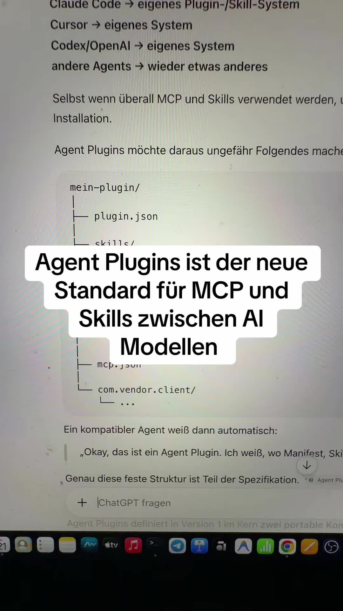

# Agent Plugins: ein gemeinsames Paketformat für Skills und MCP-Server

Der Creator stellt „Agent Plugins“ als neuen Standard vor, auf den sich große KI-Anbieter einigen wollen, damit Skills und MCP-Konfigurationen zwischen Coding Agents portierbar werden. Die Quelle ist ein 77-Sekunden-Kommentarvideo mit automatischem Transkript. Namen der beteiligten Firmen, Versionsstand und Spezifikationslink nennt sie nicht; die Belastbarkeit ist daher gering und müsste an der Primärspezifikation geprüft werden.

## Das Problem und der beschriebene Aufbau

Bisher hat jeder Agent sein eigenes Plugin- oder Skill-System: Claude Code, Cursor und Codex/OpenAI je ein eigenes, weitere Agents wieder ein anderes. Selbst wenn überall MCP und Skills genutzt werden, unterscheidet sich Installation und Verpackung. Das Cover zeigt dazu eine ChatGPT-Antwort, die diese Lage zusammenfasst und von einer „Version 1“ mit zwei portablen Kernbausteinen spricht.

Der Aufbau laut Video und Cover: ein Hauptordner mit einer `plugin.json` (Manifest mit der Spezifikation), einem Ordner `skills/` und einer `mcp.json`. Der Creator vermutet zusätzlich Skripte, etwa Python, für deterministische Logik oder Regex-Schritte. Ein kompatibler Agent erkennt anhand der festen Struktur selbst, wo Manifest, Skills und MCP-Konfiguration liegen.

## Einordnung

Die Struktur ist als Screenshot einer ChatGPT-Antwort belegt, nicht als Spezifikationstext; Details wie Feldnamen oder Governance bleiben offen, und „Skripte“ sind ausdrücklich Vermutung. Inhaltlich fügt das Format keine neue Ebene hinzu, sondern bündelt Skills und MCP-Server als Auslieferungseinheit. Der Nutzen liegt in Portabilität, nicht in besserem Agent-Verhalten. Kosten: Migrationsaufwand bestehender Plugins und das Risiko, dass „Standard“ vorerst nur eine Absichtserklärung ist. Prüfe die Primärspezifikation, bevor du eigene Skills umbaust.

## Kernaussagen
- Skills und MCP-Konfiguration sollen als ein Plugin-Paket (`plugin.json`, `skills/`, `mcp.json`) über Agents hinweg portierbar werden → [[Erweiterungs-Ebenen-Zuordnung]]
- Bisher hatte jeder Agent ein eigenes Installations- und Paketsystem, auch bei gemeinsamem MCP und Skills → [[Erweiterungs-Ebenen-Zuordnung]]

## Verbindungen
- [[Erweiterungs-Ebenen-Zuordnung]]
- [[2026-02-01-anthropic-docs-extend-claude-code]]
- [[2026-09-14-code-test-plugins-with-evals-claude-code-docs]]
- [[2026-02-01-anthropic-docs-connect-claude-code-to-mcp]]
