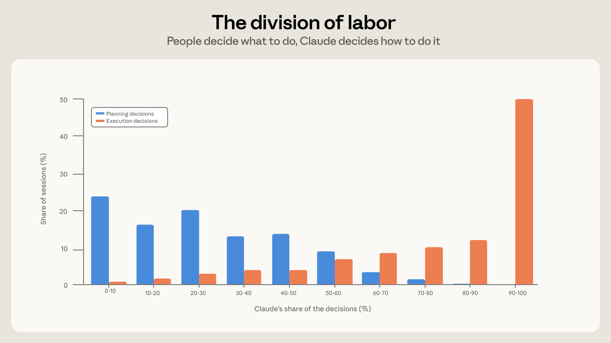
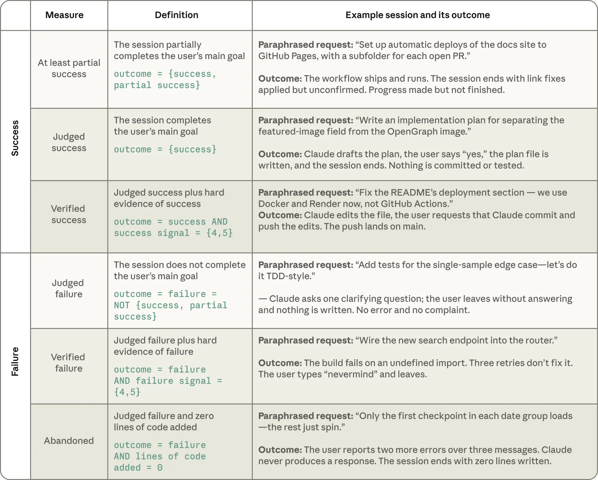

# Claude-Code-Nutzungsdaten: Menschen planen, der Agent führt aus, Domänenwissen entscheidet über Erfolg

Anthropic wertet ca. 400.000 interaktive Claude-Code-Sessions von ca. 235.000 Personen aus (Oktober 2025 bis April 2026). Kernaussage: Menschen treffen die Planungsentscheidungen, Claude die Ausführungsentscheidungen, und je mehr Domänenexpertise die Person mitbringt, desto mehr erledigt der Agent pro Prompt und desto öfter endet die Session erfolgreich. Es ist eine Herstellerstudie mit modellbasierter Klassifikation (Claude Sonnet 4.6) ohne Messung realer Ergebnisse. Der Datumsstempel der Inbox-Notiz ist unsicher; das Zitat im Artikel nennt den 16.06.2026.

## Woran gearbeitet wird

Neun Arbeitsmodi, Anteil an allen Sessions: Fixing 26 %, Building 25 %, Operating (Deploy, Config, Pipelines) 17 %, Docs und Präsentationen 10 %, System verstehen 7 %, Änderung planen 7 %, Agents und Pipelines orchestrieren 3 %, Datenanalyse 3 %, Testen 2 %. Über sieben Monate sank der Fixing-Anteil von 33 % auf 19 %, Building von etwa 27 % auf 21 %. Operating stieg von 14 % auf 21 %, Schreiben und Datenanalyse zusammen von etwa 10 % auf 20 %. Die geschätzte Aufgabenwertigkeit (Vergleich mit Freelance-Ausschreibungen) stieg im Mittel um 27 %; die Autoren sagen selbst, die Dollarwerte seien grob und nur für relative Vergleiche gedacht.

## Arbeitsteilung und Hebel pro Prompt

Menschen treffen im Schnitt ca. 70 % der Planungs-, aber nur ca. 20 % der Ausführungsentscheidungen. Eine typische Session hat etwa vier Turns; jeder Prompt löst im Mittel ca. 10 Aktionen und 2.400 Wörter Output aus (im Extrem über 100 Aktionen, bei ca. 2 % der Sessions im Schnitt). Behält der Mensch über 80 % der Ausführungsentscheidungen, sind es ca. 8 Aktionen pro Turn; übernimmt Claude über 80 % der Planung, ca. 16.

Expertise wird pro Session auf einer Skala von 1 bis 5 durch ein Modell geschätzt, anhand dreier Signale: wie präzise die Anweisung gerahmt ist, was verifiziert wird und wer wen korrigiert. Sie ist aufgabenspezifisch, kein Jobtitel. Novice-Sessions (1) lösen ca. 4,9 Aktionen und 607 Wörter pro Prompt aus, Expert-Sessions (5) ca. 11,7 Aktionen und 3.200 Wörter.

## Erfolg und Expertise

Erfolg wird über zwei transkriptbasierte Maße gemessen: „Judged“ (Klassifikator liest das Transkript) und „Verified“ (zusätzlich mindestens ein hartes Signal wie passende Commits/PRs, bestandene Tests oder explizite Bestätigung). Die Kontrollen: gleiche Arbeitsart, gleicher geschätzter Wert, gleicher Monat, gleiches Thema, gleiche Berufsgruppe.

- Verified Success: Novice 15 %, Intermediate bis Expert 28–33 %. Mindestens teilweiser Erfolg: 77 % gegenüber 91–92 %.
- In Sessions mit Problemen (Fehler, fehlgeschlagene Tests, Wiederholungen, Frust) ist Verified Success 4 % (Novice) gegenüber 15 % (Expert).
- Abbruch nach Fehlschlag ohne eine geschriebene Codezeile: 19 % bei Novices, 5–7 % bei allen anderen.
- Der größte Sprung liegt zwischen Novice und Intermediate; zwischen Intermediate und Expert flacht die Kurve ab.

Bei Coding-Sessions liegen alle zehn größten Berufsgruppen innerhalb von sieben Punkten der Software-Berufe (Verified 34 %); Management liegt mit 37 % leicht darüber. Das kann auch daran liegen, dass Manager Zufriedenheit eher explizit äußern.

## Einordnung

Die Zahlen sind selbstberichtet durch den Hersteller, klassifiziert von einem Modell und ohne Kenntnis, ob der Code später genutzt wurde. Ausgeschlossen sind Headless-Läufe (`claude -p`), SDK und Drittanbieter-IDEs, also gerade die automatisierte Nutzung. Die Erfolgsrate „Verified“ von rund 30 % hängt stark von der Definition ab (harte Signale wie Commit oder Test) und ist kein Maß für Qualität. Die Recovery-Lücke ist teils verzerrt: Experten stoßen laut Fußnote auf schwierigere Probleme, sodass ihre Lücke eher unterschätzt sein dürfte. Praktisch bestätigt die Studie, dass sich Steuerungsaufwand auf Spezifikation und Verifikation verlagert, nicht auf Codeschreiben.

## Kernaussagen
- Menschen planen (ca. 70 % der Planungsentscheidungen), der Agent führt aus (ca. 80 % der Ausführungsentscheidungen) → [[Great-Decoupling-Rollenverstaendnis]]
- Mehr Domänenwissen bedeutet längere autonome Aktionsketten pro Prompt (11,7 statt 4,9 Aktionen) → [[Plan-first-mit-getrenntem-Review]]
- Harte Verifikationssignale (Tests, Commits) definieren „Erfolg“ in der Messung → [[Testharness-als-staerkster-Hebel]]
- Fixing-Anteil fällt von 33 % auf 19 %, Operating und Schreiben wachsen → [[Intent-Engineering-als-dritte-Schicht]]

## Verbindungen
- [[Great-Decoupling-Rollenverstaendnis]]
- [[Testharness-als-staerkster-Hebel]]
- [[2026-08-14-floknowsai-ueber-achtzig-prozent-des-codes-von-claude-code-und-codex-sieht-kein]]
- [[2026-09-13-stefanantonelli-du-brauchst-keinen-entwickler-um-mit-ki-etwas-zu-bauen]]
