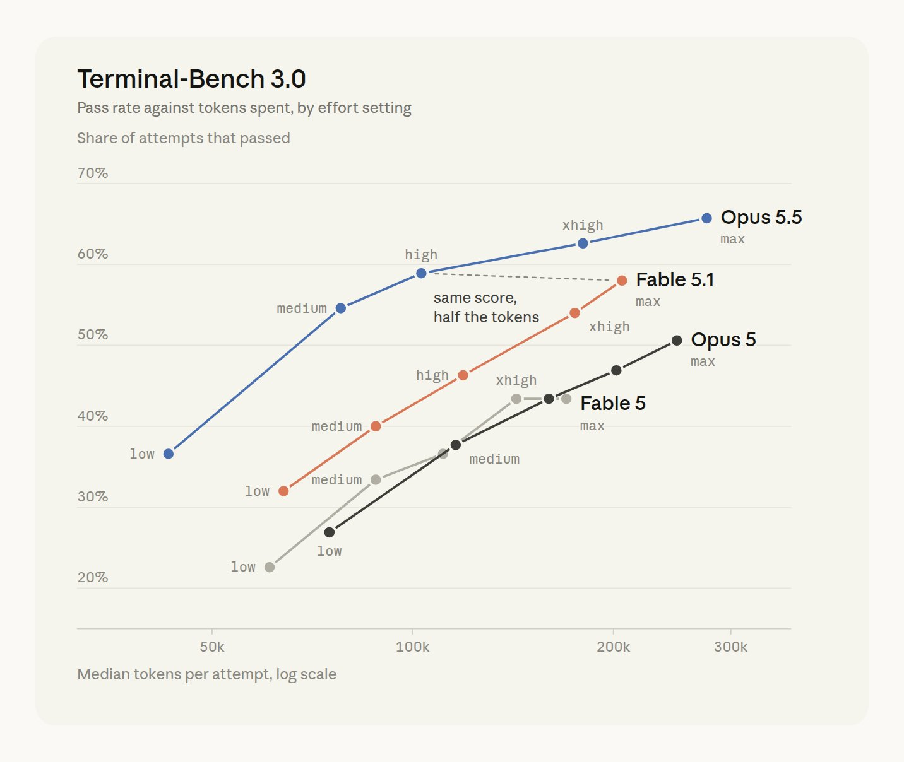
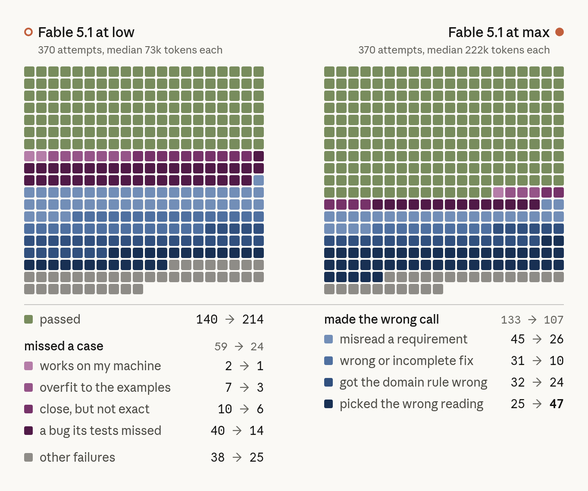
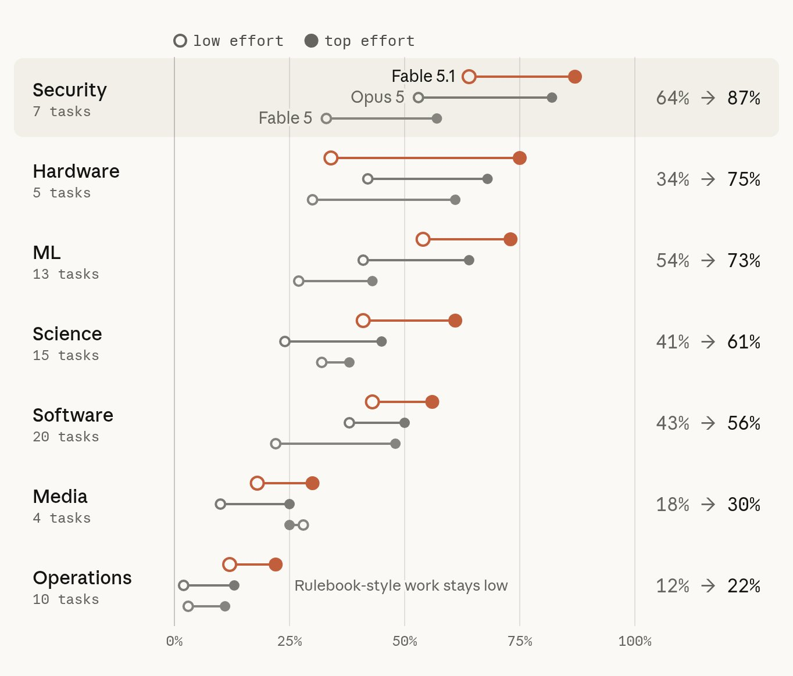

# Effort in Claude Code: Verifikationstiefe kaufen, nicht Intelligenz

Thariq (Anthropic) wertet eigene Terminal-Bench-3.0-Läufe und Tests mit Spielaufgaben aus und kommt zu einer Kernaussage: Effort steuert vor allem, wie viel Verifikation, Edge-Case-Tests und eigene Ermessensentscheidungen Claude aufwendet. Es macht das Modell nicht klüger im Sinne eines besseren Ansatzes. Die Zahlen sind Herstellermessungen des eigenen Produkts (Stand 2026-09-25), plausibel und detailliert belegt, aber nicht unabhängig geprüft.

## Was Effort ändert

Effort ist ein Signal, wie viel Rechenaufwand du willst. Thariq vergleicht es mit einer Frist: Bei knapper Frist liefert man eine tragfähige erste Version und iteriert, bei großzügiger arbeitet man gründlicher und trifft mehr eigene Entscheidungen. Bei Fable 5.1 und Opus 5.5 soll Effort außerdem den Prompt Cache in Claude Code nicht zerstören (Aussage der Quelle, nicht geprüft).

Bei unterspezifizierten Aufgaben wächst mit dem Effort vor allem der Umfang der eigenen Annahmen. Die Fitness-Tracker-App wird von einem simplen Log mit Graph (Low, 1,5 min) über ein Dashboard (High, 11 min) bis zu einer App mit Heatmap (Max, 67 min). Beim Redesign des `/config`-Menüs dauert Low 1 Minute und liefert eine Skizze, Max 28 Minuten und einen Mockup, der wie Claude Code aussieht. Thariq bevorzugt hier Low, um Claudes Idee zu verstehen. Bei einer per Interview erarbeiteten Detailspezifikation nähern sich die Ergebnisse dagegen an (Laufzeiten 16, 22, 33 und 79 Minuten für Low bis Max), Max vereinfacht lediglich einige Details.

## Terminal-Bench 3.0

Der Kurvenvergleich zeigt Pass Rate gegen mediane Tokens pro Versuch (Bild, Werte aus dem Chart abgelesen, also ungefähr): Opus 5.5 steigt von rund 37 % bei etwa 40k Tokens (Low) auf rund 65 % bei etwa 280k (Max). Fable 5.1 kommt von rund 32 % auf rund 58 % bei etwa 200k. Die Anmerkung im Chart: Opus 5.5 auf High erreicht rund 59 % und damit den Score von Fable 5.1 auf Max mit etwa der Hälfte der Tokens.

Die Fehleranalyse für Fable 5.1 (370 Versuche je Setting, also 74 Aufgaben mal 5) zeigt, was mehr Effort tatsächlich behebt. Median 73k Tokens bei Low, 222k bei Max. Bestanden: 140 auf 214. Fälle, in denen ein Randfall übersehen wurde („missed a case“): 59 auf 24, darunter „a bug its tests missed“ von 40 auf 14. Fälle mit falschem Ansatz („made the wrong call“) sinken nur von 133 auf 107, und die Kategorie „picked the wrong reading“ steigt sogar von 25 auf 47.

Nach Kategorie profitieren Security (64 % auf 87 %), Hardware (34 % auf 75 %) und ML (54 % auf 73 %) am stärksten, Operations (12 % auf 22 %) kaum: Regelwerkartige Arbeit bleibt niedrig. Die Gruppen sind klein (Security 7, Hardware 5, Operations 10 Aufgaben).

## Konkrete Verhaltensunterschiede

Der Text belegt den Mechanismus mit Läufen (jeweils 5 Versuche pro Stufe):

- HTML-Sanitizer (`html-js-filter`): Fable 5.1 geht von 1/5 (Low, ca. 2 min) auf 5/5 (xhigh, ca. 33 min). Der High-Lauf prüfte den ersten Entwurf adversarial, las den Parser-Quellcode, ließ eine Standard-XSS-Suite laufen und schrieb einen Fuzzer.
- Storage-Engine-Bug (`mvcc-lsm-compaction`): Opus 5.5 von 0/5 auf 4/5. High reproduziert den Crash zuerst, schreibt einen randomisierten Test gegen eine Referenz ohne Compaction und prüft, dass die Tests an halben Fixes scheitern. Low editiert vor dem Build und prüft nicht, ob der neue Test den Bug gefunden hätte.
- LP-Solver (`cli-2ph-simple`): 0/5 auf 5/5, weil High gegen einen Brute-Force-Solver testet und Laufzeiten misst; Low warnt nur, dass er langsam sein könnte.
- GSEA-Analyse: High probiert zwei Datenaufbereitungen und geht der Abweichung nach. Thariq merkt an, dass ein Nutzer in der Schleife hier vermutlich nachgefragt hätte.

## Thariqs Faustregel

Low für Brainstorming, Skizzen und einfache Änderungen. Medium für reguläre Feature-Arbeit. High, wenn Verifikation zählt oder viele Randfälle existieren (Bugfix in Brownfield-Code). Max für vollständig autonome, schwierige Aufgaben. Sein Feature-Loop: Claude interviewen lassen, auf Low/Medium implementieren, Ergebnis reviewen, auf High verifizieren. Umschalten geht per `/effort`, auch mitten im Gespräch.

## Einordnung

Belastbar ist die Richtung: Mehr Effort reduziert vor allem übersehene Randfälle und hilft bei Aufgaben mit versteckten Sonderfällen, nicht bei falschem Grundansatz; der Anstieg bei „picked the wrong reading“ auf Max stützt das. Die Zahlen sind Selbstmessung eines Anthropic-Mitarbeiters mit eigenen Runs, die Pass Rates sind aus dem Chart nur grob ablesbar. Die Kosten sind sichtbar: etwa dreifache Tokens (73k auf 222k) für rund 20 Prozentpunkte mehr Bestehen bei Fable 5.1, und Laufzeiten von Minuten auf über eine Stunde. Ergänzend zur [[2026-07-08-claudedevs-modell-vs-effort]]-Quelle liefert diese Notiz erstmals Zahlen für die dort nur illustrierten Kurven.

## Kernaussagen

- Effort kauft Verifikationstiefe (Randfälle, eigene Tests, Reproduktion vor dem Fix), keinen besseren Ansatz; Fehlentscheidungen beim Ansatz bleiben weitgehend bestehen → [[Modell-Eskalation-von-guenstig-nach-teuer]]
- Ein stärkeres Modell auf niedrigerem Effort kann ein schwächeres auf Max bei etwa halben Tokens einholen (Opus 5.5 High gegen Fable 5.1 Max) → [[Modell-Eskalation-von-guenstig-nach-teuer]]
- Die Interview-Spec macht Ergebnisse über Effort-Stufen hinweg ähnlicher; unterspezifizierte Prompts lassen Effort in mehr eigene Annahmen fließen → [[Spec-Grilling]]
- Ein Agent, der seine Tests gegen den Ursprungsbug prüft und gegen eine Referenzimplementierung fuzzt, gewinnt bei High die entscheidenden Aufgaben → [[Testharness-als-staerkster-Hebel]]

## Verbindungen

- [[2026-07-08-claudedevs-modell-vs-effort]]
- [[2026-07-27-cerebras-gpt-5-6-modellwahl-und-reasoning]]
- [[Modell-Eskalation-von-guenstig-nach-teuer]]
- [[Spec-Grilling]]
- [[Testharness-als-staerkster-Hebel]]
