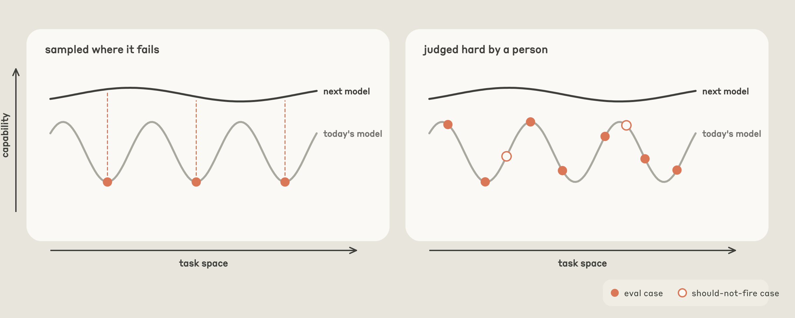
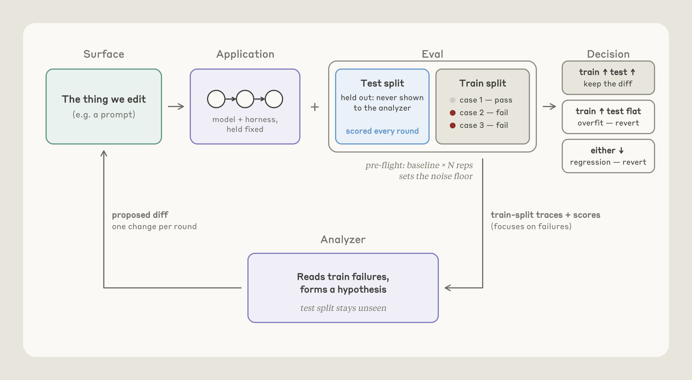
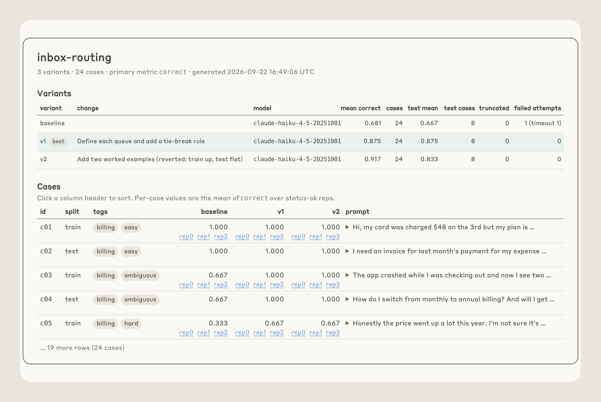

# Evals sauber bauen und per Hillclimbing verbessern, ohne sich selbst zu täuschen

Anthropic beschreibt Prinzipien für Eval-Design und für das schrittweise Verbessern gegen ein Eval (Hillclimbing) und zeigt, wie die Befehle `/claude-api build-eval` und `/claude-api hillclimb` im `claude-api`-Skill sie umsetzen. Es ist eine Primärquelle des Herstellers; die Methodik ist plausibel und gut begründet, die Fallbeispiele (Support-Benchmark, Skill-Verbesserung) sind Selbstmessungen ohne Rohdaten.

## Eval-Design: vier Eigenschaften

- Aufgaben spiegeln Produktion. Aufgaben, die nur leicht zu erzeugen oder zu bewerten sind, verzerren die Verteilung.
- Stärkere Modelle und mehr Thinking schneiden besser ab. Tun sie das nicht, sind meist Aufgaben mehrdeutig oder der Grader ist falsch kalibriert.
- Es gibt Headroom: Das beste Modell auf höchster Stufe liegt deutlich unter 100 %. Die Lücke darf nicht von unmöglichen oder mehrdeutigen Aufgaben kommen; typisches Warnzeichen ist eine Aufgabe, die in jedem Lauf scheitert. Gute Aufgabe: Zwei Fachleute kämen zum selben Urteil, und alles, was der Grader prüft, steht in der Aufgabe.
- Geringe Varianz zwischen Läufen. Ursachen sind mehrdeutige Aufgaben, ein unstabiler Grader, nicht durchgängig angewendeter Effort oder Restzustand aus früheren Versuchen (Datei, Git-Historie), der die Antwort verrät.

Aufgaben nicht danach auswählen, woran das heutige Modell scheitert: Das misst den „Fehler-Fingerabdruck“ eines Modells, nicht, was intrinsisch schwer ist. Schwere Fälle soll ein Mensch als schwer begründen können; Quellen sind Produktionsfehler, Bug Reports und Tickets. Reiner Nutzertraffic kann zu leicht ausfallen, weil Nutzer das versuchen, was funktionieren dürfte.

## build-eval: Ablauf

Beispiele stammen in dieser Priorität aus Produktions-Transkripten (nach Klärung von Aufbewahrung und sensiblen Daten), Bug Reports und Tickets, fünf bis zehn handgeschriebenen Fällen und aus dem Code synthetisierten Fällen. Der Nutzer bestätigt alle Inputs auf einer generierten Seite. Der Grader ist der günstigste passende: programmatisch bei eingeschränktem Output (Label, Schema, Tests), sonst LLM-as-Judge mit Rubrik aus prüfbaren Aussagen statt 1–5-Skala. Mit Baseline sieht der Judge beide Antworten in zufälliger Reihenfolge, ohne zu wissen, welche die Baseline ist. Das Judge-Modell sollte nicht das getestete sein. Claude bewertet einige Fälle, und der Mensch prüft, ob er anders bewertet hätte; gescorte Transkripte zu lesen gilt als Pflicht, weil Grader-Fehler häufig sind.

Danach folgen Baseline-Lauf mit Konfidenzintervall und Diagnosen: Grader zweimal auf demselben Output (gleiches Urteil?), Plumbing (Timeouts, API-Fehler, abgeschnittene Antworten), Headroom (Baseline ab etwa 95 %: Warnung, Ziel dann Kosten oder Latenz statt Qualität).

## Hillclimbing: wo und wie

Geeignete Oberflächen sind billig zu ändern (Text wie Prompts und Skills, nicht offene Harness-Umbauten), attributierbar (Skill-Triggering: Trigger-Rate hängt direkt an der Description) und klar umrissen. Kosten sind ein oft starkes Ziel, selbst bei gesättigtem Eval. Offene Aufträge wie „verbessere die Performance“ ohne Blick auf Headroom stocken eher.

Overfitting entsteht, wenn das Eval ins Harness „leckt“: ein OCR-Tool nur wegen der Benchmark-Mischung, ein Pfad-Hack, auf Formulierungen getunte Prompts, je ein Patch pro gelesenem Fehler, im Extremfall das Abrufen einer öffentlichen Referenzlösung. Gegenmittel: Cases in Train und Test splitten (Hillclimber liest nur Train), Fehlerinhalte nie in den Prompt kopieren, Antworten strukturell außer Reichweite halten.

Ablauf: Zufallssplit, vor Runde 1 ein Noise-Check (Rauschen kleiner als die kleinste Verbesserung, die du umsetzen würdest; sonst mehr Wiederholungen oder Cases). Pro Runde genau eine Änderung an der Ursache statt Umformulierung. Steigt nur Train, wird zurückgesetzt, ebenso bei Regression. Stockt der Score zwei bis drei Runden, sortiert Claude alle Restfehler nach Ursache, ohne Edit. Am Ende bleibt die Version mit dem besten Test-Score; liegt der Gewinn im Rauschen, rät das Tool vom Merge ab. Im Beispiel-Eval wurde Variante v2 (zwei Beispiele; Train 0,917, Test 0,833) verworfen, v1 (Queues definiert, Tie-Break) blieb bei 0,875 auf beiden Splits.

## Fallbeispiele (Selbstmessung)

Support-Benchmark, 44 Tickets (30 Suche, 14 Holdout): Start Opus 4.8, Standard-Effort `high`, 74,4 % Entscheidungsgenauigkeit, 4,6 Cent pro Ticket. Nach Prompt-Audit (Pflicht-Tool-Rituale, Scratchpad-Schritt, widersprüchliche Regeln entfernt) lief Opus 5.5 auf `low` mit 87,8 % bei 1,9 Cent. Ein Teil der Ersparnis ist Preis: Opus 5.5 kostet laut Quelle 20 % weniger bei Input und Output und 60 % weniger bei Cache Reads (Stand 2026-09-28). Sonnet 5 auf `low` erreichte 88,9 % bei etwa 1 Cent; mit Routing-Regeln und Refund-Cap-Querverweis 98,9 %. Auf den 14 Holdout-Tickets: 90,5 % gegen 78,6 % bei etwa einem Fünftel der Kosten.

`claude-api`-Skill: Start 66 % auf einem aus der Dokumentation abgeleiteten Eval. Ergänzung von acht fehlenden Features brachte 74 %, korrigierte C#- und Java-Typtabellen 77 %. Die Ursachen-Sortierung zeigte, dass der Inhalt vorhanden war, das Modell aber alte API-Formen aus seinen Priors schrieb. Eine Tabelle „alte Form → aktuelle Form“ am Skill-Anfang (fester Thinking-Budget → adaptives Thinking, ältere Web-Search-/Fetch-Tools) und vorgezogene Warnungen ergaben 80 %. Aufgaben, die trotz Lückenschluss nie besser wurden, entlarvten fehlerhafte Evals: Eine Aufgabe verlangte einen Fehlertyp, der Grader eine Kette von mindestens dreien; ein Grader widersprach der Doku, die laut API-Test recht hatte. Damit etwa 88 %.

## Einordnung

Methodisch belastbar und deckungsgleich mit bekannter Praxis (Train/Test-Trennung, Grader-Validierung), hier aber konsequent als Agent-Workflow mit Revert-Regeln umgesetzt. Die Zahlen sind Selbstmessung des Herstellers: kleine Stichprobe (14 Holdout-Tickets), keine Konfidenzintervalle im Text. Der Kostenvergleich mischt Prompt-Änderung, Modellwechsel und Preissenkung. Aufwand: Wiederholungen und Grader-Läufe kosten Tokens, und der Mensch muss Inputs und Grader freigeben. Im Archiv fehlen drei der neun Abbildungen des Originals (Abbildungen 1, 8 und 9: vermutlich Eval-Eigenschaften, Modellvergleich im Support-Benchmark, Skill-Selbstkorrektur); die Notiz stützt sich auf den Text.

## Kernaussagen

- Eval-Aufgaben nach menschlichem Urteil über Schwierigkeit wählen, nicht nach den Fehlern des heutigen Modells; Headroom, geringe Varianz und menschlich geprüfter Grader sind Pflicht → [[Testharness-als-staerkster-Hebel]]
- Skill-Triggering ist eine ausdrücklich empfohlene Hillclimb-Oberfläche, weil Trigger-Rate und Description direkt gekoppelt sind → [[Skill-Qualitaet-durch-Trigger-und-Baseline-Evals]]
- Pro Runde eine Änderung, Revert bei Train-Gewinn ohne Test-Gewinn, Fehlerinhalte nie in den Prompt → [[Skill-Qualitaet-durch-Trigger-und-Baseline-Evals]]
- Kostenziel am gesättigten Eval: Prompt-Audit, dann Modell und Effort stufenweise nach unten prüfen → [[Modell-Eskalation-von-guenstig-nach-teuer]]

## Verbindungen

- [[Hillclimbing-mit-Holdout-Split]]
- [[Skill-Qualitaet-durch-Trigger-und-Baseline-Evals]]
- [[Testharness-als-staerkster-Hebel]]
- [[Modell-Eskalation-von-guenstig-nach-teuer]]
- [[2026-09-14-code-test-plugins-with-evals-claude-code-docs]]
- [[2026-09-22-claude-getting-the-most-out-of-opus-5-5-in-claude-and-c]]
