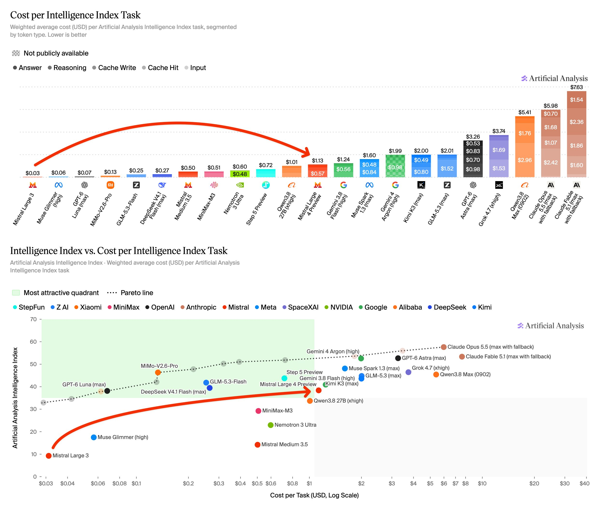
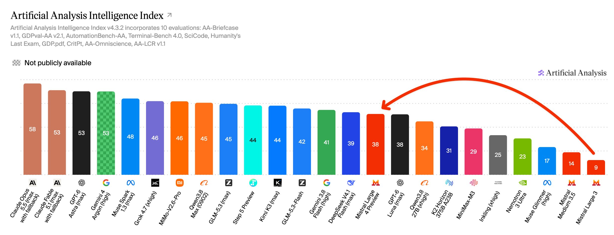
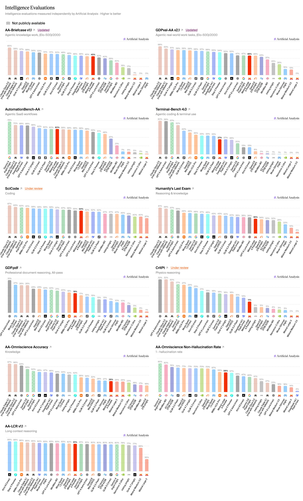
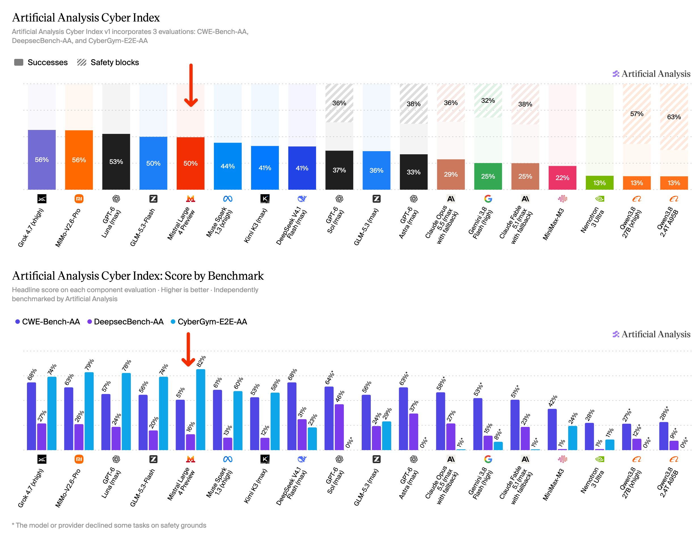
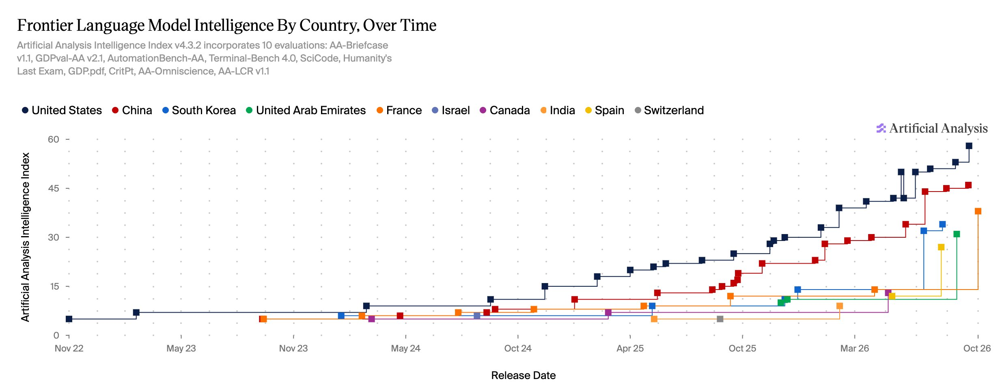

# `Mistral Large 4 Preview`: Fähigkeiten und Kosten

## Modell und Verfügbarkeit

Artificial Analysis (AA) berichtet `Mistral Large 4 Preview`: „Research Public Preview“ über Mistrals API, 1 Billion Parameter, 49 Milliarden aktiv, 512k Kontexttokens, Text-/Bildinput, Textoutput. Offene Gewichte: für Ende Oktober 2026 geplant, kein belegter Release. API-Bildlimit laut Bericht: 100 je Anfrage statt acht.

## Preise und Aufgabenverbrauch

USD je 1 Million Tokens:

|Tarif|Input|Output|Cached Input|
|---|---:|---:|---:|
|Standard|`$1.36`|`$4.18`|`$0.14`|
|50-%-Startrabatt, erste zwei Wochen|`$0.68`|`$2.09`|nicht gesondert beziffert|

AA-Aufgabenkosten im Intelligence Index, gewichtet: Standard `$1.13`, Startrabatt `$0.57`. Vergleich: `GLM-5.3-Flash` `$0.25`, `DeepSeek V4.1 Flash (max)` `$0.27`, `GPT-6 Luna (max)` `$0.07`.

## Unabhängige AA-Benchmarks

Intelligence Index `v4.3.2`: 38, zehn Evaluationen.

|Messung|Wert|
|---|---:|
|AA-Briefcase v1.1 / GDPval-AA v2.1, normalisierter Elo|45 % / 46 %|
|AutomationBench-AA / Terminal-Bench 4.0|60 % / 27 %|
|SciCode / CritPt, jeweils „Under review“|54 % / 11 %|
|Humanity’s Last Exam / GDP.pdf|35 % / 19 %|
|AA-Omniscience Accuracy / Non-Hallucination Rate|26 % / 58 %|
|AA-LCR v1.1|81 %|

|Cyber-Messung|Wert|
|---|---:|
|Cyber Index v1|50 %|
|CWE-Bench-AA / DeepsecBench-AA / CyberGym-E2E-AA|51 % / 16 % / 82 %|

## Einordnung

Vergleichsindex: `GPT-6 Luna (max)` 38, `DeepSeek V4.1 Flash (max)` 39. Frankreich liegt in AAs Frontier-Auswahl hinter USA und China auf Platz drei.

Preview, Startrabatt und ausstehende Gewichte begrenzen die Übertragbarkeit. Cyber-Erfolg ist kein Nachweis allgemeiner Sicherheit. Tokenpreis und gewichtete Benchmark-Aufgabenkosten sind verschiedene Größen.

## Kernaussagen

- [[Modell-Eskalation-von-guenstig-nach-teuer]]: Ähnliche Indexwerte können stark unterschiedliche Aufgabenkosten haben.
- [[Action-Space-Design-nach-Modellfaehigkeit]]: Das konkrete Fähigkeitsprofil braucht eigene Einsatz-Evals.

## Verbindungen

- [[2026-09-22-epoch-the-plunging-price-of-thought]]
- [[2026-07-09-artificialanlys-2075268970492657905]]
