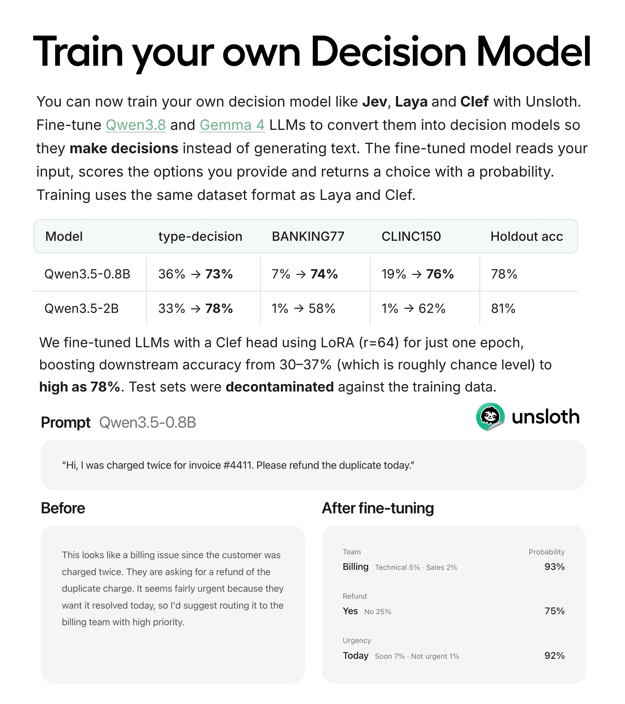

# Kleine LLMs zu Decision-Modellen trainieren: Unsloth mit Clef-Head und LoRA

Unsloth erweitert den lokalen Betrieb von Decision-Modellen um eigenes Training: Ein LLM soll vorgegebene Optionen bewerten und Wahrscheinlichkeiten liefern, statt eine Antwort auszuformulieren. Der Anbieter berichtet deutliche Accuracy-Gewinne durch Fine-Tuning mit einem Clef-Head und LoRA. Die Zahlen stammen aus dem Post und seinem Benchmark-Bild; sie sind keine unabhängige Reproduktion.

## Training statt bloßer Inferenz-Umleitung

Der Hauptpost nennt `Qwen3.5-0.8B` mit `4 GB VRAM`, LoRA-Rang `r=64` und einer Epoche. Als weitere geeignete Modellfamilien werden `Qwen3.8` und `Gemma 4` genannt. Ein zweiter Autor-Post ergänzt Training über eine UI und `2,5 GB VRAM` für kleine Modelle wie Laya. Das sind Trainingsangaben und andere Größen als die `4 GB RAM` für Laya-Inferenz aus [[2026-09-28-unslothai-2104592692072304916]].

Das Bild beschreibt Eingabe, vorgegebene Optionen und eine Entscheidung mit Wahrscheinlichkeit. Es zeigt beispielhaft getrennte Entscheidungen für Team-Zuordnung, Erstattungswunsch und Dringlichkeit. Die Wiederverwendung des Dataset-Formats von Laya und Clef ist eine Herstellerangabe; sie belegt keine identische Modellarchitektur oder Qualität.

## Benchmark-Werte aus dem Bild

| Modell | `type-decision` im Bild | BANKING77 | CLINC150 | Holdout-Accuracy |
|---|---|---|---|---|
| `Qwen3.5-0.8B` | 36 % → 73 % | 7 % → 74 % | 19 % → 76 % | 78 % |
| `Qwen3.5-2B` | 33 % → 78 % | 1 % → 58 % | 1 % → 62 % | 81 % |

Der Post nennt für `0.8B` zusätzlich eine aggregierte Accuracy von `20,7 % → 74,3 %` über drei Decision-Benchmarks und separat eine Downstream-Verbesserung von `30–37 % → 78 %`. Diese Angaben sind von den einzelnen Benchmark-Spalten und dem Holdout-Wert zu unterscheiden. Laut Bild wurden Tests gegen Trainingsdaten dekontaminiert; Verfahren und Wirksamkeit wurden hier nicht geprüft.

## Ergänzender Guide und abweichende Parameter

Der [verlinkte Unsloth-Guide](https://unsloth.ai/docs/basics/train-your-own-decision-model-with-unsloth) wurde am 09.10.2026 zusätzlich [lokal archiviert](../../00_Inbox/Quellen/URL/2026-10-08-unsloth-train-your-own-decision-model-with-unsloth-unslo.md). Er beschreibt einen separaten Decision-Head, Holdout-Kalibrierung und anschließende Testauswertung. Seine Setup-Empfehlung und sein Codebeispiel verwenden `r=16` und zwei Epochen; der Benchmark-Abschnitt wiederholt dagegen `r=64` und eine Epoche. Diese Konfigurationen dürfen nicht still zu einer vermeintlich exakten Reproduktion zusammengezogen werden.

## Einordnung

Der Beitrag ergänzt [[Entscheidung-per-Scoring-statt-Generierung]] um eine Trainingsmethode. Ein trainierter Decision-Head ist ein anderer Mechanismus als der dort beschriebene eingeschränkte Softmax über Label-Tokens; gleich ist der feste Antwortraum.

Die Accuracy-Werte belegen nur den Herstellerbericht für die genannten Datensätze. Sie zeigen weder Kalibrierungsqualität im eigenen Einsatz noch Übertragbarkeit auf persönliche Präferenzen, Empfehlungen oder andere Aufgaben. Ein eigenes Eval braucht getrennte Trainings-, Kalibrierungs- und Testdaten; dessen Ergebnisse gehören neben Kosten und Fehlentscheidungen bewertet. Das ist eine Einordnung, kein zusätzliches Messergebnis der Quelle. `unslothai/unsloth` liegt nicht unter `external_repos/`; eine Code-Verifikation und Reproduktion bleiben offen. Erfasst wurden zwei Autor-Posts, ohne behauptete Thread-Vollständigkeit.

## Kernaussagen

- Ein kleiner LLM-Backbone kann mit einem Decision-Head und LoRA für begrenzte Antwortoptionen spezialisiert werden → [[Decision-Head-Finetuning]]
- Entscheidungen mit Wahrscheinlichkeiten ersetzen bei festem Antwortraum die Freitextausgabe; Training und Kalibrierung bleiben eigenständige Aufgaben → [[Entscheidung-per-Scoring-statt-Generierung]]
- Benchmark-, Holdout- und aggregierte Accuracy sowie Trainings- und Inferenzspeicher getrennt betrachten → [[Decision-Head-Finetuning]]

## Verbindungen

- [[2026-09-28-unslothai-2104592692072304916]]
- [[2026-09-20-avichawla-2101563610644496464]]
- [[Entscheidung-per-Scoring-statt-Generierung]]
- [[Decision-Head-Finetuning]]
- [[Hillclimbing-mit-Holdout-Split]]
