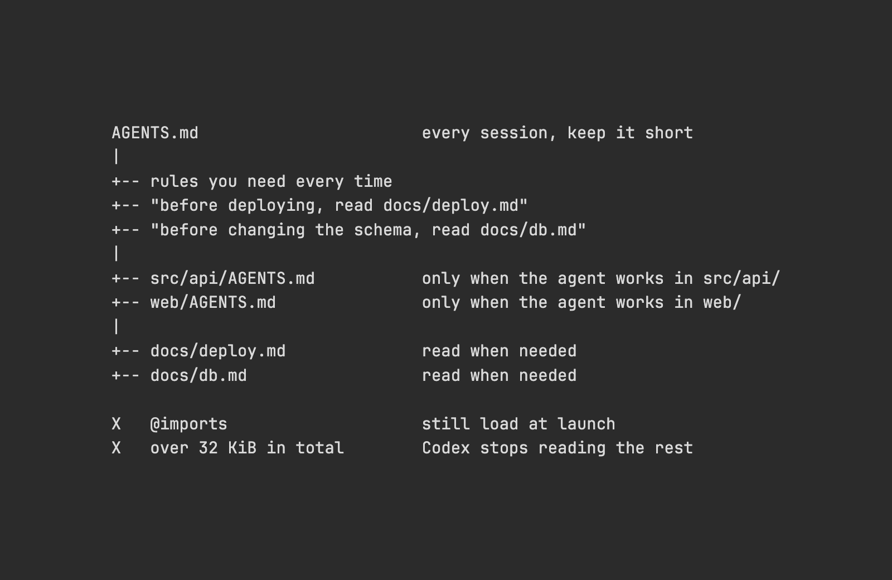

# Agent-Dateien verschlanken und Spezialregeln gezielt laden

## Regeln nach Bedarf laden

Vox empfiehlt unter **200 Zeilen** je Agent-Datei und nennt **32 KiB insgesamt** als Codex-Standardlimit. Dauerhaft geladene Regeln beanspruchten bei jedem Turn Kontext; längere Dateien würden schlechter befolgt.

Das Diagramm legt universelle Regeln in die Root-Datei, API-/Web-Regeln in `src/api/AGENTS.md` beziehungsweise `web/AGENTS.md`. Explizite Leseanlässe verweisen vor Deployment auf `docs/deploy.md` und vor Schemaänderungen auf `docs/db.md`. `@`-Imports würden weiterhin beim Start geladen, also **null Tokens** sparen; jenseits von 32 KiB würde Codex abbrechen.

## Einordnung

Archiviert ist ein Autor-Post; die Unterhaltung ist nicht nachweislich vollständig. Repo-Check: `openai/codex@823ea830c` bestätigt 32 KiB als gemeinsamen Standard für Projektdateien, kein Limit je Datei (`config_toml.rs`, `agents_md.rs`). `anthropics/claude-code@2bfb629`, `CHANGELOG.md`, bestätigt `/skill-doctor` und `/doctor prompt-audit` ab `2.1.283`; deren Freigabeverhalten wurde nicht getestet. Unverifiziert bleiben einmaliges Codex-Laden ohne Nachladen beim Ordnerwechsel, Claudes Laden beim Dateizugriff und laufende Skill-Metadatenkosten. Die unterschiedlichen behaupteten Ladezeitpunkte begrenzen das pauschale Diagramm. Eigeneinschätzung: Die Strukturidee ist übertragbar; Imports, Ladeanlässe und Kontextgewinn brauchen Prüfung im jeweiligen Werkzeug.

## Kernaussagen

- [[AGENTS-md-Onboarding-Design]]: Nur universelle Regeln dauerhaft laden; Spezialwissen mit konkretem Anlass auslagern und Duplikate beseitigen.
- [[Kontext-Hygiene-Entscheidungsbaum]]: Optisch kürzere Dateien durch Imports garantieren laut Quelle keine Kontextentlastung; ungenutzte Skills prüfen und deaktivieren.
- [[AGENTS-md-Onboarding-Design]]: Der vorgeschlagene Prompt für `Opus 5.5` lässt drei Subagents zunehmend aggressive Entwürfe samt Löschungen, Verschiebungen und Vorher-/Nachher-Zeilen/KiB erstellen, ohne nützliche Regeln zu verlieren; Auswahl vor Umsetzung/PR, `CLAUDE.md`-Import der Hauptdatei beibehalten.

## Verbindungen

- [[2026-09-18-repo-anthropics-claude-code-agents-md-support]]
- [[2026-02-01-humanlayer-writing-a-good-claude-md]]
