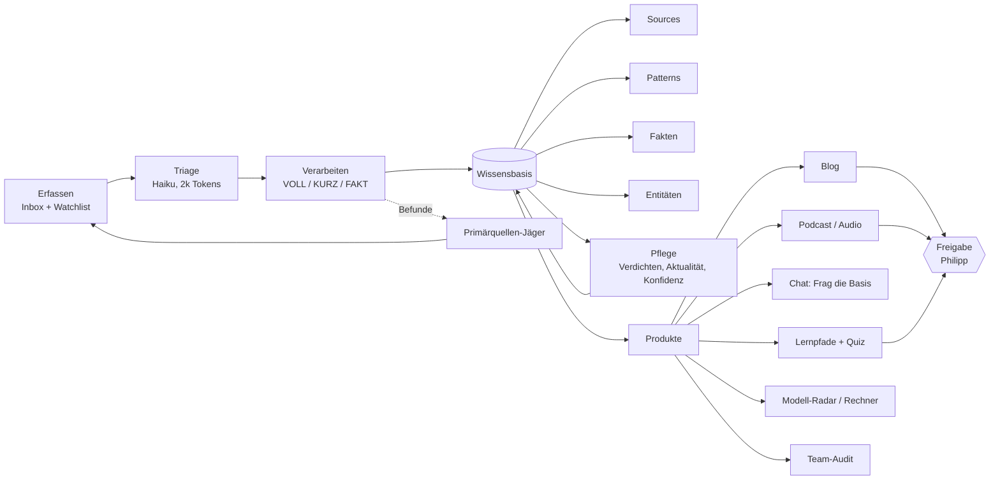

# Wissensfabrik: Konzept für ein automatisiertes Informationssystem

**Stand:** 2026-09-29 · **Status:** Entwurf zur Entscheidung · **Grundlage:** vollständige Verarbeitung von 168 Inbox-Quellen

Aus gesammelten Quellen (X, TikTok, Artikel, YouTube, PDF) entsteht eine gepflegte Wissensbasis. Aus dieser Basis entstehen wiederkehrend Produkte für Philipp und Kollegen, die mit KI arbeiten oder coden: Blogartikel, Podcasts, Antworten im Chat, Lernpfade, Entscheidungshilfen.

## 1. Was die Inhalte zeigen

### Zusammensetzung

| Typ | Quellen | Median-Größe | Auffälligkeit |
|---|---|---|---|
| X | 68 | 6,8 KB | 38 davon Sekundärquellen (vibedeck-Aufarbeitung) |
| URL | 43 | 6,7 KB | 32 Sekundärquellen, 12 Anthropic-/Claude-Docs (Primärdoku) |
| TikTok | 50 | 2,7 KB | kurz, meist Caption plus Auto-Transkript, 6 ohne Transkript |
| YouTube | 6 | 30 KB | lang, hohe Dichte |
| PDF | 1 | 61 KB | Mozilla-Bericht „State of Open Source AI“ |

- **Wenige Autoren liefern viel:** `@agentic.james` 14, Anthropic Docs 12, `@floknowsai` 8, `@promptgefluester` 7, `@Voxyz_ai` 7, `@nate.b.jones` 6, `@ArtificialAnlys` 5. Das ist ein Signal: Für diese Quellen lohnt eine dauerhafte Beobachtung, für den Rest reicht Gelegenheitserfassung.
- **Thema der 88 neu geschriebenen Notizen:** Arbeitsweisen 53, Tools & Releases 20, KI-Kosten 7, Markt & Strategie 3, Neue Modelle 3, Security 2. 28 Notizen sind zeitkritisch (Preise, Releases, Benchmarks), 60 nicht.

### Fünf Inhaltsarten mit unterschiedlichem Verfallsdatum

| Art | Beispiel | Haltbarkeit | gehört in |
|---|---|---|---|
| **Arbeitsweise** | Plan-first, Testharness, Kontext-Hygiene | Monate bis Jahre | Pattern |
| **Datierte Fakten** | Opus 5.5 hat im Coding Agent Index 66 Punkte, kostet $13,04 pro Task | Wochen | Fakten-Register |
| **Werkzeug-Release** | `/checkup`, Code-Mode-MCP, Plugin-Evals | Wochen bis Monate | Source-Notiz, ggf. Pattern-Beleg |
| **Primärdokumentation** | Claude-Code-Docs, Anthropic-Studie | so lange die Version gilt | Beleg mit Typ `verifiziert` |
| **Meinung und Motivation** | „KI hängt dich ab“, Kurswerbung | keine | nur wenn substanziell, sonst ignorieren |

Die bisherige Wissensbasis kannte nur die erste Art. Alles andere wurde entweder in Patterns gepresst oder aussortiert. Das erklärt, warum ein Blog über Modelle und Preise aus ihr allein nicht funktioniert hätte.

### Was die Verarbeitung an Auffälligkeiten ans Licht brachte

Die Agents haben 53 Befunde gemeldet. Sie fallen in wenige Gruppen, und jede Gruppe ist ein Hebel für das System:

- **Fehlende Primärquellen (etwa 10):** Die Anthropic-Studie zu 400.000 Sessions, zwei arXiv-Studien (16-Entwickler-Studie, Kontextqualität), Anthropics Artikel zu den vier Loop-Typen, OpenAI-Doku zu Astra, der TypeSafe-Blogpost zu Jev. Alle stehen in den Notizen nur aus zweiter Hand.
- **Unbelegte Herstellerzahlen (etwa 10):** MRCR 93 %/76 %, „97 % weniger Code“, „200-mal schneller“, 94 Commits an einem Tag. Bei der letzten Zahl stützte das mitgelieferte Bild (ein GitHub-Contribution-Graph) die Behauptung nicht.
- **Auto-Transkript-Fehler (mehrere):** „Sonic“ statt Sonnet, „Grammy“ statt Grilling-Skill, „Sweatper“ statt Sweeper.
- **Versions- und Datumsdrift (4):** Der Juli-Bericht nennt Opus 5 mit 61 Punkten (Index v4.1), die September-Posts mit 51 (v4.3). Ein Artikel trägt in der Inbox das Datum 2026-09-17, zitiert sich selbst aber mit 2026-06-16.
- **Werbung und Lead-Magnete (4).**

## 2. Wo die bisherige Verarbeitung Wert verschenkt hat

| Problem | Beleg | Konsequenz |
|---|---|---|
| Jede Quelle wird gleich tief verarbeitet | 110–150k Tokens je Quelle, auch bei dünnen TikToks | Rückstau von 126 offenen Quellen |
| Die Hauptinstanz liest alles zur Konsolidierung | Konsolidierung war „regelmäßig länger als die Subagent-Läufe“ | ein Engpass, der mit dem Bestand wächst |
| Nur ein Speicher: Patterns | Preise und Benchmarks landeten in Patterns oder nirgends | veraltende Zahlen ohne Verfallsmarke |
| Einordnung steckt im Fließtext der Quelle | Essay-lange Einordnungen mit Änderungsvorschlägen an Pattern-Dateien | Wissen ist nicht maschinell auslesbar |
| Belege wachsen nur | Kontext-Hygiene hat jetzt 36 Belege | ein Pattern wird zum Logbuch statt zur Empfehlung |
| Primärquellen fehlen | siehe oben | Konfidenz kann nicht sauber hochgestuft werden |
| Anbieterfilter zu eng | Haiku sortierte OpenAI-/Gemini-/Cursor-Material als „nicht Claude-Ökosystem“ aus | blinde Flecken bei Modellvergleichen |

## 3. Was in dieser Runde geändert und getestet wurde

Alle 125 offenen Quellen wurden mit einem neuen Ablauf verarbeitet.

| Schritt | Vorher | Jetzt |
|---|---|---|
| Vorauswahl | keine | **Triage** durch Haiku auf Basis von 700-Zeichen-Auszügen: VOLL / KURZ / FAKT / IGNORIEREN |
| Tiefe | immer voll | VOLL (bis 300–1000 Wörter), **KURZ** (bis 180 Wörter), **FAKT** (Notiz plus Faktenzeilen) |
| Rückgabe der Agents | Freitext-Bericht, den der Hauptagent liest | **Report-Datei** mit Markern (`@@STATUS`, `@@BELEG`, `@@FAKT`, `@@BEFUND`) |
| Konsolidierung | Hauptagent liest und schreibt | **Script** (`quellen_pipeline.py apply`): setzt Status, hängt geprüfte Beleg-Zeilen an, sammelt Fakten und Befunde |
| Wissensarten | ein Speicher | Patterns, Sources und neu das **Fakten-Register** |

### Ergebnis

| Kennzahl | Wert |
|---|---|
| Quellen verarbeitet | 125 (93 eingearbeitet, 29 ignoriert, 3 warten auf neue Erfassung) |
| Neue Source-Notizen | 88 |
| Neue Beleg-Zeilen in Patterns | 173 |
| Neues Pattern | `Metrikband-gestufte-Agent-Autonomie` |
| Fakten-Register | 65 datierte Zeilen |
| Token-Verbrauch | rund 3,0 Mio. gesamt, **etwa 24k je Quelle** (früher 110–150k) |
| Validator | 56 Fehler vor und nach dem Lauf, keiner neu |

Aufgeschlüsselt: Vollverarbeitung 64k je Quelle, Kurzeintrag 10k, Fakten 21k, Triage 1,8k.

### Was dabei schiefging (und die Gegenmaßnahme)

- **Ein Shell-Detail hat 8 Reports unbemerkt nicht übernommen** (`seq -w` erzeugt bei einstelligen Zahlen keine führende Null). Aufgefallen ist es nur, weil der Inbox-Status nicht zu den Source-Notizen passte. **Maßnahme:** Das Script muss am Ende Erwartung und Ist vergleichen (Anzahl Reports, Anzahl Status-Wechsel) und bei Abweichung abbrechen.
- **Die Triage hat ein selbst erfundenes Anbieterkriterium angewandt** („nicht Claude-Ökosystem“) und bewertet über Auszüge zu grob. Sie taugt als Vorsortierung, nicht als Urteil. Acht Fehlentscheidungen habe ich von Hand korrigiert.
- **Sekundärquellen sind die Regel.** 62 % von X und URL kommen aus der vibedeck-Aufarbeitung. Ein Beleg daraus zählt nicht als unabhängige Bestätigung.

## 4. Zielbild

### Vier Speicher statt einem

| Speicher | Inhalt | Verfall | Wird gelesen von |
|---|---|---|---|
| `Sources/` | redaktionelle Aufarbeitung je Quelle, unveränderlich | keiner | Belege, Blog |
| `Patterns/` | Arbeitsweisen, lebend, mit Konfidenz | langsam | Chat, Lernpfade, Team-Audit |
| `Fakten/` | datierte Einzelangaben mit Einschränkung | schnell | Modell-Radar, Kosten-Blog |
| `Entitaeten/` (neu) | eine Seite je Modell, Tool und Autor: Verweise auf Sources, Fakten, Patterns | mittel | Chat, Blog, Podcast |

Neue Frontmatter-Felder, die schon in dieser Runde eingeführt wurden: `thema`, `zeitkritisch`. Weitere: `primaerquelle` (URL oder Datei der Originalquelle), `geprueft` (Datum der letzten Prüfung).

### Fünf Pflegeprozesse

1. **Primärquellen-Jäger.** Liest die `@@BEFUND`-Zeilen und die Links in den Notizen, legt fehlende Primärquellen als Kandidaten in eine Queue und erfasst sie nach Freigabe.
2. **Konfidenz aus Unabhängigkeit.** Beleg-Zeilen erhalten ein Feld für die Primärquelle. Das Script zählt unabhängige Primärquellen und schlägt Hochstufungen vor. Heute wären das rund 14 Kandidaten (Testharness 20 Autoren, Erweiterungs-Ebenen 14, Great-Decoupling 9, Freiheitsgrad 7, Hook-Entscheidungstyp 6 …), die ich wegen fehlender Primärquellen-Angaben nicht automatisch angehoben habe.
3. **Verdichtung.** Ab etwa 15 Belegen schreibt ein Agent einen Kernaussage-Block an den Anfang des Patterns und markiert überholte Aussagen. Belege bleiben (Invariante 1).
4. **Aktualitätsprüfung.** Zeitkritische Notizen und Fakten tragen ein Prüfdatum. Nach 60 Tagen erscheinen sie in einer Prüfliste.
5. **Spannungs-Radar.** Widersprüche zwischen Quellen werden gesammelt und sind Rohstoff für Debatten-Formate (siehe Ideen).

## 5. Die Ideen

Zielgruppe für alle: Philipp und Kollegen, die mit KI arbeiten oder coden.

### A. Blog: sechs Formate aus einem Bestand

| Format | Rhythmus | Rohstoff | Beispiel-Titel |
|---|---|---|---|
| **Modell-Radar** | wöchentlich | Fakten-Register | „Opus 5.5 an der Spitze, aber teurer pro Task“ |
| **Arbeitsweise im Detail** | alle 2–4 Wochen | ein Pattern mit vielen Belegen | „Kontext-Hygiene: Wann clear, wann compact?“ |
| **Behauptungs-Check** | monatlich | Befunde | „Fünf Zahlen aus der Szene, geprüft“ |
| **Duell** | monatlich | Spannungen | „Adversarial Agent oder menschlicher Review?“ |
| **Werkzeug-Notiz** | nach Bedarf | Release-Sources | „Code-Mode-MCP: weniger Schemas, mehr Tests“ |
| **Wochen-Digest** | wöchentlich | alles Neue | „KW 39: Modelle, Preise, Releases“ |

Der Entwurf zu „Opus 5.5“ aus dieser Sitzung zeigt Ton und Dichte: eigene Rechnung sichtbar gekennzeichnet, Widersprüche eingeordnet, Fazit mit Handlungsempfehlung.

### B. Podcast und Audio mit `notebooklm-py`

`notebooklm-py` (0.8.3) ist installiert und kann Audio-Overview, Video, Slide-Deck, Quiz, Flashcards, Infografik, Mind-Map, Data-Table und Report erzeugen sowie Notebooks teilen. Im Repo liegen mit `reports/notebooklm/` bereits ein Briefing und zwei Prompts als Vorläufer.

| Produkt | Notebook-Inhalt | Prompt-Idee |
|---|---|---|
| **Wochen-Deep-Dive** (10–15 Min) | Wochen-Digest, neue Fakten, betroffene Patterns | „Zwei Hosts erklären, was sich diese Woche für Entwickler ändert, mit konkreten Handlungen“ |
| **Debatten-Folge** | zwei Sources mit widersprüchlicher Position plus das Pattern mit der Spannung | „Ein Host vertritt Position A, einer B. Am Ende: wann welche gilt“ |
| **Pattern-Erklärfolge** | ein Pattern mit Belegen | „Erkläre das Pattern in 8 Minuten für jemanden, der nur Chat kennt“ |
| **Team-Quiz und Flashcards** | Patterns eines Lernpfads | Quiz nach jedem Lernpfad-Modul |
| **Slide-Deck** | Wochen-Digest | 10 Folien für die Team-Runde |
| **Data-Table** | Fakten-Register | Modelle × Preis × Score |

Wichtig: **Gefüttert wird NotebookLM mit unseren eigenen Notizen (Patterns, Sources, Fakten), nicht mit dem Originaltext Dritter.** Das ist urheberrechtlich sauberer und inhaltlich besser, weil die Einordnung bereits enthalten ist.

**Freigabe nötig:** Anmeldung per Browser-Login und Upload zu Google. `notebooklm-py` nutzt eine nicht offizielle Schnittstelle und kann bei Änderungen brechen. Deshalb kein Blocker für den Rest des Systems.

### C. Chat: „Frag die Wissensbasis“

Alle Patterns zusammen sind 225 KB, etwa 60k Tokens. Eine Vektordatenbank ist unnötig.

- **Skill `wissen-fragen`:** liest `Index.md` (60 Zeilen), wählt die passenden Patterns und Sources, antwortet mit Zitaten, Konfidenz, Stand-Datum und Hinweis auf Spannungen. Bei Lücken sagt er das offen und legt eine Zeile in `Wissensluecken.md` ab.
- **Auslieferung an Kollegen ohne Claude Code:** ein geteiltes NotebookLM-Notebook mit Patterns und Fakten, als Chat-Oberfläche.
- **Kreislauf:** Die gesammelten Lücken steuern, welche Quellen als Nächstes erfasst werden.

### D. Lernpfade für Kollegen

Aus den Patterns entstehen geordnete Pfade (Einsteiger, Fortgeschrittene, Teamlead) mit jeweils drei bis fünf Modulen, Quiz und Flashcards. Reihenfolge nach Voraussetzungen: Kontext-Hygiene vor Ralph-Loop, Testharness vor CI-Agent.

### E. Modell-Radar und Kostenrechner

Ein interaktiver Rechner als Artifact, gespeist aus dem Fakten-Register: Aufgabentyp und Effort-Stufe wählen, Kosten pro Task und Score vergleichen. Beruht auf der Erkenntnis, dass Listenpreise wenig aussagen (Opus 5.5 ist 20 % billiger pro Token, aber 21 % teurer pro Coding-Task).

### F. Team-Audit: Patterns gegen die eigene Konfiguration

Ein Skill vergleicht die `AGENTS.md`, Skills und Hooks eines Repos mit den Patterns und liefert einen Diff aus Vorschlägen mit Beleg und Konfidenz. Das macht aus Wissen eine konkrete Änderung.

### G. Szene-Karte mit Zuverlässigkeitsprofil

Pro Autor: Anzahl Beiträge, Anteil belegter Aussagen, häufigste Themen, Primär- oder Sekundärquelle. Als reine Einordnung („belegt/selbstberichtet“) ohne Bewertung der Person. Nützlich für die Watchlist.

### H. Wissenslandkarte

Der vorhandene Skill `graphify` kann aus Sources, Patterns und Entitäten einen Graph und einen HTML-Report erzeugen. Er zeigt Cluster, dünn belegte Ecken und Verbindungen zwischen Themen.

## 6. Automatisierung und Kosten

| Takt | Aufgabe | Ergebnis |
|---|---|---|
| täglich | neue Quellen aus Inbox und Watchlist, Triage, Verarbeitung in kleinen Batches mit Tokenlimit | Notizen und Belege, Commit-Vorschlag |
| wöchentlich | Fakten-Update, Wochen-Digest, Blog-Entwurf, Podcast-Entwurf | `entwuerfe/` |
| monatlich | Verdichtung, Aktualitätsprüfung, Konfidenz-Vorschläge, Behauptungs-Check | Prüfliste, Entwürfe |

**Kostenrahmen (gemessen):** Bei etwa 20 neuen Quellen pro Woche sind das grob 0,6–0,7 Mio. Tokens für Verarbeitung und Entwürfe, also im Monat etwa so viel wie der heutige Einmal-Rückstau (3,0 Mio.).

**Ausführung:** Lokal per Windows-Aufgabenplanung mit `claude -p "/<skill>"`, weil Ingest-Scripts, Logins und lokale Änderungen dort liegen. Cloud-Routinen sehen nur, was gepusht ist.

**Sicherungen:**
- Jedes Produkt entsteht als Entwurf und geht erst nach Freigabe raus.
- Jeder Lauf endet mit einem Abgleich von Erwartung und Ist (Anzahl Reports, Status-Wechsel, Validator-Zahl).
- Fakten und Zitate tragen immer Quelle und Datum.

## 7. Empfohlene Reihenfolge

1. **Erledigt (2026-09-29):** Der Skill `quellen-verarbeiten` läuft jetzt im neuen Ablauf (Triage, VOLL/KURZ/FAKT, Report-Dateien). Das Werkzeug ist `70_Scripts/quellen_pipeline.py`, die Aufträge liegen unter `30_Skills/local/quellen-verarbeiten/references/`.
2. **Diese Woche:** Skill `wissen-fragen` und Fakten-Pflege. Beides ist klein und trägt den Chat und den Modell-Radar.
3. **Danach:** Blog-Digest als Skill (Entwürfe), erster Wochenlauf von Hand, dann zeitgesteuert.
4. **Mit Freigabe:** NotebookLM-Anbindung, zuerst ein einzelner Wochen-Podcast als Probe.
5. **Später:** Primärquellen-Jäger, Entitäten, Lernpfade, Team-Audit.

## 8. Entscheidungen

Entschieden am 2026-09-29:

1. **Ort:** öffentlicher Blog auf `blog.sp23.online`, mit RSS. Der Generator liegt in `blog/`, Beiträge gehen erst nach Freigabe (`status: freigegeben`) in Seite und Feed.
2. **NotebookLM:** Login ist erfolgt. Hochgeladen werden nur eigene Notizen. Erste Audio-Probe erzeugt (`reports/notebooklm/probe-modell-radar-kw39.m4a`, 23,7 Minuten bei „default“-Länge; künftig `--length short`).
3. **Skill `quellen-verarbeiten`:** auf den neuen Ablauf umgestellt.
4. **Kadenz:** nicht nur ein Artikel pro Woche (siehe unten).

Noch offen:

- Hosting und Deployment für `blog.sp23.online` (siehe `blog/README.md`).
- Freigabe der ersten neun Entwürfe.
- Autorenname und Blogtitel (Platzhalter: „sp23“ und „sp23 · KI-Praxis“).
- Watchlist: sollen die häufigsten Autoren und Herstellerblogs automatisch erfasst werden?

### Kadenz: drei Ebenen statt eines Artikels

| Ebene | Umfang | Rhythmus | Aufwand für die Freigabe |
|---|---|---|---|
| Kurzmeldung | 120–250 Wörter, eine Neuigkeit | 1–2 pro Werktag | wenige Minuten je Stück, gebündelt |
| Artikel | 500–1200 Wörter (Modell-Radar, Arbeitsweise, Duell, Check, Werkzeug) | 2–3 pro Woche | jeweils sorgfältige Prüfung |
| Wochen-Digest | 400–700 Wörter | freitags | kurz, da nur Verweise |

Das ergibt grob zehn Beiträge pro Woche. Der Engpass ist dann nicht das Schreiben, sondern (1) die Erfassung neuer Quellen und (2) deine Prüfzeit. Für (1) hilft eine Watchlist mit automatischer Erfassung von Herstellerblogs und Benchmark-Seiten; für (2) die Regel, dass Kurzmeldungen gebündelt freigegeben werden.

## 9. Grenzen dieses Konzepts

- Die Triage arbeitet mit Auszügen und ist nur eine Vorsortierung.
- Die Ersparnis von 24k statt 110–150k je Quelle beruht auf dieser Runde. Sie schließt die schlanke Konsolidierung durch das Script ein und kann bei anderen Quellenmischungen abweichen.
- Ob die Produkte bei Kollegen ankommen, ist offen. Deshalb Probe vor Automatisierung.
- `notebooklm-py` ist eine inoffizielle Schnittstelle und damit ein Betriebsrisiko.
